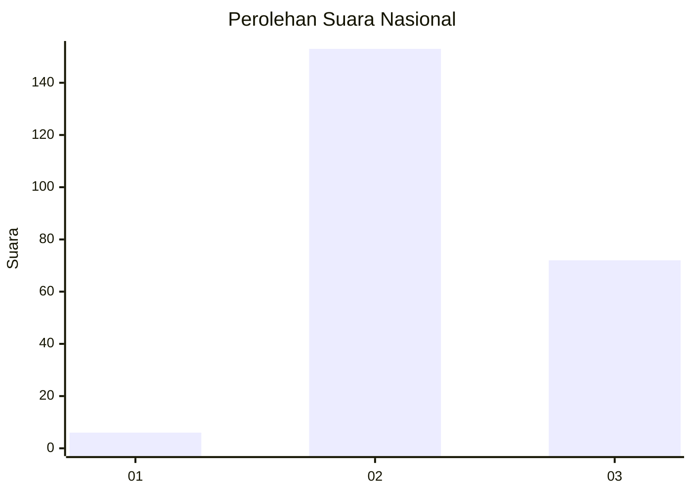
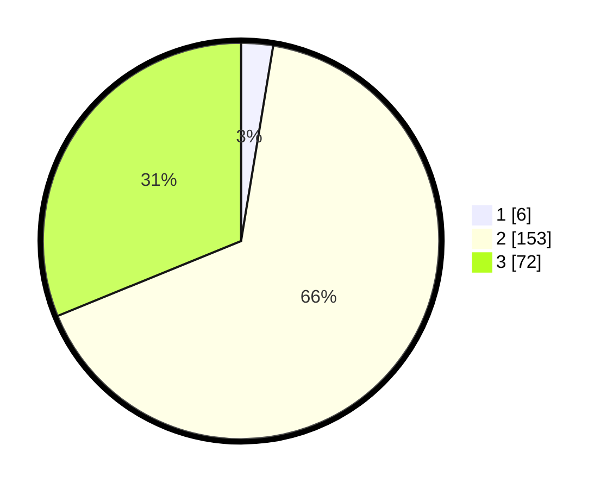

# Hasil

## Grafik

## Tabel

| No. | Nama Paslon    | Suara | Suara (raw) | Persentase |
|:--- |:-------------- | -----:| -----------:| ----------:|
| 1   | ANIES MUHAIMIN | 6     | [6][p-1]    | 2,60       |
| 2   | PRABOWO GIBRAN | 153   | [153][p-2]  | 66,23      |
| 3   | GANJAR MAHFUD  | 72    | [72][p-3]   | 31,17      |

[p-1]: https://github.com/gigit-pemilu/pemilu-2024/blob/main/pilpres/hitung-suara/sub/51-bali/sub/04-gianyar/sub/03-gianyar/sub/1006-gianyar/sub/001-tps/sub/paslon-1.txt
[p-2]: https://github.com/gigit-pemilu/pemilu-2024/blob/main/pilpres/hitung-suara/sub/51-bali/sub/04-gianyar/sub/03-gianyar/sub/1006-gianyar/sub/001-tps/sub/paslon-2.txt
[p-3]: https://github.com/gigit-pemilu/pemilu-2024/blob/main/pilpres/hitung-suara/sub/51-bali/sub/04-gianyar/sub/03-gianyar/sub/1006-gianyar/sub/001-tps/sub/paslon-3.txt

## Foto C Plano

https://sirekap-obj-formc.kpu.go.id/1aa3/pemilu/ppwp/51/04/03/10/06/5104031006001-20240216-085015--0aa76bfb-12b9-4f86-8be8-7b637bd10b4e.jpg

https://sirekap-obj-formc.kpu.go.id/1aa3/pemilu/ppwp/51/04/03/10/06/5104031006001-20240216-085018--46b2368b-b043-45b6-91ce-1c143f6ec512.jpg

https://sirekap-obj-formc.kpu.go.id/1aa3/pemilu/ppwp/51/04/03/10/06/5104031006001-20240216-085017--08f2f624-7a6a-493a-8f16-f7e7f8ad7659.jpg

## Metadata

| Key        | Value               |
| ---------- | ------------------- |
| Time Stamp | 2024-02-16 10:30:29 |

## DATA PEMILIH TETAP

Jumlah pemilih dalam DPT: **290**.
 * L: **148**.
 * P: **142**.

## DATA PENGGUNA HAK PILIH

Jumlah pengguna hak pilih dalam DPT: **237**.
 * L: **120**.
 * P: **117**.

Jumlah pengguna hak pilih dalam DPTb: **2**.
 * L: **2**.
 * P: **0**.

Jumlah pengguna hak pilih dalam DPK: **2**.
 * L: **1**.
 * P: **1**.

Jumlah pengguna hak pilih: **241**.
 * L: **123**.
 * P: **118**.

## JUMLAH SUARA SAH DAN TIDAK SAH

JUMLAH SELURUH SUARA SAH: **231**.

JUMLAH SUARA TIDAK SAH: **10**.

JUMLAH SELURUH SUARA SAH DAN SUARA TIDAK SAH: **241**.

