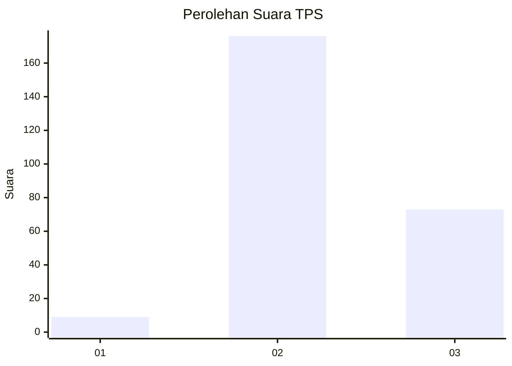
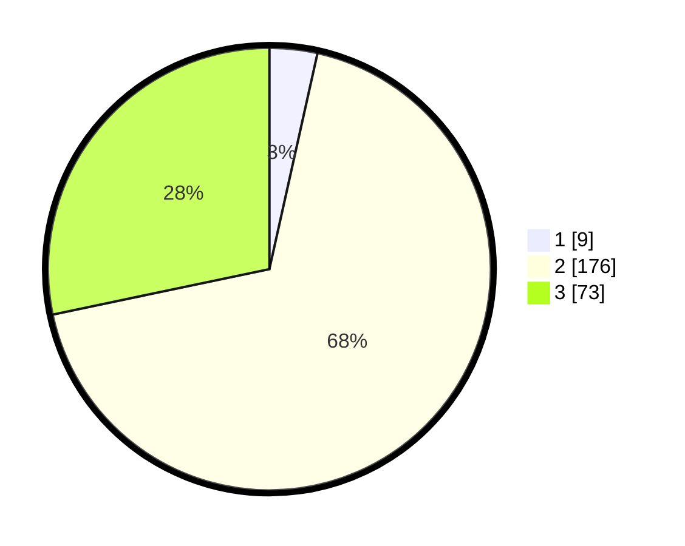

# Hasil

## Grafik

## Tabel

| No. | Nama Paslon    | Suara | Suara (raw) | Persentase |
|:--- |:-------------- | -----:| -----------:| ----------:|
| 1   | ANIES MUHAIMIN | 9     | [9][p-1]    | 3,49       |
| 2   | PRABOWO GIBRAN | 176   | [176][p-2]  | 68,22      |
| 3   | GANJAR MAHFUD  | 73    | [73][p-3]   | 28,29      |

[p-1]: https://github.com/gigit-pemilu/pemilu-2024-51-bali/blob/main/pilpres/hitung-suara/sub/51-bali/sub/04-gianyar/sub/03-gianyar/sub/1006-gianyar/sub/002-tps/sub/paslon-1.txt
[p-2]: https://github.com/gigit-pemilu/pemilu-2024-51-bali/blob/main/pilpres/hitung-suara/sub/51-bali/sub/04-gianyar/sub/03-gianyar/sub/1006-gianyar/sub/002-tps/sub/paslon-2.txt
[p-3]: https://github.com/gigit-pemilu/pemilu-2024-51-bali/blob/main/pilpres/hitung-suara/sub/51-bali/sub/04-gianyar/sub/03-gianyar/sub/1006-gianyar/sub/002-tps/sub/paslon-3.txt

## Foto C Plano

https://sirekap-obj-formc.kpu.go.id/cfa8/pemilu/ppwp/51/04/03/10/06/5104031006002-20240216-020403--ff797c38-88b5-4543-be34-90e7ff6e2a11.jpg

https://sirekap-obj-formc.kpu.go.id/cfa8/pemilu/ppwp/51/04/03/10/06/5104031006002-20240216-051817--a4a3a5c0-a004-4224-ac66-89f1a262fb0e.jpg

https://sirekap-obj-formc.kpu.go.id/cfa8/pemilu/ppwp/51/04/03/10/06/5104031006002-20240216-020406--92ce509c-b75d-4a2f-861a-6a66b4486fd8.jpg

## Metadata

| Key        | Value               |
| ---------- | ------------------- |
| Time Stamp | 2024-02-16 10:30:29 |

## DATA PEMILIH TETAP

Jumlah pemilih dalam DPT: **294**.
 * L: **145**.
 * P: **149**.

## DATA PENGGUNA HAK PILIH

Jumlah pengguna hak pilih dalam DPT: **265**.
 * L: **134**.
 * P: **131**.

Jumlah pengguna hak pilih dalam DPTb: **3**.
 * L: **2**.
 * P: **1**.

Jumlah pengguna hak pilih dalam DPK: **0**.
 * L: **0**.
 * P: **0**.

Jumlah pengguna hak pilih: **268**.
 * L: **136**.
 * P: **132**.

## JUMLAH SUARA SAH DAN TIDAK SAH

JUMLAH SELURUH SUARA SAH: **258**.

JUMLAH SUARA TIDAK SAH: **10**.

JUMLAH SELURUH SUARA SAH DAN SUARA TIDAK SAH: **268**.

