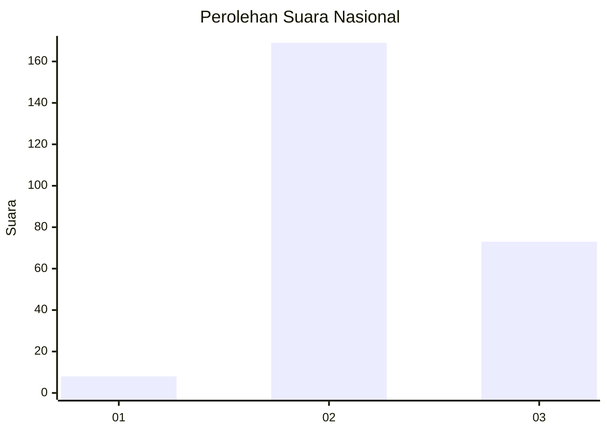

# Hasil

## Grafik

## Tabel

| No. | Nama Paslon    | Suara | Suara (raw) | Persentase |
|:--- |:-------------- | -----:| -----------:| ----------:|
| 1   | ANIES MUHAIMIN | 8     | [8][p-1]    | 3,20       |
| 2   | PRABOWO GIBRAN | 169   | [169][p-2]  | 67,60      |
| 3   | GANJAR MAHFUD  | 73    | [73][p-3]   | 29,20      |

[p-1]: https://github.com/gigit-pemilu/pemilu-2024/blob/main/pilpres/hitung-suara/sub/51-bali/sub/04-gianyar/sub/03-gianyar/sub/1006-gianyar/sub/003-tps/sub/paslon-1.txt
[p-2]: https://github.com/gigit-pemilu/pemilu-2024/blob/main/pilpres/hitung-suara/sub/51-bali/sub/04-gianyar/sub/03-gianyar/sub/1006-gianyar/sub/003-tps/sub/paslon-2.txt
[p-3]: https://github.com/gigit-pemilu/pemilu-2024/blob/main/pilpres/hitung-suara/sub/51-bali/sub/04-gianyar/sub/03-gianyar/sub/1006-gianyar/sub/003-tps/sub/paslon-3.txt

## Foto C Plano

https://sirekap-obj-formc.kpu.go.id/9785/pemilu/ppwp/51/04/03/10/06/5104031006003-20240215-205656--205f9992-0789-4fc4-901a-d68c4335bed1.jpg

https://sirekap-obj-formc.kpu.go.id/9785/pemilu/ppwp/51/04/03/10/06/5104031006003-20240215-205659--2f157d44-78a7-4572-a035-cccf26a533c7.jpg

https://sirekap-obj-formc.kpu.go.id/9785/pemilu/ppwp/51/04/03/10/06/5104031006003-20240215-205658--7b82e630-7362-4d76-90a9-6f00992eaa54.jpg

## Metadata

| Key        | Value               |
| ---------- | ------------------- |
| Time Stamp | 2024-02-15 23:29:50 |

## DATA PEMILIH TETAP

Jumlah pemilih dalam DPT: **288**.
 * L: **145**.
 * P: **143**.

## DATA PENGGUNA HAK PILIH

Jumlah pengguna hak pilih dalam DPT: **258**.
 * L: **130**.
 * P: **128**.

Jumlah pengguna hak pilih dalam DPTb: **3**.
 * L: **1**.
 * P: **2**.

Jumlah pengguna hak pilih dalam DPK: **1**.
 * L: **0**.
 * P: **1**.

Jumlah pengguna hak pilih: **262**.
 * L: **131**.
 * P: **131**.

## JUMLAH SUARA SAH DAN TIDAK SAH

JUMLAH SELURUH SUARA SAH: **250**.

JUMLAH SUARA TIDAK SAH: **12**.

JUMLAH SELURUH SUARA SAH DAN SUARA TIDAK SAH: **262**.

