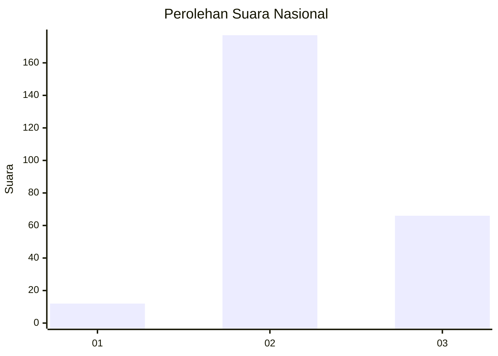
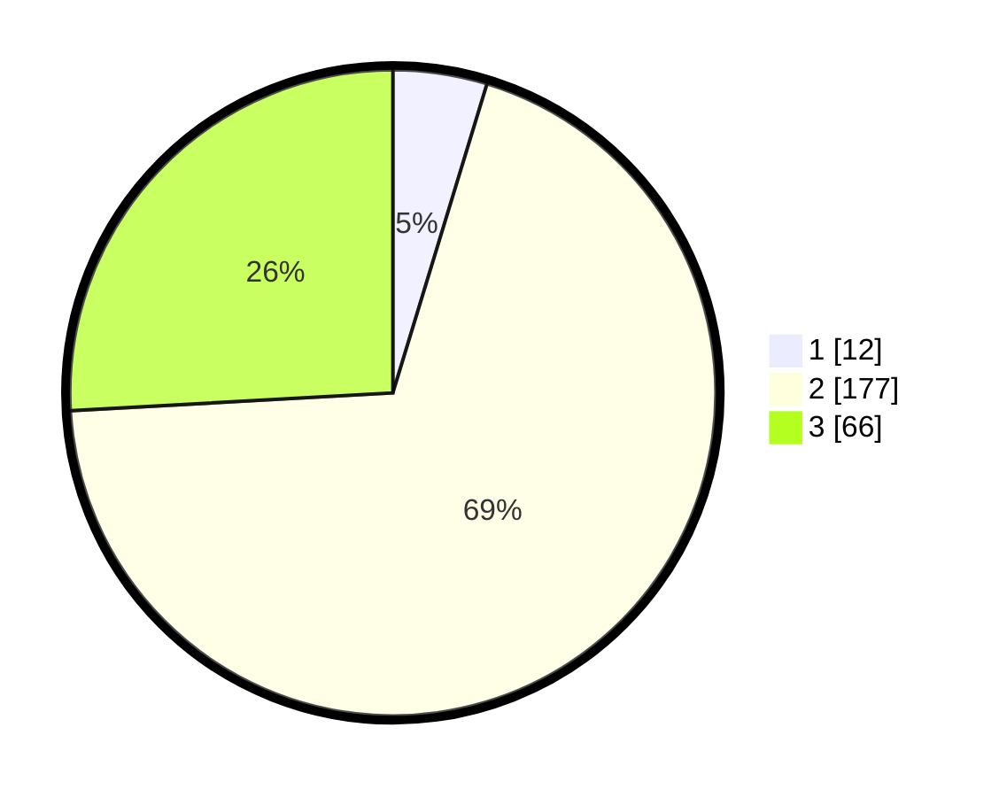

# Hasil

## Grafik

## Tabel

| No. | Nama Paslon    | Suara | Suara (raw) | Persentase |
|:--- |:-------------- | -----:| -----------:| ----------:|
| 1   | ANIES MUHAIMIN | 12    | [12][p-1]   | 4,71       |
| 2   | PRABOWO GIBRAN | 177   | [177][p-2]  | 69,41      |
| 3   | GANJAR MAHFUD  | 66    | [66][p-3]   | 25,88      |

[p-1]: https://github.com/gigit-pemilu/pemilu-2024/blob/main/pilpres/hitung-suara/sub/51-bali/sub/04-gianyar/sub/03-gianyar/sub/1006-gianyar/sub/004-tps/sub/paslon-1.txt
[p-2]: https://github.com/gigit-pemilu/pemilu-2024/blob/main/pilpres/hitung-suara/sub/51-bali/sub/04-gianyar/sub/03-gianyar/sub/1006-gianyar/sub/004-tps/sub/paslon-2.txt
[p-3]: https://github.com/gigit-pemilu/pemilu-2024/blob/main/pilpres/hitung-suara/sub/51-bali/sub/04-gianyar/sub/03-gianyar/sub/1006-gianyar/sub/004-tps/sub/paslon-3.txt

## Foto C Plano

https://sirekap-obj-formc.kpu.go.id/1efd/pemilu/ppwp/51/04/03/10/06/5104031006004-20240217-081910--edf0a2b7-1974-409b-895d-e75c6700c981.jpg

https://sirekap-obj-formc.kpu.go.id/1efd/pemilu/ppwp/51/04/03/10/06/5104031006004-20240217-081911--b30d6a8a-2790-42f8-b2c4-495643cd2897.jpg

https://sirekap-obj-formc.kpu.go.id/1efd/pemilu/ppwp/51/04/03/10/06/5104031006004-20240217-081910--69342f80-d844-49a7-94d0-8343057af7de.jpg

## Metadata

| Key        | Value               |
| ---------- | ------------------- |
| Time Stamp | 2024-02-17 16:52:47 |

## DATA PEMILIH TETAP

Jumlah pemilih dalam DPT: **291**.
 * L: **145**.
 * P: **146**.

## DATA PENGGUNA HAK PILIH

Jumlah pengguna hak pilih dalam DPT: **259**.
 * L: **125**.
 * P: **134**.

Jumlah pengguna hak pilih dalam DPTb: **2**.
 * L: **1**.
 * P: **1**.

Jumlah pengguna hak pilih dalam DPK: **1**.
 * L: **1**.
 * P: **0**.

Jumlah pengguna hak pilih: **262**.
 * L: **127**.
 * P: **135**.

## JUMLAH SUARA SAH DAN TIDAK SAH

JUMLAH SELURUH SUARA SAH: **255**.

JUMLAH SUARA TIDAK SAH: **7**.

JUMLAH SELURUH SUARA SAH DAN SUARA TIDAK SAH: **262**.

