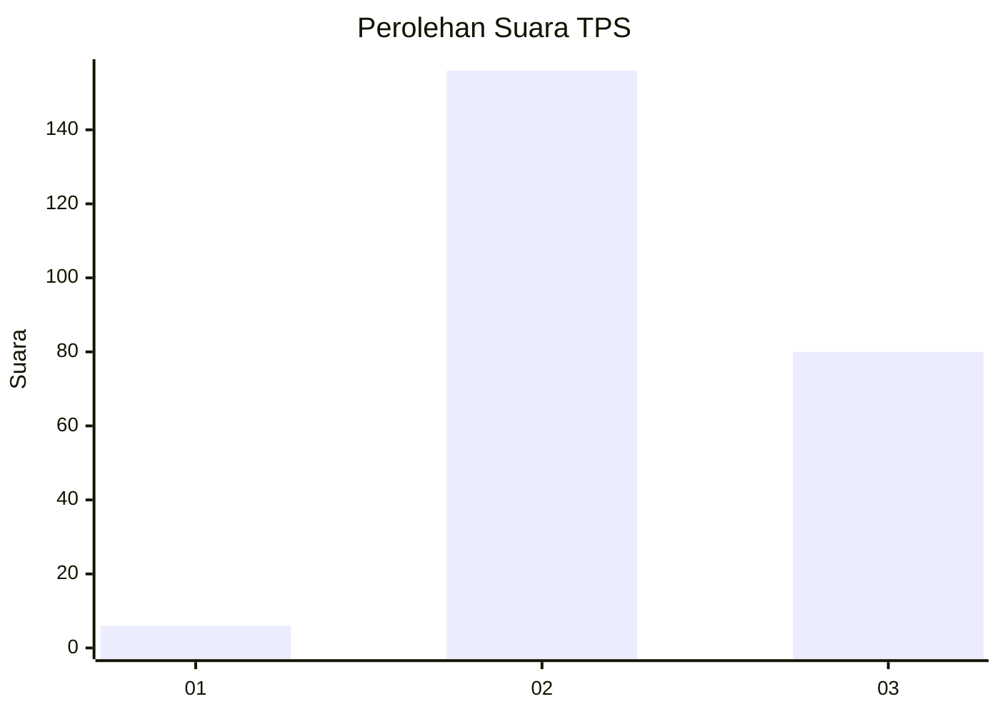
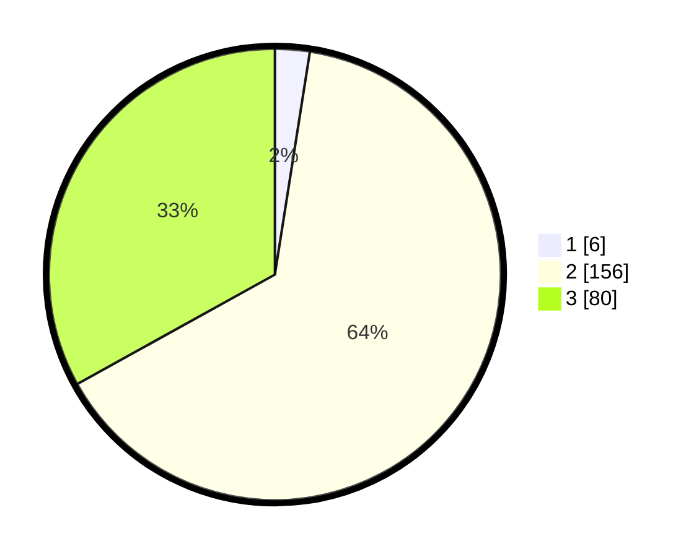

# Hasil

## Grafik

## Tabel

| No. | Nama Paslon    | Suara | Suara (raw) | Persentase |
|:--- |:-------------- | -----:| -----------:| ----------:|
| 1   | ANIES MUHAIMIN | 6     | [6][p-1]    | 2,48       |
| 2   | PRABOWO GIBRAN | 156   | [156][p-2]  | 64,46      |
| 3   | GANJAR MAHFUD  | 80    | [80][p-3]   | 33,06      |

[p-1]: https://github.com/gigit-pemilu/pemilu-2024-51-bali/blob/main/pilpres/hitung-suara/sub/51-bali/sub/04-gianyar/sub/03-gianyar/sub/1006-gianyar/sub/007-tps/sub/paslon-1.txt
[p-2]: https://github.com/gigit-pemilu/pemilu-2024-51-bali/blob/main/pilpres/hitung-suara/sub/51-bali/sub/04-gianyar/sub/03-gianyar/sub/1006-gianyar/sub/007-tps/sub/paslon-2.txt
[p-3]: https://github.com/gigit-pemilu/pemilu-2024-51-bali/blob/main/pilpres/hitung-suara/sub/51-bali/sub/04-gianyar/sub/03-gianyar/sub/1006-gianyar/sub/007-tps/sub/paslon-3.txt

## Foto C Plano

https://sirekap-obj-formc.kpu.go.id/9919/pemilu/ppwp/51/04/03/10/06/5104031006007-20240214-233758--7e89dd81-7750-4e58-a9a9-afb3fe8c763e.jpg

https://sirekap-obj-formc.kpu.go.id/9919/pemilu/ppwp/51/04/03/10/06/5104031006007-20240214-234033--46b41bfd-397f-4f8f-ab5d-2c6581ff3d41.jpg

https://sirekap-obj-formc.kpu.go.id/9919/pemilu/ppwp/51/04/03/10/06/5104031006007-20240214-234143--a954d5a9-21b6-41cb-9f4b-968d587d0b25.jpg

## Metadata

| Key        | Value               |
| ---------- | ------------------- |
| Time Stamp | 2024-02-15 15:30:25 |

