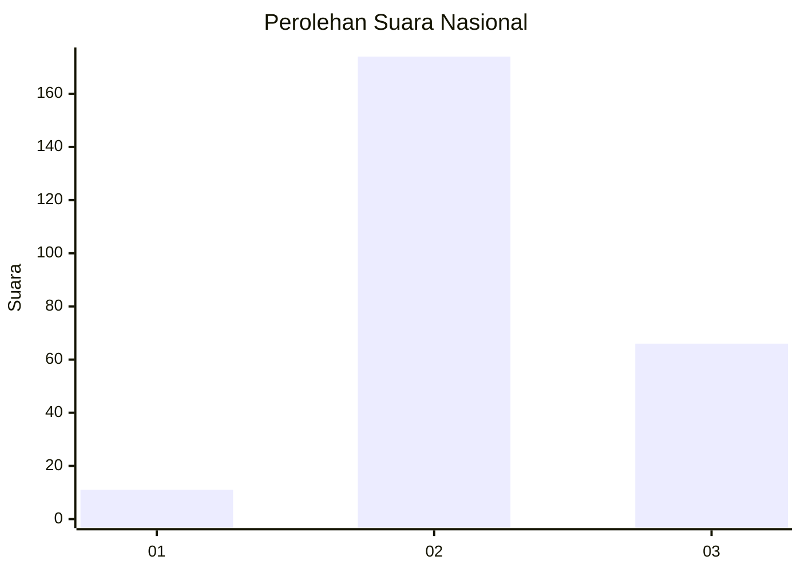

# Hasil

## Grafik

## Tabel

| No. | Nama Paslon    | Suara | Suara (raw) | Persentase |
|:--- |:-------------- | -----:| -----------:| ----------:|
| 1   | ANIES MUHAIMIN | 11    | [11][p-1]   | 4,38       |
| 2   | PRABOWO GIBRAN | 174   | [174][p-2]  | 69,32      |
| 3   | GANJAR MAHFUD  | 66    | [66][p-3]   | 26,29      |

[p-1]: https://github.com/gigit-pemilu/pemilu-2024/blob/main/pilpres/hitung-suara/sub/51-bali/sub/04-gianyar/sub/03-gianyar/sub/1006-gianyar/sub/013-tps/sub/paslon-1.txt
[p-2]: https://github.com/gigit-pemilu/pemilu-2024/blob/main/pilpres/hitung-suara/sub/51-bali/sub/04-gianyar/sub/03-gianyar/sub/1006-gianyar/sub/013-tps/sub/paslon-2.txt
[p-3]: https://github.com/gigit-pemilu/pemilu-2024/blob/main/pilpres/hitung-suara/sub/51-bali/sub/04-gianyar/sub/03-gianyar/sub/1006-gianyar/sub/013-tps/sub/paslon-3.txt

## Foto C Plano

https://sirekap-obj-formc.kpu.go.id/551f/pemilu/ppwp/51/04/03/10/06/5104031006013-20240217-083528--6ea8eb49-5503-4c80-9df4-5228fcb7fd59.jpg

https://sirekap-obj-formc.kpu.go.id/551f/pemilu/ppwp/51/04/03/10/06/5104031006013-20240217-083529--cd37d3dd-f486-4330-99f1-9f159dffc0e1.jpg

https://sirekap-obj-formc.kpu.go.id/551f/pemilu/ppwp/51/04/03/10/06/5104031006013-20240217-083528--62842ca8-d74b-469b-9b0b-e1043bc8bb70.jpg

## Metadata

| Key        | Value               |
| ---------- | ------------------- |
| Time Stamp | 2024-02-17 17:30:00 |

## DATA PEMILIH TETAP

Jumlah pemilih dalam DPT: **294**.
 * L: **142**.
 * P: **152**.

## DATA PENGGUNA HAK PILIH

Jumlah pengguna hak pilih dalam DPT: **250**.
 * L: **124**.
 * P: **126**.

Jumlah pengguna hak pilih dalam DPTb: **0**.
 * L: **0**.
 * P: **0**.

Jumlah pengguna hak pilih dalam DPK: **8**.
 * L: **3**.
 * P: **5**.

Jumlah pengguna hak pilih: **258**.
 * L: **127**.
 * P: **131**.

## JUMLAH SUARA SAH DAN TIDAK SAH

JUMLAH SELURUH SUARA SAH: **251**.

JUMLAH SUARA TIDAK SAH: **7**.

JUMLAH SELURUH SUARA SAH DAN SUARA TIDAK SAH: **258**.

