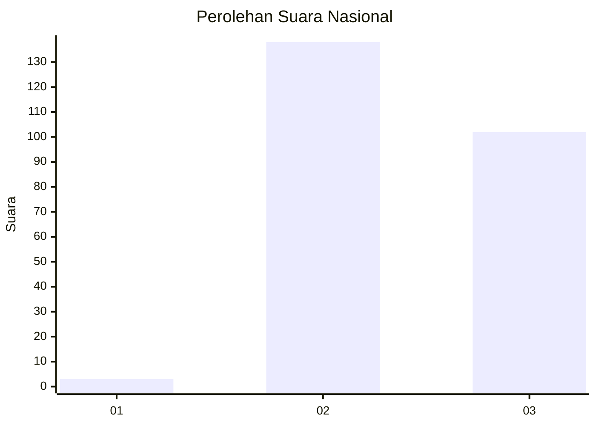
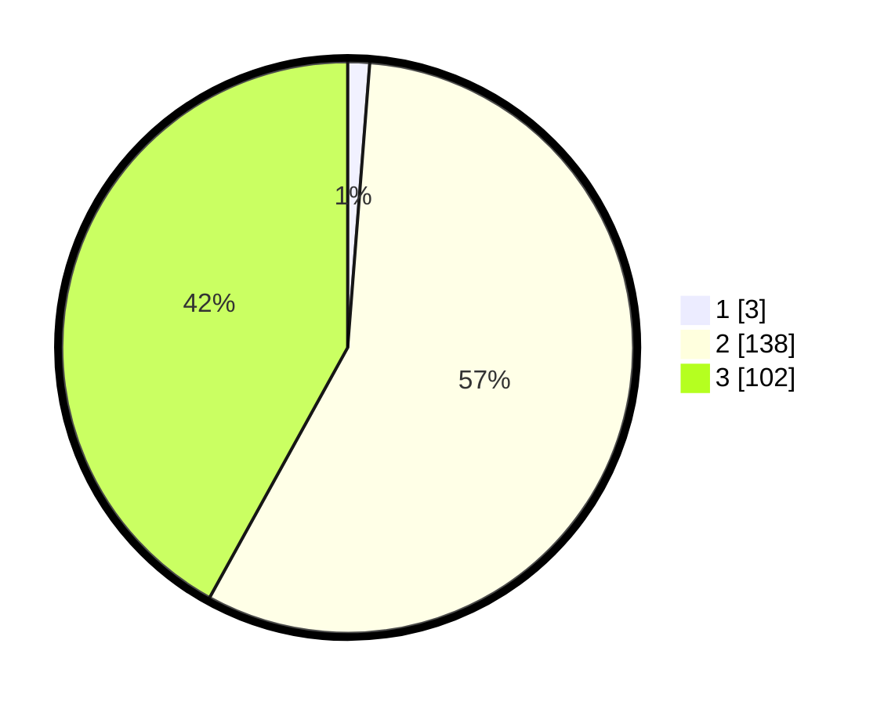

# Hasil

## Grafik

## Tabel

| No. | Nama Paslon    | Suara | Suara (raw) | Persentase |
|:--- |:-------------- | -----:| -----------:| ----------:|
| 1   | ANIES MUHAIMIN | 3     | [3][p-1]    | 1,23       |
| 2   | PRABOWO GIBRAN | 138   | [138][p-2]  | 56,79      |
| 3   | GANJAR MAHFUD  | 102   | [102][p-3]  | 41,98      |

[p-1]: https://github.com/gigit-pemilu/pemilu-2024/blob/main/pilpres/hitung-suara/sub/51-bali/sub/04-gianyar/sub/03-gianyar/sub/1006-gianyar/sub/016-tps/sub/paslon-1.txt
[p-2]: https://github.com/gigit-pemilu/pemilu-2024/blob/main/pilpres/hitung-suara/sub/51-bali/sub/04-gianyar/sub/03-gianyar/sub/1006-gianyar/sub/016-tps/sub/paslon-2.txt
[p-3]: https://github.com/gigit-pemilu/pemilu-2024/blob/main/pilpres/hitung-suara/sub/51-bali/sub/04-gianyar/sub/03-gianyar/sub/1006-gianyar/sub/016-tps/sub/paslon-3.txt

## Foto C Plano

https://sirekap-obj-formc.kpu.go.id/910c/pemilu/ppwp/51/04/03/10/06/5104031006016-20240214-140932--d61cf9e4-76a2-430a-a7e0-cc0443082cf3.jpg

https://sirekap-obj-formc.kpu.go.id/910c/pemilu/ppwp/51/04/03/10/06/5104031006016-20240214-141538--bca6bcfd-4711-4abe-a0cc-bbbc680b678a.jpg

https://sirekap-obj-formc.kpu.go.id/910c/pemilu/ppwp/51/04/03/10/06/5104031006016-20240217-084052--cfa878c2-5ee2-4e84-8f1f-3e8f84752358.jpg

## Metadata

| Key        | Value               |
| ---------- | ------------------- |
| Time Stamp | 2024-02-17 09:00:02 |

## DATA PEMILIH TETAP

Jumlah pemilih dalam DPT: **295**.
 * L: **150**.
 * P: **145**.

## DATA PENGGUNA HAK PILIH

Jumlah pengguna hak pilih dalam DPT: **245**.
 * L: **125**.
 * P: **120**.

Jumlah pengguna hak pilih dalam DPTb: **3**.
 * L: **2**.
 * P: **1**.

Jumlah pengguna hak pilih dalam DPK: **1**.
 * L: **0**.
 * P: **1**.

Jumlah pengguna hak pilih: **249**.
 * L: **127**.
 * P: **122**.

## JUMLAH SUARA SAH DAN TIDAK SAH

JUMLAH SELURUH SUARA SAH: **243**.

JUMLAH SUARA TIDAK SAH: **6**.

JUMLAH SELURUH SUARA SAH DAN SUARA TIDAK SAH: **249**.

