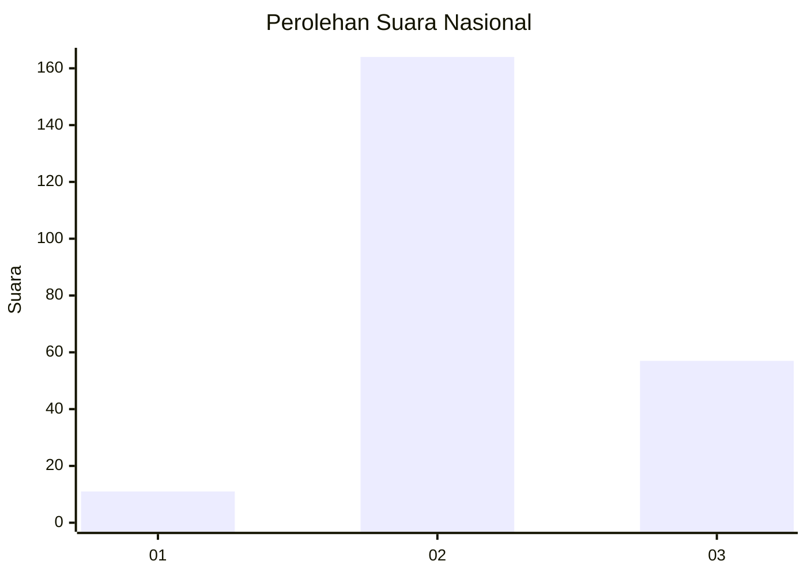
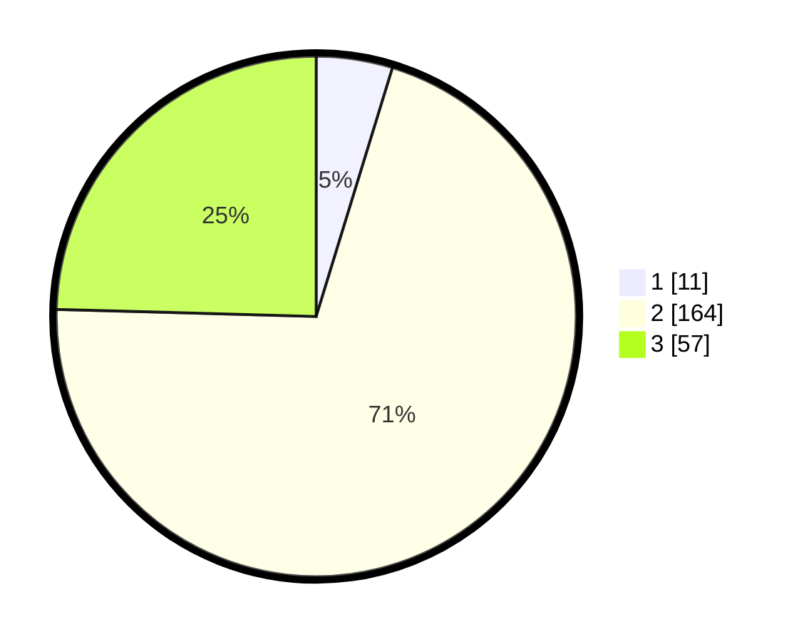

# Hasil

## Grafik

## Tabel

| No. | Nama Paslon    | Suara | Suara (raw) | Persentase |
|:--- |:-------------- | -----:| -----------:| ----------:|
| 1   | ANIES MUHAIMIN | 11    | [11][p-1]   | 4,74       |
| 2   | PRABOWO GIBRAN | 164   | [164][p-2]  | 70,69      |
| 3   | GANJAR MAHFUD  | 57    | [57][p-3]   | 24,57      |

[p-1]: https://github.com/gigit-pemilu/pemilu-2024/blob/main/pilpres/hitung-suara/sub/51-bali/sub/04-gianyar/sub/03-gianyar/sub/1006-gianyar/sub/022-tps/sub/paslon-1.txt
[p-2]: https://github.com/gigit-pemilu/pemilu-2024/blob/main/pilpres/hitung-suara/sub/51-bali/sub/04-gianyar/sub/03-gianyar/sub/1006-gianyar/sub/022-tps/sub/paslon-2.txt
[p-3]: https://github.com/gigit-pemilu/pemilu-2024/blob/main/pilpres/hitung-suara/sub/51-bali/sub/04-gianyar/sub/03-gianyar/sub/1006-gianyar/sub/022-tps/sub/paslon-3.txt

## Foto C Plano

https://sirekap-obj-formc.kpu.go.id/278a/pemilu/ppwp/51/04/03/10/06/5104031006022-20240216-053631--64a47b15-1777-4c5b-a604-9a03e3119fe9.jpg

https://sirekap-obj-formc.kpu.go.id/278a/pemilu/ppwp/51/04/03/10/06/5104031006022-20240216-053644--2c0b7dde-02ba-4d3b-b93e-788e8beb2ef4.jpg

https://sirekap-obj-formc.kpu.go.id/278a/pemilu/ppwp/51/04/03/10/06/5104031006022-20240216-053639--0e9e47a7-6274-4869-b699-d6c72f34efb9.jpg

## Metadata

| Key        | Value               |
| ---------- | ------------------- |
| Time Stamp | 2024-02-16 10:30:29 |

## DATA PEMILIH TETAP

Jumlah pemilih dalam DPT: **287**.
 * L: **139**.
 * P: **148**.

## DATA PENGGUNA HAK PILIH

Jumlah pengguna hak pilih dalam DPT: **222**.
 * L: **107**.
 * P: **115**.

Jumlah pengguna hak pilih dalam DPTb: **5**.
 * L: **0**.
 * P: **5**.

Jumlah pengguna hak pilih dalam DPK: **5**.
 * L: **0**.
 * P: **5**.

Jumlah pengguna hak pilih: **232**.
 * L: **107**.
 * P: **125**.

## JUMLAH SUARA SAH DAN TIDAK SAH

JUMLAH SELURUH SUARA SAH: **232**.

JUMLAH SUARA TIDAK SAH: **0**.

JUMLAH SELURUH SUARA SAH DAN SUARA TIDAK SAH: **232**.

