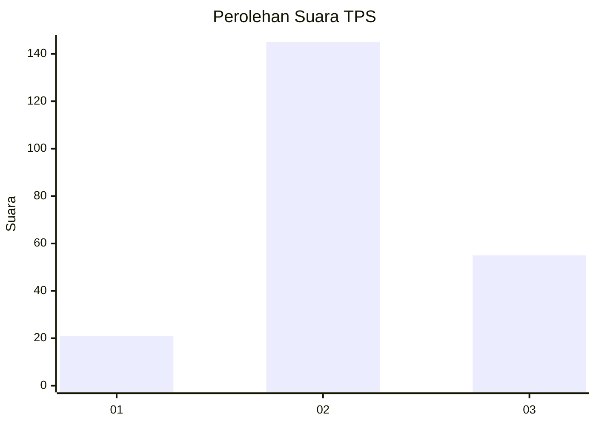
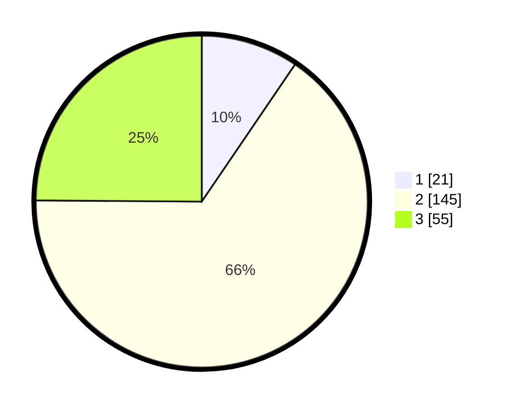

# Hasil

## Grafik

## Tabel

| No. | Nama Paslon    | Suara | Suara (raw) | Persentase |
|:--- |:-------------- | -----:| -----------:| ----------:|
| 1   | ANIES MUHAIMIN | 21    | [21][p-1]   | 9,50       |
| 2   | PRABOWO GIBRAN | 145   | [145][p-2]  | 65,61      |
| 3   | GANJAR MAHFUD  | 55    | [55][p-3]   | 24,89      |

[p-1]: https://github.com/gigit-pemilu/pemilu-2024-51-bali/blob/main/pilpres/hitung-suara/sub/51-bali/sub/04-gianyar/sub/03-gianyar/sub/1006-gianyar/sub/026-tps/sub/paslon-1.txt
[p-2]: https://github.com/gigit-pemilu/pemilu-2024-51-bali/blob/main/pilpres/hitung-suara/sub/51-bali/sub/04-gianyar/sub/03-gianyar/sub/1006-gianyar/sub/026-tps/sub/paslon-2.txt
[p-3]: https://github.com/gigit-pemilu/pemilu-2024-51-bali/blob/main/pilpres/hitung-suara/sub/51-bali/sub/04-gianyar/sub/03-gianyar/sub/1006-gianyar/sub/026-tps/sub/paslon-3.txt

## Foto C Plano

https://sirekap-obj-formc.kpu.go.id/7a45/pemilu/ppwp/51/04/03/10/06/5104031006026-20240215-185526--bf4095f9-d674-42b3-b160-74683e90c07c.jpg

https://sirekap-obj-formc.kpu.go.id/7a45/pemilu/ppwp/51/04/03/10/06/5104031006026-20240215-185549--e25dc6cc-89c2-4af4-be12-e566394b2d79.jpg

https://sirekap-obj-formc.kpu.go.id/7a45/pemilu/ppwp/51/04/03/10/06/5104031006026-20240215-185538--e12f254f-1fb9-44b6-82b3-652f9d396a4b.jpg

## Metadata

| Key        | Value               |
| ---------- | ------------------- |
| Time Stamp | 2024-02-15 19:30:26 |

## DATA PEMILIH TETAP

Jumlah pemilih dalam DPT: **287**.
 * L: **130**.
 * P: **157**.

## DATA PENGGUNA HAK PILIH

Jumlah pengguna hak pilih dalam DPT: **220**.
 * L: **97**.
 * P: **123**.

Jumlah pengguna hak pilih dalam DPTb: **6**.
 * L: **5**.
 * P: **1**.

Jumlah pengguna hak pilih dalam DPK: **0**.
 * L: **0**.
 * P: **0**.

Jumlah pengguna hak pilih: **226**.
 * L: **220**.
 * P: **6**.

## JUMLAH SUARA SAH DAN TIDAK SAH

JUMLAH SELURUH SUARA SAH: **221**.

JUMLAH SUARA TIDAK SAH: **5**.

JUMLAH SELURUH SUARA SAH DAN SUARA TIDAK SAH: **226**.

