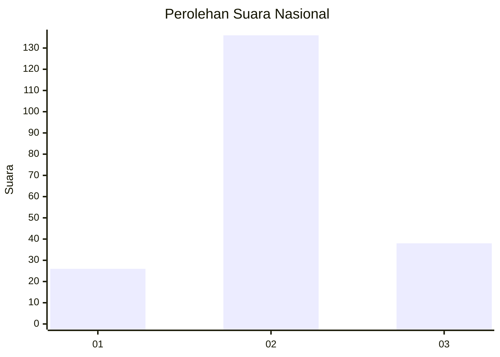
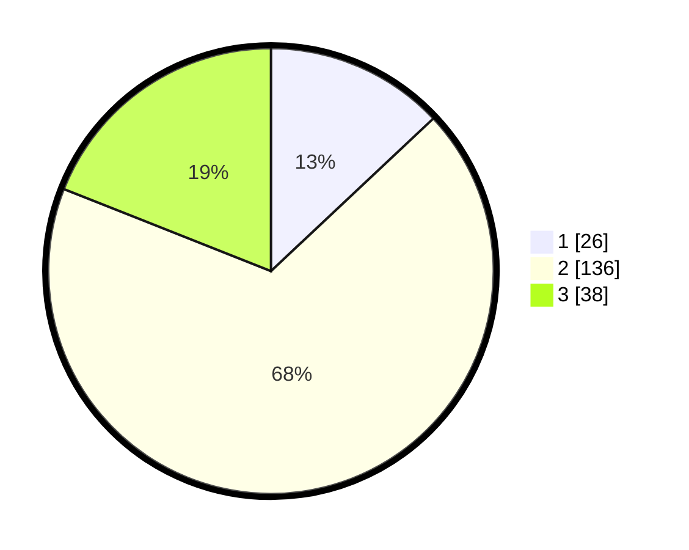

# Hasil

## Grafik

## Tabel

| No. | Nama Paslon    | Suara | Suara (raw) | Persentase |
|:--- |:-------------- | -----:| -----------:| ----------:|
| 1   | ANIES MUHAIMIN | 26    | [26][p-1]   | 13,00      |
| 2   | PRABOWO GIBRAN | 136   | [136][p-2]  | 68,00      |
| 3   | GANJAR MAHFUD  | 38    | [38][p-3]   | 19,00      |

[p-1]: https://github.com/gigit-pemilu/pemilu-2024/blob/main/pilpres/hitung-suara/sub/51-bali/sub/04-gianyar/sub/03-gianyar/sub/1006-gianyar/sub/030-tps/sub/paslon-1.txt
[p-2]: https://github.com/gigit-pemilu/pemilu-2024/blob/main/pilpres/hitung-suara/sub/51-bali/sub/04-gianyar/sub/03-gianyar/sub/1006-gianyar/sub/030-tps/sub/paslon-2.txt
[p-3]: https://github.com/gigit-pemilu/pemilu-2024/blob/main/pilpres/hitung-suara/sub/51-bali/sub/04-gianyar/sub/03-gianyar/sub/1006-gianyar/sub/030-tps/sub/paslon-3.txt

## Foto C Plano

https://sirekap-obj-formc.kpu.go.id/4fd2/pemilu/ppwp/51/04/03/10/06/5104031006030-20240216-120416--9368b5c5-8afe-4737-9f32-ca2cc1a2040d.jpg

https://sirekap-obj-formc.kpu.go.id/4fd2/pemilu/ppwp/51/04/03/10/06/5104031006030-20240216-120418--11dbbd64-a66b-47cd-a5a0-193a0c09dc2b.jpg

https://sirekap-obj-formc.kpu.go.id/4fd2/pemilu/ppwp/51/04/03/10/06/5104031006030-20240216-120417--09eca3fe-d4bc-4b23-9091-18668900de67.jpg

## Metadata

| Key        | Value               |
| ---------- | ------------------- |
| Time Stamp | 2024-02-16 14:30:33 |

## DATA PEMILIH TETAP

Jumlah pemilih dalam DPT: **285**.
 * L: **132**.
 * P: **153**.

## DATA PENGGUNA HAK PILIH

Jumlah pengguna hak pilih dalam DPT: **192**.
 * L: **88**.
 * P: **104**.

Jumlah pengguna hak pilih dalam DPTb: **7**.
 * L: **2**.
 * P: **5**.

Jumlah pengguna hak pilih dalam DPK: **3**.
 * L: **2**.
 * P: **1**.

Jumlah pengguna hak pilih: **202**.
 * L: **92**.
 * P: **110**.

## JUMLAH SUARA SAH DAN TIDAK SAH

JUMLAH SELURUH SUARA SAH: **200**.

JUMLAH SUARA TIDAK SAH: **2**.

JUMLAH SELURUH SUARA SAH DAN SUARA TIDAK SAH: **202**.

