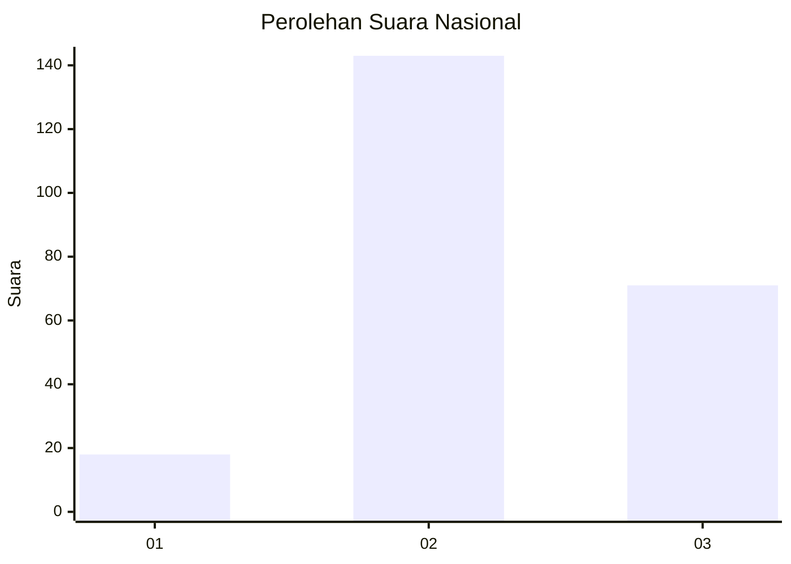
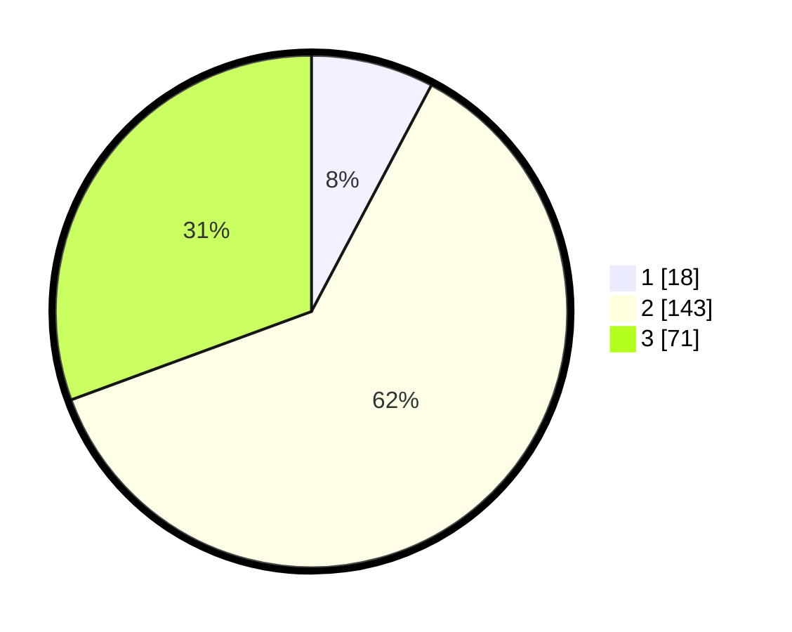

# Hasil

## Grafik

## Tabel

| No. | Nama Paslon    | Suara | Suara (raw) | Persentase |
|:--- |:-------------- | -----:| -----------:| ----------:|
| 1   | ANIES MUHAIMIN | 18    | [18][p-1]   | 7,76       |
| 2   | PRABOWO GIBRAN | 143   | [143][p-2]  | 61,64      |
| 3   | GANJAR MAHFUD  | 71    | [71][p-3]   | 30,60      |

[p-1]: https://github.com/gigit-pemilu/pemilu-2024/blob/main/pilpres/hitung-suara/sub/51-bali/sub/04-gianyar/sub/03-gianyar/sub/1006-gianyar/sub/034-tps/sub/paslon-1.txt
[p-2]: https://github.com/gigit-pemilu/pemilu-2024/blob/main/pilpres/hitung-suara/sub/51-bali/sub/04-gianyar/sub/03-gianyar/sub/1006-gianyar/sub/034-tps/sub/paslon-2.txt
[p-3]: https://github.com/gigit-pemilu/pemilu-2024/blob/main/pilpres/hitung-suara/sub/51-bali/sub/04-gianyar/sub/03-gianyar/sub/1006-gianyar/sub/034-tps/sub/paslon-3.txt

## Foto C Plano

https://sirekap-obj-formc.kpu.go.id/e4f1/pemilu/ppwp/51/04/03/10/06/5104031006034-20240215-222855--6214ee95-b17f-4bed-a908-8b6a0e5c565f.jpg

https://sirekap-obj-formc.kpu.go.id/e4f1/pemilu/ppwp/51/04/03/10/06/5104031006034-20240215-222858--b3e9ae30-fe04-4e49-bf68-1184ac915e2f.jpg

https://sirekap-obj-formc.kpu.go.id/e4f1/pemilu/ppwp/51/04/03/10/06/5104031006034-20240215-222857--7ea43d26-9610-4edd-a166-ad16bd4555e7.jpg

## Metadata

| Key        | Value               |
| ---------- | ------------------- |
| Time Stamp | 2024-02-15 23:29:50 |

## DATA PEMILIH TETAP

Jumlah pemilih dalam DPT: **282**.
 * L: **116**.
 * P: **166**.

## DATA PENGGUNA HAK PILIH

Jumlah pengguna hak pilih dalam DPT: **215**.
 * L: **86**.
 * P: **129**.

Jumlah pengguna hak pilih dalam DPTb: **5**.
 * L: **4**.
 * P: **1**.

Jumlah pengguna hak pilih dalam DPK: **16**.
 * L: **10**.
 * P: **6**.

Jumlah pengguna hak pilih: **236**.
 * L: **100**.
 * P: **136**.

## JUMLAH SUARA SAH DAN TIDAK SAH

JUMLAH SELURUH SUARA SAH: **236**.

JUMLAH SUARA TIDAK SAH: **4**.

JUMLAH SELURUH SUARA SAH DAN SUARA TIDAK SAH: **240**.

