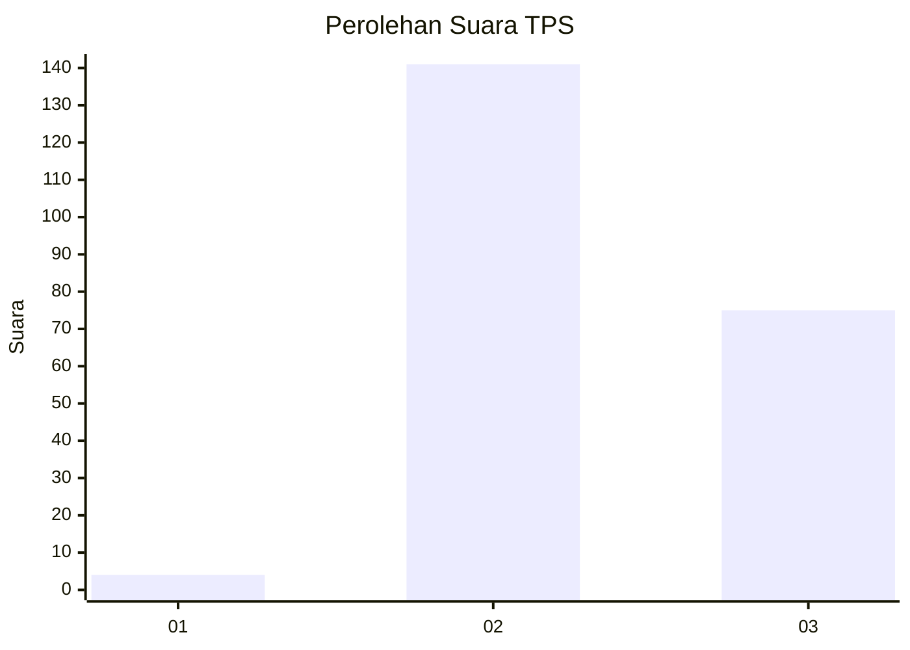
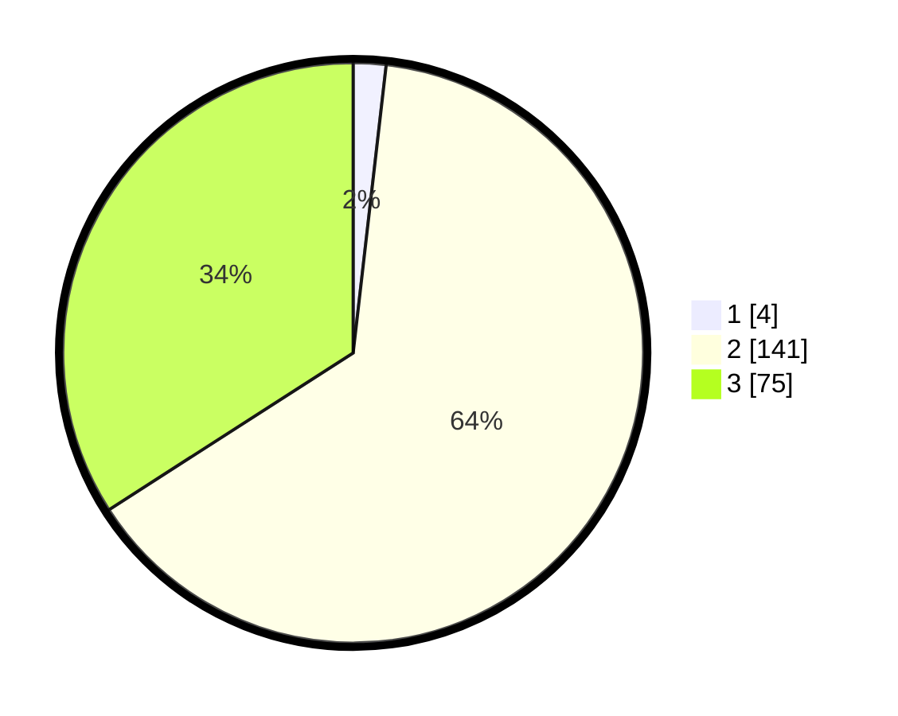

# Hasil

## Grafik

## Tabel

| No. | Nama Paslon    | Suara | Suara (raw) | Persentase |
|:--- |:-------------- | -----:| -----------:| ----------:|
| 1   | ANIES MUHAIMIN | 4     | [4][p-1]    | 1,82       |
| 2   | PRABOWO GIBRAN | 141   | [141][p-2]  | 64,09      |
| 3   | GANJAR MAHFUD  | 75    | [75][p-3]   | 34,09      |

[p-1]: https://github.com/gigit-pemilu/pemilu-2024-51-bali/blob/main/pilpres/hitung-suara/sub/51-bali/sub/04-gianyar/sub/03-gianyar/sub/1006-gianyar/sub/035-tps/sub/paslon-1.txt
[p-2]: https://github.com/gigit-pemilu/pemilu-2024-51-bali/blob/main/pilpres/hitung-suara/sub/51-bali/sub/04-gianyar/sub/03-gianyar/sub/1006-gianyar/sub/035-tps/sub/paslon-2.txt
[p-3]: https://github.com/gigit-pemilu/pemilu-2024-51-bali/blob/main/pilpres/hitung-suara/sub/51-bali/sub/04-gianyar/sub/03-gianyar/sub/1006-gianyar/sub/035-tps/sub/paslon-3.txt

## Foto C Plano

https://sirekap-obj-formc.kpu.go.id/5d50/pemilu/ppwp/51/04/03/10/06/5104031006035-20240215-220146--5eb992fd-60a0-422e-a934-1e20bacd48c6.jpg

https://sirekap-obj-formc.kpu.go.id/5d50/pemilu/ppwp/51/04/03/10/06/5104031006035-20240215-220148--6046cfba-90c5-4f96-9e2f-b31d72f21fa6.jpg

https://sirekap-obj-formc.kpu.go.id/5d50/pemilu/ppwp/51/04/03/10/06/5104031006035-20240215-220148--6e29f7cc-1795-48f7-b073-3c0ba8ea316d.jpg

## Metadata

| Key        | Value               |
| ---------- | ------------------- |
| Time Stamp | 2024-02-15 23:29:50 |

## DATA PEMILIH TETAP

Jumlah pemilih dalam DPT: **276**.
 * L: **131**.
 * P: **145**.

## DATA PENGGUNA HAK PILIH

Jumlah pengguna hak pilih dalam DPT: **212**.
 * L: **104**.
 * P: **108**.

Jumlah pengguna hak pilih dalam DPTb: **2**.
 * L: **1**.
 * P: **1**.

Jumlah pengguna hak pilih dalam DPK: **7**.
 * L: **5**.
 * P: **2**.

Jumlah pengguna hak pilih: **221**.
 * L: **110**.
 * P: **111**.

## JUMLAH SUARA SAH DAN TIDAK SAH

JUMLAH SELURUH SUARA SAH: **220**.

JUMLAH SUARA TIDAK SAH: **1**.

JUMLAH SELURUH SUARA SAH DAN SUARA TIDAK SAH: **221**.

