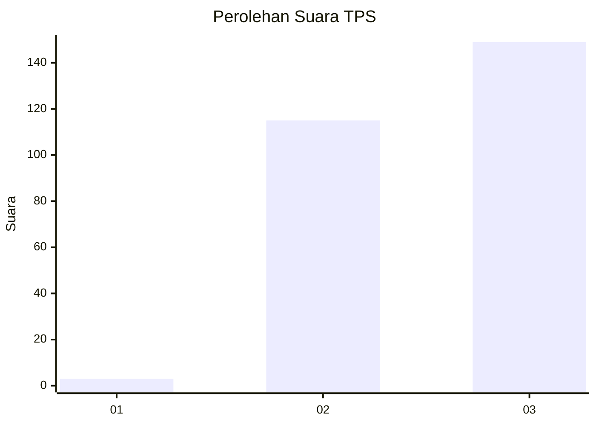
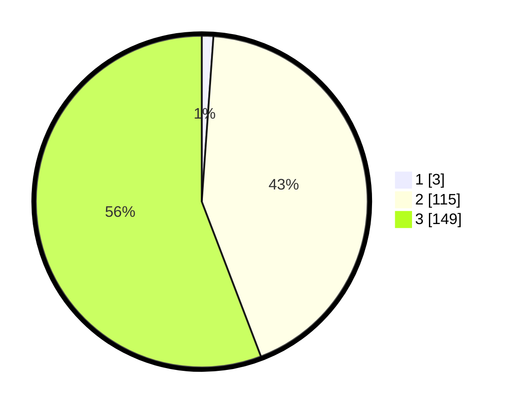

# Hasil

## Grafik

## Tabel

| No. | Nama Paslon    | Suara | Suara (raw) | Persentase |
|:--- |:-------------- | -----:| -----------:| ----------:|
| 1   | ANIES MUHAIMIN | 3     | [3][p-1]    | 1,12       |
| 2   | PRABOWO GIBRAN | 115   | [115][p-2]  | 43,07      |
| 3   | GANJAR MAHFUD  | 149   | [149][p-3]  | 55,81      |

[p-1]: https://github.com/gigit-pemilu/pemilu-2024-51-bali/blob/main/pilpres/hitung-suara/sub/51-bali/sub/04-gianyar/sub/03-gianyar/sub/1007-bitera/sub/001-tps/sub/paslon-1.txt
[p-2]: https://github.com/gigit-pemilu/pemilu-2024-51-bali/blob/main/pilpres/hitung-suara/sub/51-bali/sub/04-gianyar/sub/03-gianyar/sub/1007-bitera/sub/001-tps/sub/paslon-2.txt
[p-3]: https://github.com/gigit-pemilu/pemilu-2024-51-bali/blob/main/pilpres/hitung-suara/sub/51-bali/sub/04-gianyar/sub/03-gianyar/sub/1007-bitera/sub/001-tps/sub/paslon-3.txt

## Foto C Plano

https://sirekap-obj-formc.kpu.go.id/02fd/pemilu/ppwp/51/04/03/10/07/5104031007001-20240216-032650--a38fe539-6a32-4ab1-a4d1-89f27ed57899.jpg

https://sirekap-obj-formc.kpu.go.id/02fd/pemilu/ppwp/51/04/03/10/07/5104031007001-20240216-033029--03d17ae6-bbfd-4423-b9c3-13388cf03890.jpg

https://sirekap-obj-formc.kpu.go.id/02fd/pemilu/ppwp/51/04/03/10/07/5104031007001-20240216-032656--f5118095-0e3d-42a0-8ba6-8b8ee2172d74.jpg

## Metadata

| Key        | Value               |
| ---------- | ------------------- |
| Time Stamp | 2024-02-16 10:30:29 |

## DATA PEMILIH TETAP

Jumlah pemilih dalam DPT: **291**.
 * L: **137**.
 * P: **154**.

## DATA PENGGUNA HAK PILIH

Jumlah pengguna hak pilih dalam DPT: **261**.
 * L: **122**.
 * P: **139**.

Jumlah pengguna hak pilih dalam DPTb: **2**.
 * L: **1**.
 * P: **1**.

Jumlah pengguna hak pilih dalam DPK: **5**.
 * L: **3**.
 * P: **2**.

Jumlah pengguna hak pilih: **268**.
 * L: **126**.
 * P: **142**.

## JUMLAH SUARA SAH DAN TIDAK SAH

JUMLAH SELURUH SUARA SAH: **267**.

JUMLAH SUARA TIDAK SAH: **1**.

JUMLAH SELURUH SUARA SAH DAN SUARA TIDAK SAH: **268**.

