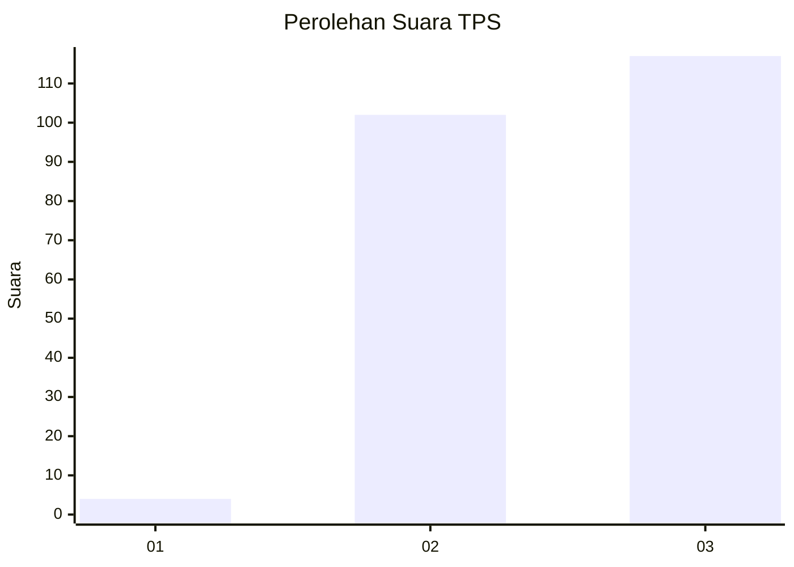
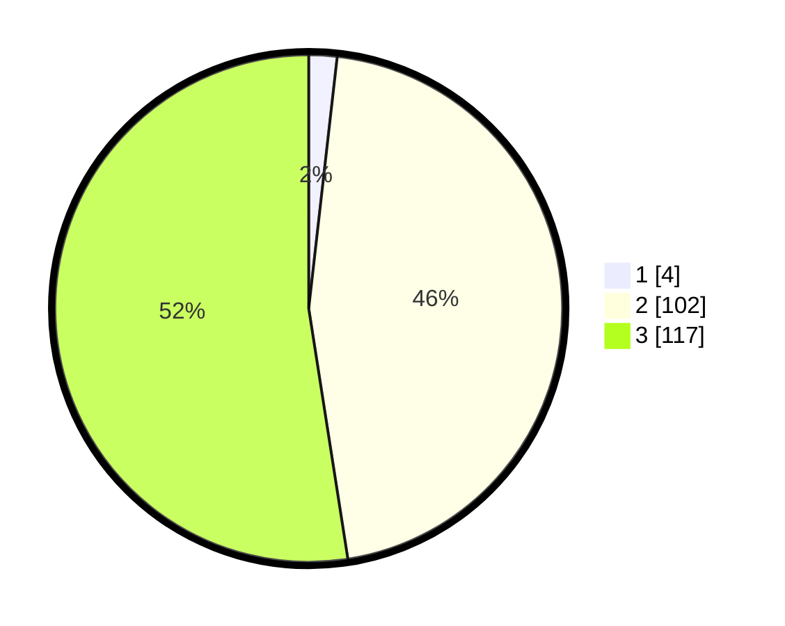

# Hasil

## Grafik

## Tabel

| No. | Nama Paslon    | Suara | Suara (raw) | Persentase |
|:--- |:-------------- | -----:| -----------:| ----------:|
| 1   | ANIES MUHAIMIN | 4     | [4][p-1]    | 1,79       |
| 2   | PRABOWO GIBRAN | 102   | [102][p-2]  | 45,74      |
| 3   | GANJAR MAHFUD  | 117   | [117][p-3]  | 52,47      |

[p-1]: https://github.com/gigit-pemilu/pemilu-2024-51-bali/blob/main/pilpres/hitung-suara/sub/51-bali/sub/04-gianyar/sub/03-gianyar/sub/1007-bitera/sub/004-tps/sub/paslon-1.txt
[p-2]: https://github.com/gigit-pemilu/pemilu-2024-51-bali/blob/main/pilpres/hitung-suara/sub/51-bali/sub/04-gianyar/sub/03-gianyar/sub/1007-bitera/sub/004-tps/sub/paslon-2.txt
[p-3]: https://github.com/gigit-pemilu/pemilu-2024-51-bali/blob/main/pilpres/hitung-suara/sub/51-bali/sub/04-gianyar/sub/03-gianyar/sub/1007-bitera/sub/004-tps/sub/paslon-3.txt

## Foto C Plano

https://sirekap-obj-formc.kpu.go.id/3d69/pemilu/ppwp/51/04/03/10/07/5104031007004-20240214-141330--b3bec016-2935-4929-89c3-1f3e50df7408.jpg

https://sirekap-obj-formc.kpu.go.id/3d69/pemilu/ppwp/51/04/03/10/07/5104031007004-20240214-141402--f85199d2-ad6b-4b29-9d5f-63ed2191e471.jpg

https://sirekap-obj-formc.kpu.go.id/3d69/pemilu/ppwp/51/04/03/10/07/5104031007004-20240216-035428--90622aac-3a9d-4c0c-b0ef-f32ab7bbc2fa.jpg

## Metadata

| Key        | Value               |
| ---------- | ------------------- |
| Time Stamp | 2024-02-16 04:00:27 |

## DATA PEMILIH TETAP

Jumlah pemilih dalam DPT: **248**.
 * L: **122**.
 * P: **126**.

## DATA PENGGUNA HAK PILIH

Jumlah pengguna hak pilih dalam DPT: **226**.
 * L: **111**.
 * P: **115**.

Jumlah pengguna hak pilih dalam DPTb: **0**.
 * L: **0**.
 * P: **0**.

Jumlah pengguna hak pilih dalam DPK: **1**.
 * L: **1**.
 * P: **0**.

Jumlah pengguna hak pilih: **227**.
 * L: **112**.
 * P: **115**.

## JUMLAH SUARA SAH DAN TIDAK SAH

JUMLAH SELURUH SUARA SAH: **223**.

JUMLAH SUARA TIDAK SAH: **4**.

JUMLAH SELURUH SUARA SAH DAN SUARA TIDAK SAH: **227**.

