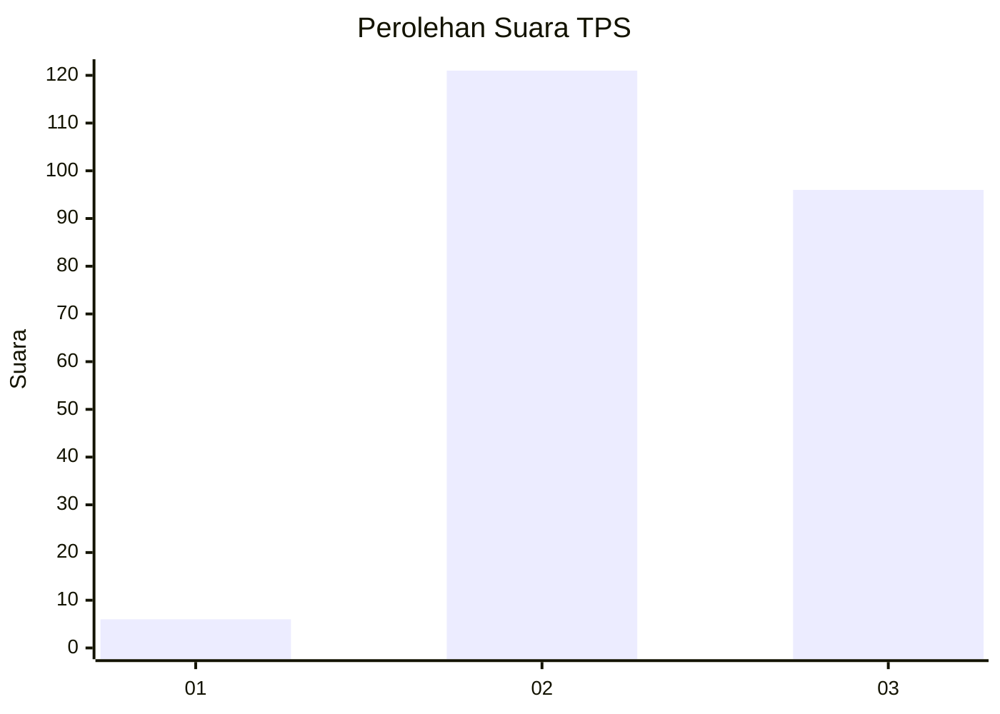
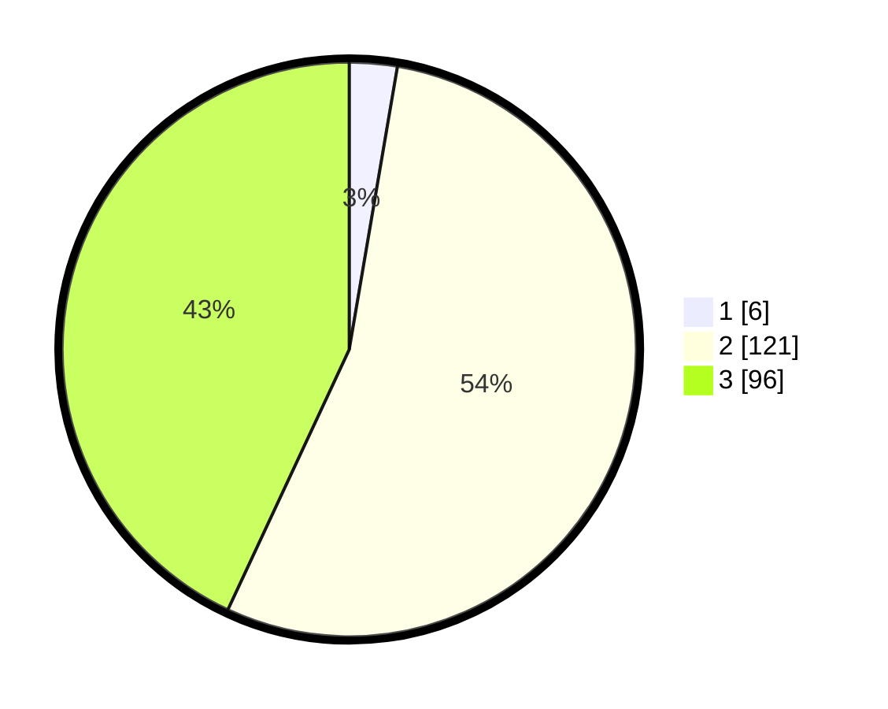

# Hasil

## Grafik

## Tabel

| No. | Nama Paslon    | Suara | Suara (raw) | Persentase |
|:--- |:-------------- | -----:| -----------:| ----------:|
| 1   | ANIES MUHAIMIN | 6     | [6][p-1]    | 2,69       |
| 2   | PRABOWO GIBRAN | 121   | [121][p-2]  | 54,26      |
| 3   | GANJAR MAHFUD  | 96    | [96][p-3]   | 43,05      |

[p-1]: https://github.com/gigit-pemilu/pemilu-2024-51-bali/blob/main/pilpres/hitung-suara/sub/51-bali/sub/04-gianyar/sub/03-gianyar/sub/1007-bitera/sub/007-tps/sub/paslon-1.txt
[p-2]: https://github.com/gigit-pemilu/pemilu-2024-51-bali/blob/main/pilpres/hitung-suara/sub/51-bali/sub/04-gianyar/sub/03-gianyar/sub/1007-bitera/sub/007-tps/sub/paslon-2.txt
[p-3]: https://github.com/gigit-pemilu/pemilu-2024-51-bali/blob/main/pilpres/hitung-suara/sub/51-bali/sub/04-gianyar/sub/03-gianyar/sub/1007-bitera/sub/007-tps/sub/paslon-3.txt

## Foto C Plano

https://sirekap-obj-formc.kpu.go.id/23a6/pemilu/ppwp/51/04/03/10/07/5104031007007-20240214-160123--44f48a32-20c8-4bd4-a358-bc4e3bd96bc6.jpg

https://sirekap-obj-formc.kpu.go.id/23a6/pemilu/ppwp/51/04/03/10/07/5104031007007-20240214-155500--cf33cf88-f6f1-492b-b921-578354beb9bc.jpg

https://sirekap-obj-formc.kpu.go.id/23a6/pemilu/ppwp/51/04/03/10/07/5104031007007-20240214-155709--cf957ff0-9782-4450-abd5-3b242608bca6.jpg

## Metadata

| Key        | Value               |
| ---------- | ------------------- |
| Time Stamp | 2024-02-24 22:31:28 |

