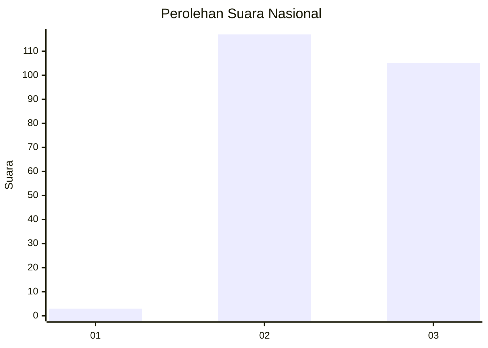
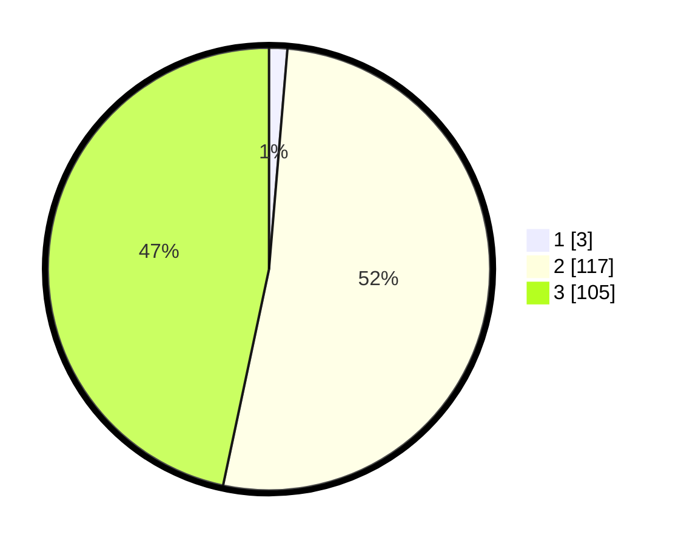

# Hasil

## Grafik

## Tabel

| No. | Nama Paslon    | Suara | Suara (raw) | Persentase |
|:--- |:-------------- | -----:| -----------:| ----------:|
| 1   | ANIES MUHAIMIN | 3     | [3][p-1]    | 1,33       |
| 2   | PRABOWO GIBRAN | 117   | [117][p-2]  | 52,00      |
| 3   | GANJAR MAHFUD  | 105   | [105][p-3]  | 46,67      |

[p-1]: https://github.com/gigit-pemilu/pemilu-2024/blob/main/pilpres/hitung-suara/sub/51-bali/sub/04-gianyar/sub/03-gianyar/sub/1007-bitera/sub/014-tps/sub/paslon-1.txt
[p-2]: https://github.com/gigit-pemilu/pemilu-2024/blob/main/pilpres/hitung-suara/sub/51-bali/sub/04-gianyar/sub/03-gianyar/sub/1007-bitera/sub/014-tps/sub/paslon-2.txt
[p-3]: https://github.com/gigit-pemilu/pemilu-2024/blob/main/pilpres/hitung-suara/sub/51-bali/sub/04-gianyar/sub/03-gianyar/sub/1007-bitera/sub/014-tps/sub/paslon-3.txt

## Foto C Plano

https://sirekap-obj-formc.kpu.go.id/f1a8/pemilu/ppwp/51/04/03/10/07/5104031007014-20240215-190037--965196bf-3a18-4173-a5ce-1cbe05cbe943.jpg

https://sirekap-obj-formc.kpu.go.id/f1a8/pemilu/ppwp/51/04/03/10/07/5104031007014-20240215-190058--65a0390c-27a5-4aa0-a146-a259c88534b4.jpg

https://sirekap-obj-formc.kpu.go.id/f1a8/pemilu/ppwp/51/04/03/10/07/5104031007014-20240215-190047--28dbcb78-e707-44dc-aa33-23cd5431a13a.jpg

## Metadata

| Key        | Value               |
| ---------- | ------------------- |
| Time Stamp | 2024-02-15 19:30:26 |

## DATA PEMILIH TETAP

Jumlah pemilih dalam DPT: **249**.
 * L: **122**.
 * P: **127**.

## DATA PENGGUNA HAK PILIH

Jumlah pengguna hak pilih dalam DPT: **227**.
 * L: **106**.
 * P: **121**.

Jumlah pengguna hak pilih dalam DPTb: **0**.
 * L: **0**.
 * P: **0**.

Jumlah pengguna hak pilih dalam DPK: **0**.
 * L: **0**.
 * P: **0**.

Jumlah pengguna hak pilih: **227**.
 * L: **106**.
 * P: **121**.

## JUMLAH SUARA SAH DAN TIDAK SAH

JUMLAH SELURUH SUARA SAH: **225**.

JUMLAH SUARA TIDAK SAH: **2**.

JUMLAH SELURUH SUARA SAH DAN SUARA TIDAK SAH: **227**.

