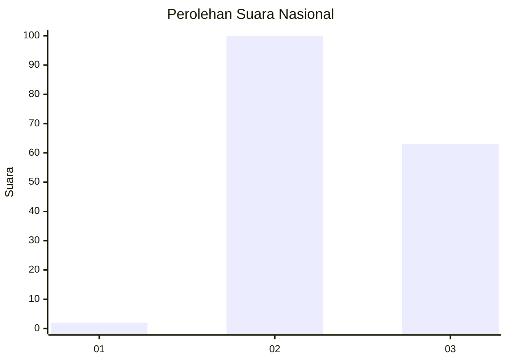
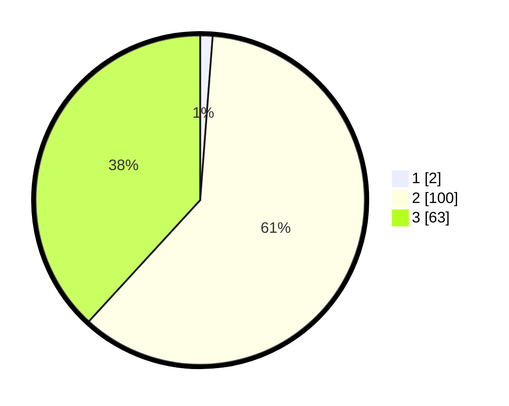

# Hasil

## Grafik

## Tabel

| No. | Nama Paslon    | Suara | Suara (raw) | Persentase |
|:--- |:-------------- | -----:| -----------:| ----------:|
| 1   | ANIES MUHAIMIN | 2     | [2][p-1]    | 1,21       |
| 2   | PRABOWO GIBRAN | 100   | [100][p-2]  | 60,61      |
| 3   | GANJAR MAHFUD  | 63    | [63][p-3]   | 38,18      |

[p-1]: https://github.com/gigit-pemilu/pemilu-2024/blob/main/pilpres/hitung-suara/sub/51-bali/sub/04-gianyar/sub/03-gianyar/sub/1008-beng/sub/007-tps/sub/paslon-1.txt
[p-2]: https://github.com/gigit-pemilu/pemilu-2024/blob/main/pilpres/hitung-suara/sub/51-bali/sub/04-gianyar/sub/03-gianyar/sub/1008-beng/sub/007-tps/sub/paslon-2.txt
[p-3]: https://github.com/gigit-pemilu/pemilu-2024/blob/main/pilpres/hitung-suara/sub/51-bali/sub/04-gianyar/sub/03-gianyar/sub/1008-beng/sub/007-tps/sub/paslon-3.txt

## Foto C Plano

https://sirekap-obj-formc.kpu.go.id/8c0c/pemilu/ppwp/51/04/03/10/08/5104031008007-20240216-132901--6f03da40-af92-4a70-8771-ff3cb4042992.jpg

https://sirekap-obj-formc.kpu.go.id/8c0c/pemilu/ppwp/51/04/03/10/08/5104031008007-20240216-132903--cb0a77d7-fe99-4945-b498-564c8c85782f.jpg

https://sirekap-obj-formc.kpu.go.id/8c0c/pemilu/ppwp/51/04/03/10/08/5104031008007-20240216-132902--bdd8f4cb-fff0-4551-ac85-f4165e7b4145.jpg

## Metadata

| Key        | Value               |
| ---------- | ------------------- |
| Time Stamp | 2024-02-16 14:30:33 |

## DATA PEMILIH TETAP

Jumlah pemilih dalam DPT: **176**.
 * L: **84**.
 * P: **92**.

## DATA PENGGUNA HAK PILIH

Jumlah pengguna hak pilih dalam DPT: **166**.
 * L: **78**.
 * P: **88**.

Jumlah pengguna hak pilih dalam DPTb: **0**.
 * L: **0**.
 * P: **0**.

Jumlah pengguna hak pilih dalam DPK: **0**.
 * L: **0**.
 * P: **0**.

Jumlah pengguna hak pilih: **166**.
 * L: **70**.
 * P: **88**.

## JUMLAH SUARA SAH DAN TIDAK SAH

JUMLAH SELURUH SUARA SAH: **165**.

JUMLAH SUARA TIDAK SAH: **1**.

JUMLAH SELURUH SUARA SAH DAN SUARA TIDAK SAH: **166**.

