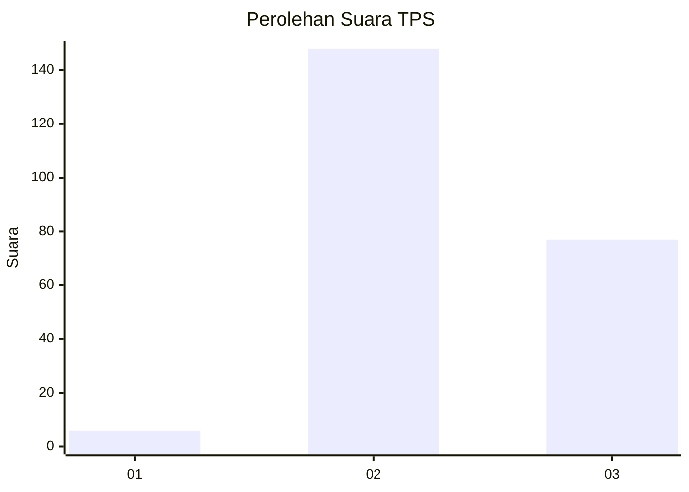
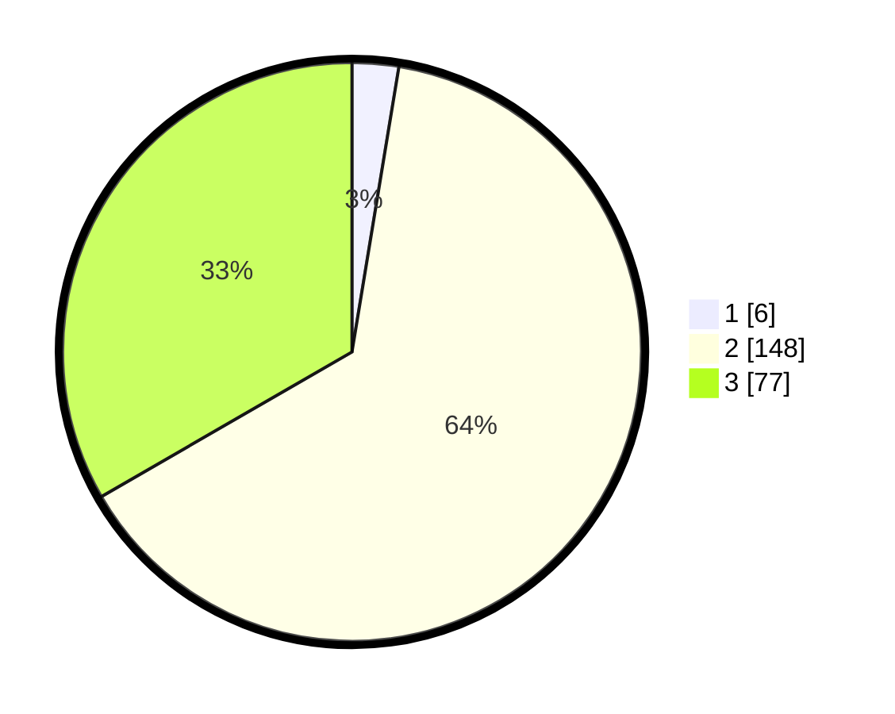

# Hasil

## Grafik

## Tabel

| No. | Nama Paslon    | Suara | Suara (raw) | Persentase |
|:--- |:-------------- | -----:| -----------:| ----------:|
| 1   | ANIES MUHAIMIN | 6     | [6][p-1]    | 2,60       |
| 2   | PRABOWO GIBRAN | 148   | [148][p-2]  | 64,07      |
| 3   | GANJAR MAHFUD  | 77    | [77][p-3]   | 33,33      |

[p-1]: https://github.com/gigit-pemilu/pemilu-2024-51-bali/blob/main/pilpres/hitung-suara/sub/51-bali/sub/04-gianyar/sub/03-gianyar/sub/1008-beng/sub/011-tps/sub/paslon-1.txt
[p-2]: https://github.com/gigit-pemilu/pemilu-2024-51-bali/blob/main/pilpres/hitung-suara/sub/51-bali/sub/04-gianyar/sub/03-gianyar/sub/1008-beng/sub/011-tps/sub/paslon-2.txt
[p-3]: https://github.com/gigit-pemilu/pemilu-2024-51-bali/blob/main/pilpres/hitung-suara/sub/51-bali/sub/04-gianyar/sub/03-gianyar/sub/1008-beng/sub/011-tps/sub/paslon-3.txt

## Foto C Plano

https://sirekap-obj-formc.kpu.go.id/a6c0/pemilu/ppwp/51/04/03/10/08/5104031008011-20240215-020756--1b7d1055-af5a-4d97-90e4-e7bf20f3e5f5.jpg

https://sirekap-obj-formc.kpu.go.id/a6c0/pemilu/ppwp/51/04/03/10/08/5104031008011-20240214-195221--0af9ba75-bebd-4b92-9d0f-5dd2ee3de52b.jpg

https://sirekap-obj-formc.kpu.go.id/a6c0/pemilu/ppwp/51/04/03/10/08/5104031008011-20240214-212020--b4e75c27-0bae-4d1f-b27f-81ad9615633d.jpg

## Metadata

| Key        | Value               |
| ---------- | ------------------- |
| Time Stamp | 2024-02-16 11:00:29 |

