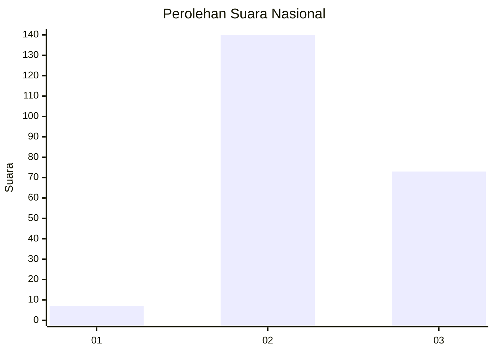
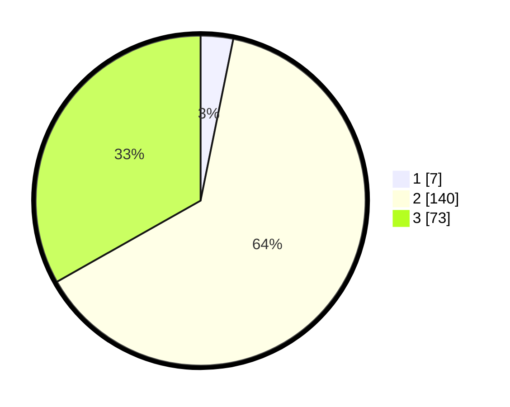

# Hasil

## Grafik

## Tabel

| No. | Nama Paslon    | Suara | Suara (raw) | Persentase |
|:--- |:-------------- | -----:| -----------:| ----------:|
| 1   | ANIES MUHAIMIN | 7     | [7][p-1]    | 3,18       |
| 2   | PRABOWO GIBRAN | 140   | [140][p-2]  | 63,64      |
| 3   | GANJAR MAHFUD  | 73    | [73][p-3]   | 33,18      |

[p-1]: https://github.com/gigit-pemilu/pemilu-2024/blob/main/pilpres/hitung-suara/sub/51-bali/sub/04-gianyar/sub/03-gianyar/sub/1008-beng/sub/012-tps/sub/paslon-1.txt
[p-2]: https://github.com/gigit-pemilu/pemilu-2024/blob/main/pilpres/hitung-suara/sub/51-bali/sub/04-gianyar/sub/03-gianyar/sub/1008-beng/sub/012-tps/sub/paslon-2.txt
[p-3]: https://github.com/gigit-pemilu/pemilu-2024/blob/main/pilpres/hitung-suara/sub/51-bali/sub/04-gianyar/sub/03-gianyar/sub/1008-beng/sub/012-tps/sub/paslon-3.txt

## Foto C Plano

https://sirekap-obj-formc.kpu.go.id/41b8/pemilu/ppwp/51/04/03/10/08/5104031008012-20240215-013945--7d074dd4-7d73-4cfd-8c44-e1b77e878eaa.jpg

https://sirekap-obj-formc.kpu.go.id/41b8/pemilu/ppwp/51/04/03/10/08/5104031008012-20240215-014115--60ac6f43-2783-4603-b85a-77a3378abd95.jpg

https://sirekap-obj-formc.kpu.go.id/41b8/pemilu/ppwp/51/04/03/10/08/5104031008012-20240215-014325--d33abe1e-9c9b-467d-acbd-c5e36fff0e1b.jpg

## Metadata

| Key        | Value               |
| ---------- | ------------------- |
| Time Stamp | 2024-02-15 12:00:28 |

