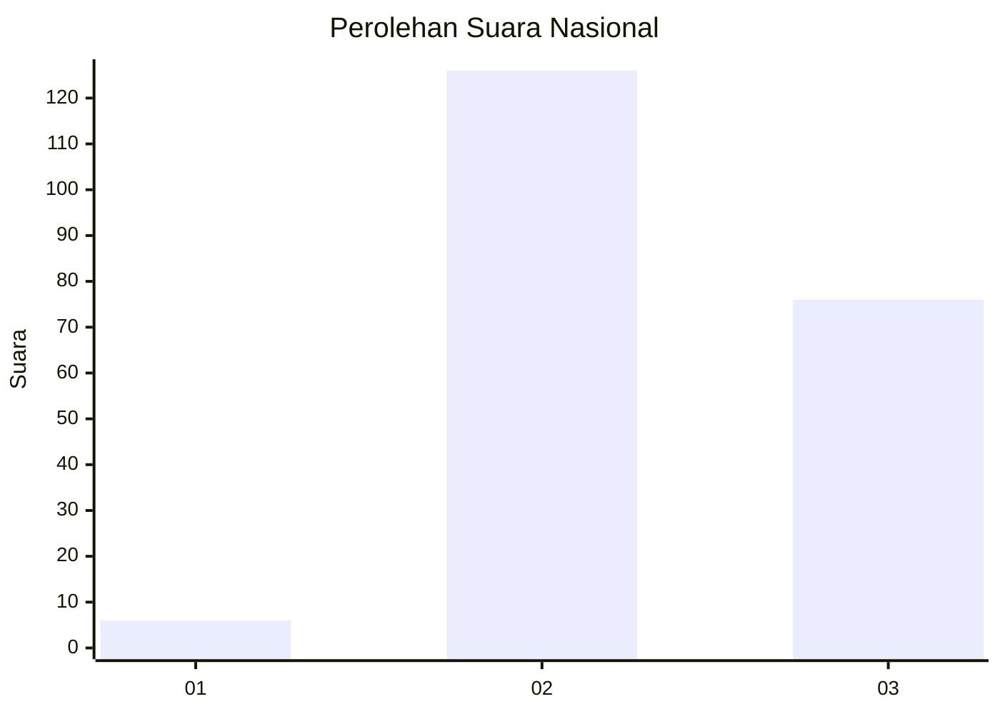
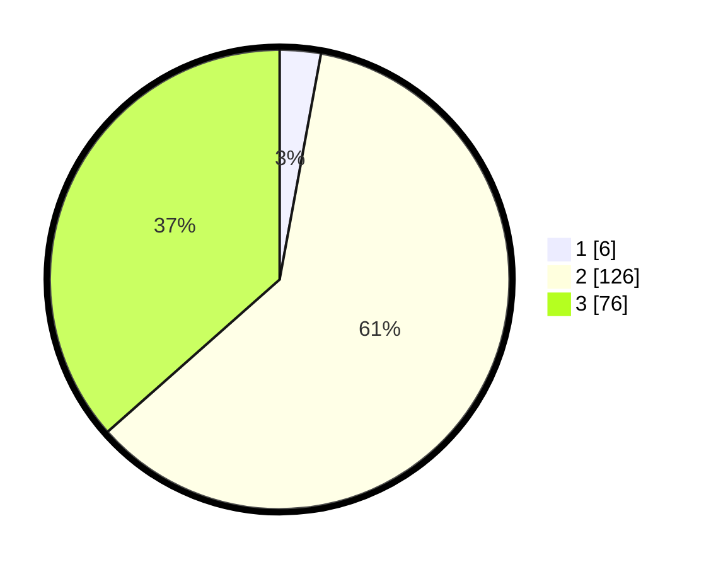

# Hasil

## Grafik

## Tabel

| No. | Nama Paslon    | Suara | Suara (raw) | Persentase |
|:--- |:-------------- | -----:| -----------:| ----------:|
| 1   | ANIES MUHAIMIN | 6     | [6][p-1]    | 2,88       |
| 2   | PRABOWO GIBRAN | 126   | [126][p-2]  | 60,58      |
| 3   | GANJAR MAHFUD  | 76    | [76][p-3]   | 36,54      |

[p-1]: https://github.com/gigit-pemilu/pemilu-2024/blob/main/pilpres/hitung-suara/sub/51-bali/sub/04-gianyar/sub/03-gianyar/sub/1008-beng/sub/013-tps/sub/paslon-1.txt
[p-2]: https://github.com/gigit-pemilu/pemilu-2024/blob/main/pilpres/hitung-suara/sub/51-bali/sub/04-gianyar/sub/03-gianyar/sub/1008-beng/sub/013-tps/sub/paslon-2.txt
[p-3]: https://github.com/gigit-pemilu/pemilu-2024/blob/main/pilpres/hitung-suara/sub/51-bali/sub/04-gianyar/sub/03-gianyar/sub/1008-beng/sub/013-tps/sub/paslon-3.txt

## Foto C Plano

https://sirekap-obj-formc.kpu.go.id/5c61/pemilu/ppwp/51/04/03/10/08/5104031008013-20240214-212224--ebeb45bc-a28f-4d00-8b64-94e3bc8cdfea.jpg

https://sirekap-obj-formc.kpu.go.id/5c61/pemilu/ppwp/51/04/03/10/08/5104031008013-20240216-120538--49b22109-7c17-4564-aec4-e12b6bb80426.jpg

https://sirekap-obj-formc.kpu.go.id/5c61/pemilu/ppwp/51/04/03/10/08/5104031008013-20240214-212550--5adf2fda-e6db-40c7-b24b-2e99acdfa82c.jpg

## Metadata

| Key        | Value               |
| ---------- | ------------------- |
| Time Stamp | 2024-02-16 14:30:33 |

## DATA PEMILIH TETAP

Jumlah pemilih dalam DPT: **242**.
 * L: **128**.
 * P: **114**.

## DATA PENGGUNA HAK PILIH

Jumlah pengguna hak pilih dalam DPT: **199**.
 * L: **101**.
 * P: **98**.

Jumlah pengguna hak pilih dalam DPTb: **2**.
 * L: **1**.
 * P: **1**.

Jumlah pengguna hak pilih dalam DPK: **9**.
 * L: **6**.
 * P: **3**.

Jumlah pengguna hak pilih: **210**.
 * L: **108**.
 * P: **102**.

## JUMLAH SUARA SAH DAN TIDAK SAH

JUMLAH SELURUH SUARA SAH: **208**.

JUMLAH SUARA TIDAK SAH: **2**.

JUMLAH SELURUH SUARA SAH DAN SUARA TIDAK SAH: **210**.

