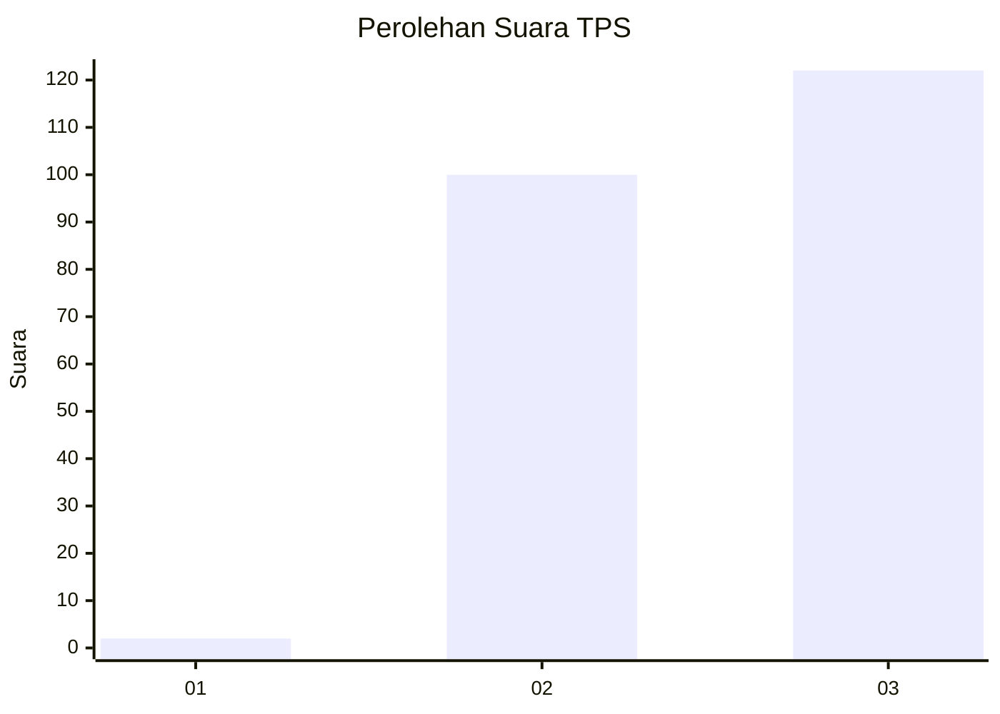
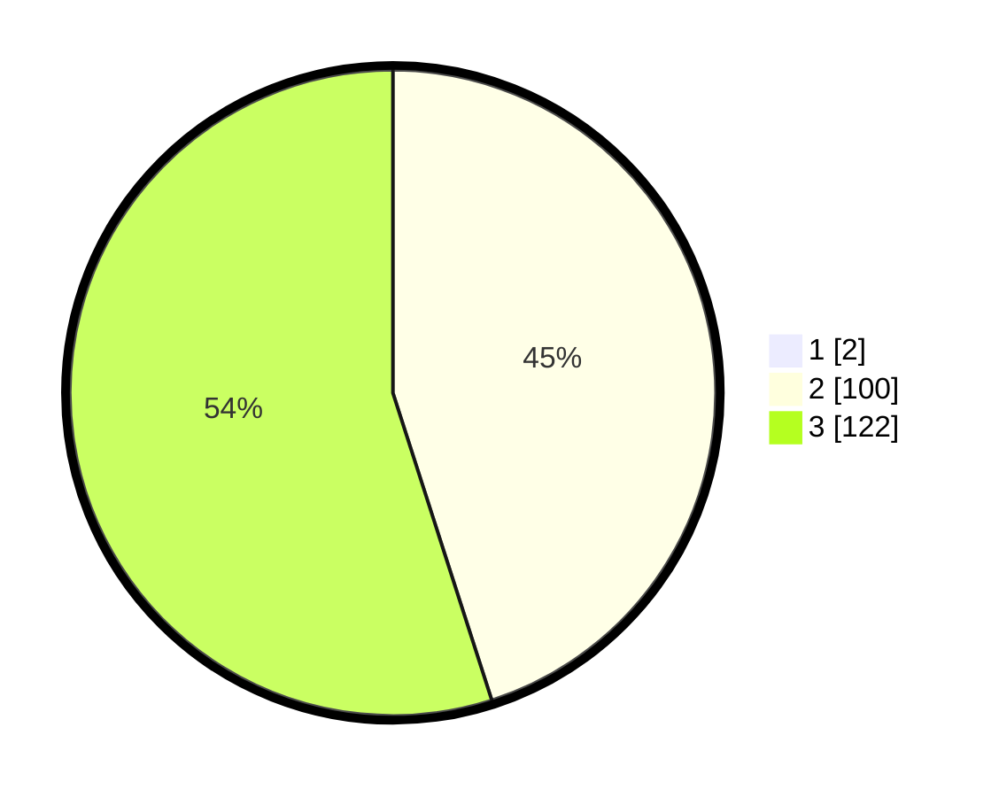

# Hasil

## Grafik

## Tabel

| No. | Nama Paslon    | Suara | Suara (raw) | Persentase |
|:--- |:-------------- | -----:| -----------:| ----------:|
| 1   | ANIES MUHAIMIN | 2     | [2][p-1]    | 0,89       |
| 2   | PRABOWO GIBRAN | 100   | [100][p-2]  | 44,64      |
| 3   | GANJAR MAHFUD  | 122   | [122][p-3]  | 54,46      |

[p-1]: https://github.com/gigit-pemilu/pemilu-2024-51-bali/blob/main/pilpres/hitung-suara/sub/51-bali/sub/04-gianyar/sub/03-gianyar/sub/1008-beng/sub/014-tps/sub/paslon-1.txt
[p-2]: https://github.com/gigit-pemilu/pemilu-2024-51-bali/blob/main/pilpres/hitung-suara/sub/51-bali/sub/04-gianyar/sub/03-gianyar/sub/1008-beng/sub/014-tps/sub/paslon-2.txt
[p-3]: https://github.com/gigit-pemilu/pemilu-2024-51-bali/blob/main/pilpres/hitung-suara/sub/51-bali/sub/04-gianyar/sub/03-gianyar/sub/1008-beng/sub/014-tps/sub/paslon-3.txt

## Foto C Plano

https://sirekap-obj-formc.kpu.go.id/18a5/pemilu/ppwp/51/04/03/10/08/5104031008014-20240214-215242--e1621443-0f20-44cb-9882-db4ad33c942f.jpg

https://sirekap-obj-formc.kpu.go.id/18a5/pemilu/ppwp/51/04/03/10/08/5104031008014-20240214-215526--7f8503b7-1126-43bc-836e-b20a1df829b3.jpg

https://sirekap-obj-formc.kpu.go.id/18a5/pemilu/ppwp/51/04/03/10/08/5104031008014-20240214-215727--ac9cac4d-4ea6-491c-a207-793cc3ea7a67.jpg

## Metadata

| Key        | Value               |
| ---------- | ------------------- |
| Time Stamp | 2024-02-15 06:00:23 |

