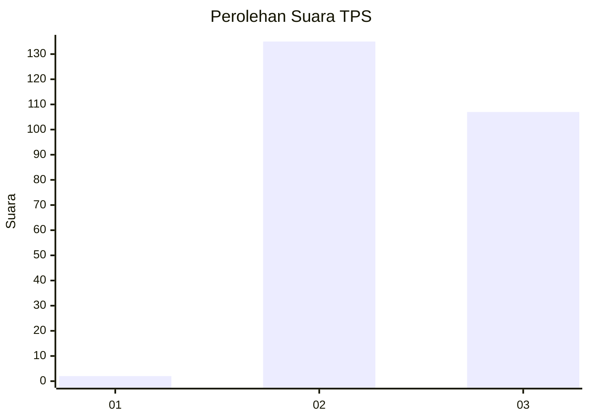
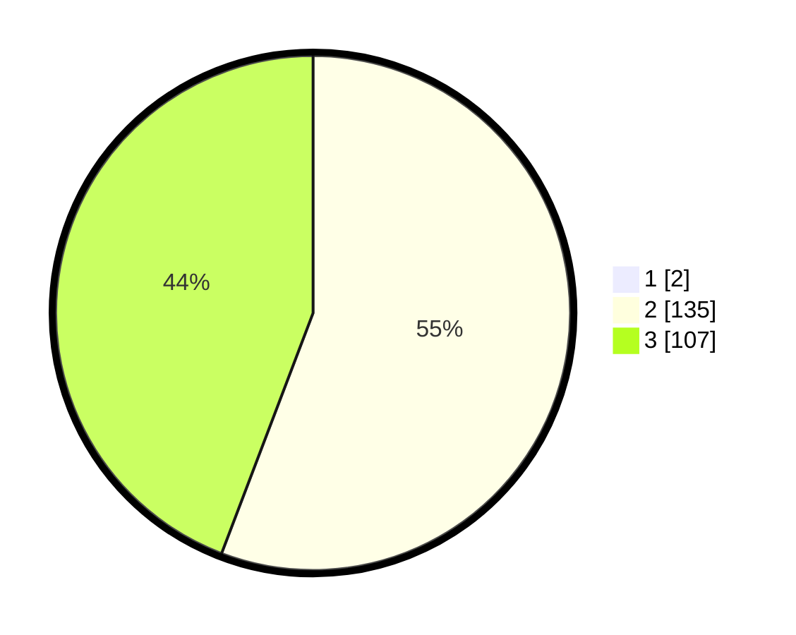

# Hasil

## Grafik

## Tabel

| No. | Nama Paslon    | Suara | Suara (raw) | Persentase |
|:--- |:-------------- | -----:| -----------:| ----------:|
| 1   | ANIES MUHAIMIN | 2     | [2][p-1]    | 0,82       |
| 2   | PRABOWO GIBRAN | 135   | [135][p-2]  | 55,33      |
| 3   | GANJAR MAHFUD  | 107   | [107][p-3]  | 43,85      |

[p-1]: https://github.com/gigit-pemilu/pemilu-2024-51-bali/blob/main/pilpres/hitung-suara/sub/51-bali/sub/04-gianyar/sub/03-gianyar/sub/2001-tulikup/sub/010-tps/sub/paslon-1.txt
[p-2]: https://github.com/gigit-pemilu/pemilu-2024-51-bali/blob/main/pilpres/hitung-suara/sub/51-bali/sub/04-gianyar/sub/03-gianyar/sub/2001-tulikup/sub/010-tps/sub/paslon-2.txt
[p-3]: https://github.com/gigit-pemilu/pemilu-2024-51-bali/blob/main/pilpres/hitung-suara/sub/51-bali/sub/04-gianyar/sub/03-gianyar/sub/2001-tulikup/sub/010-tps/sub/paslon-3.txt

## Foto C Plano

https://sirekap-obj-formc.kpu.go.id/90c8/pemilu/ppwp/51/04/03/20/01/5104032001010-20240214-231544--77eef644-db4c-4785-b9b2-b623dcb7e638.jpg

https://sirekap-obj-formc.kpu.go.id/90c8/pemilu/ppwp/51/04/03/20/01/5104032001010-20240214-232318--550fe927-bcc4-4fcc-8181-deef13989697.jpg

https://sirekap-obj-formc.kpu.go.id/90c8/pemilu/ppwp/51/04/03/20/01/5104032001010-20240214-232710--a20760a3-42a7-4bf1-9cb0-5412145a3bd8.jpg

## Metadata

| Key        | Value               |
| ---------- | ------------------- |
| Time Stamp | 2024-02-21 18:00:00 |

