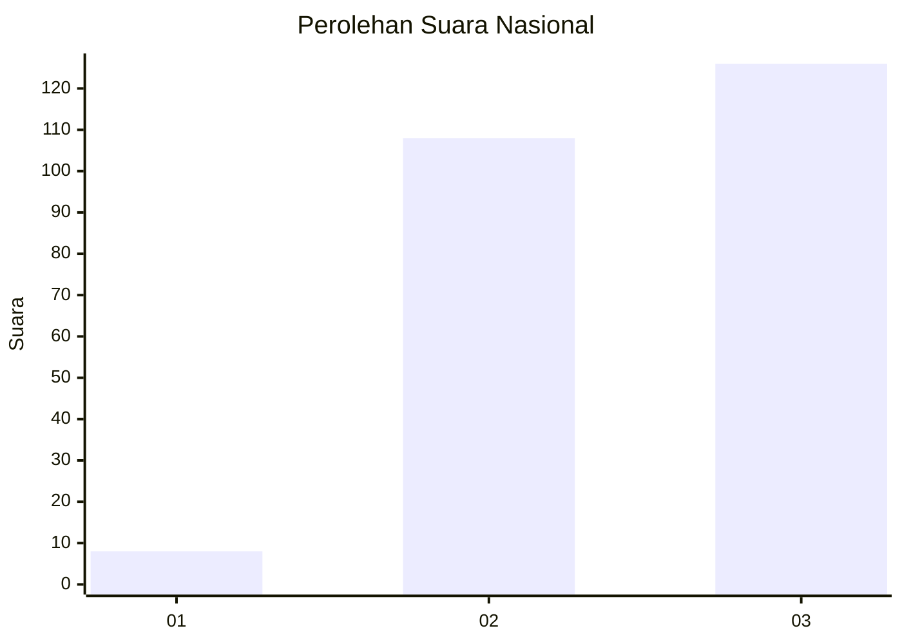
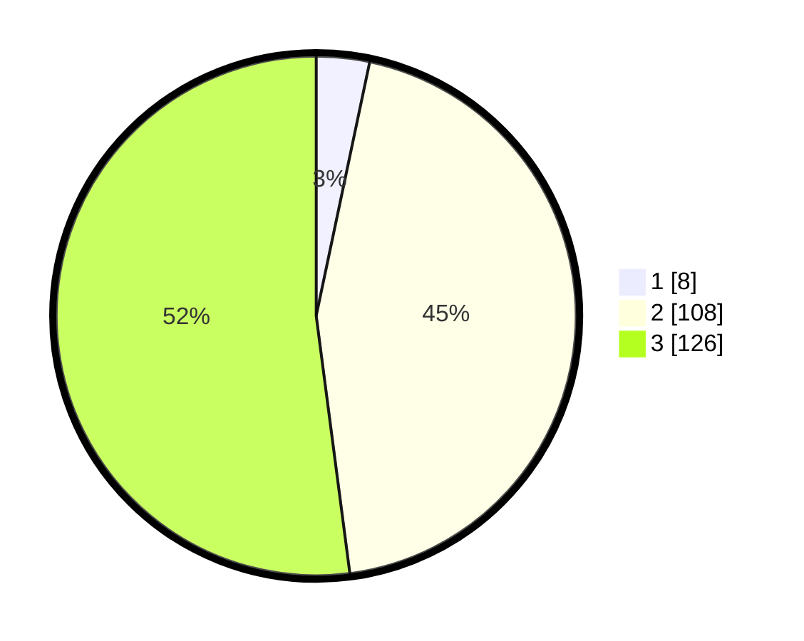

# Hasil

## Grafik

## Tabel

| No. | Nama Paslon    | Suara | Suara (raw) | Persentase |
|:--- |:-------------- | -----:| -----------:| ----------:|
| 1   | ANIES MUHAIMIN | 8     | [8][p-1]    | 3,31       |
| 2   | PRABOWO GIBRAN | 108   | [108][p-2]  | 44,63      |
| 3   | GANJAR MAHFUD  | 126   | [126][p-3]  | 52,07      |

[p-1]: https://github.com/gigit-pemilu/pemilu-2024/blob/main/pilpres/hitung-suara/sub/51-bali/sub/04-gianyar/sub/03-gianyar/sub/2001-tulikup/sub/011-tps/sub/paslon-1.txt
[p-2]: https://github.com/gigit-pemilu/pemilu-2024/blob/main/pilpres/hitung-suara/sub/51-bali/sub/04-gianyar/sub/03-gianyar/sub/2001-tulikup/sub/011-tps/sub/paslon-2.txt
[p-3]: https://github.com/gigit-pemilu/pemilu-2024/blob/main/pilpres/hitung-suara/sub/51-bali/sub/04-gianyar/sub/03-gianyar/sub/2001-tulikup/sub/011-tps/sub/paslon-3.txt

## Foto C Plano

https://sirekap-obj-formc.kpu.go.id/2a4b/pemilu/ppwp/51/04/03/20/01/5104032001011-20240216-055738--725c8038-fde0-4a0a-b6e5-947242a47274.jpg

https://sirekap-obj-formc.kpu.go.id/2a4b/pemilu/ppwp/51/04/03/20/01/5104032001011-20240216-055739--653e1783-4065-4509-b8ba-876e9d9b3837.jpg

https://sirekap-obj-formc.kpu.go.id/2a4b/pemilu/ppwp/51/04/03/20/01/5104032001011-20240216-055739--c1d00b11-9f3f-4b74-8ff9-7f4df558d002.jpg

## Metadata

| Key        | Value               |
| ---------- | ------------------- |
| Time Stamp | 2024-02-16 11:00:29 |

## DATA PEMILIH TETAP

Jumlah pemilih dalam DPT: **277**.
 * L: **133**.
 * P: **144**.

## DATA PENGGUNA HAK PILIH

Jumlah pengguna hak pilih dalam DPT: **249**.
 * L: **117**.
 * P: **132**.

Jumlah pengguna hak pilih dalam DPTb: **1**.
 * L: **0**.
 * P: **1**.

Jumlah pengguna hak pilih dalam DPK: **0**.
 * L: **0**.
 * P: **0**.

Jumlah pengguna hak pilih: **250**.
 * L: **117**.
 * P: **133**.

## JUMLAH SUARA SAH DAN TIDAK SAH

JUMLAH SELURUH SUARA SAH: **242**.

JUMLAH SUARA TIDAK SAH: **8**.

JUMLAH SELURUH SUARA SAH DAN SUARA TIDAK SAH: **250**.

