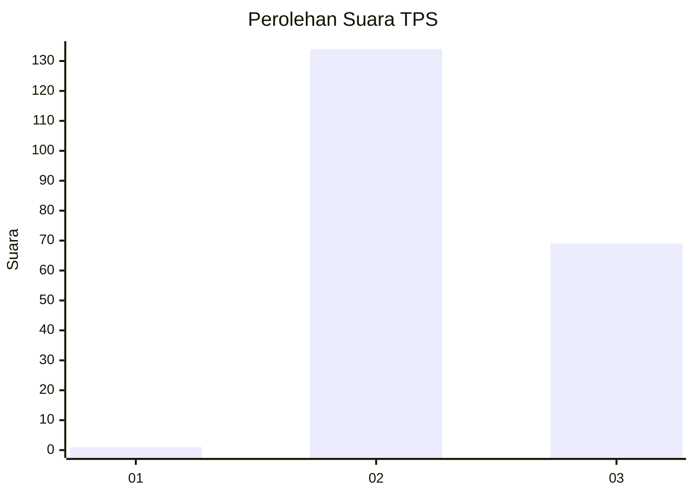
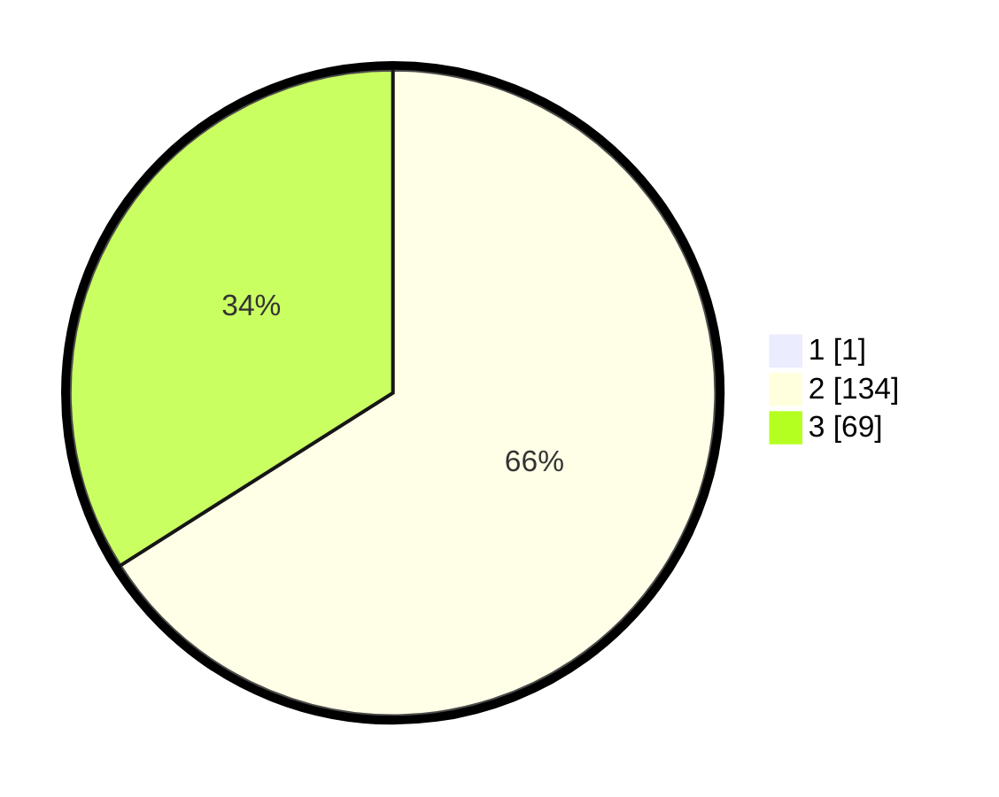

# Hasil

## Grafik

## Tabel

| No. | Nama Paslon    | Suara | Suara (raw) | Persentase |
|:--- |:-------------- | -----:| -----------:| ----------:|
| 1   | ANIES MUHAIMIN | 1     | [1][p-1]    | 0,49       |
| 2   | PRABOWO GIBRAN | 134   | [134][p-2]  | 65,69      |
| 3   | GANJAR MAHFUD  | 69    | [69][p-3]   | 33,82      |

[p-1]: https://github.com/gigit-pemilu/pemilu-2024-51-bali/blob/main/pilpres/hitung-suara/sub/51-bali/sub/04-gianyar/sub/03-gianyar/sub/2001-tulikup/sub/022-tps/sub/paslon-1.txt
[p-2]: https://github.com/gigit-pemilu/pemilu-2024-51-bali/blob/main/pilpres/hitung-suara/sub/51-bali/sub/04-gianyar/sub/03-gianyar/sub/2001-tulikup/sub/022-tps/sub/paslon-2.txt
[p-3]: https://github.com/gigit-pemilu/pemilu-2024-51-bali/blob/main/pilpres/hitung-suara/sub/51-bali/sub/04-gianyar/sub/03-gianyar/sub/2001-tulikup/sub/022-tps/sub/paslon-3.txt

## Foto C Plano

https://sirekap-obj-formc.kpu.go.id/65f8/pemilu/ppwp/51/04/03/20/01/5104032001022-20240214-192605--cd27e58c-196e-410e-a05c-ac5770aa7f1d.jpg

https://sirekap-obj-formc.kpu.go.id/65f8/pemilu/ppwp/51/04/03/20/01/5104032001022-20240214-192705--923cdc53-f673-4fb4-bcb4-97cc5a9ee01c.jpg

https://sirekap-obj-formc.kpu.go.id/65f8/pemilu/ppwp/51/04/03/20/01/5104032001022-20240214-192803--25282636-c112-4599-beba-18fb177129ba.jpg

## Metadata

| Key        | Value               |
| ---------- | ------------------- |
| Time Stamp | 2024-02-15 12:00:28 |

