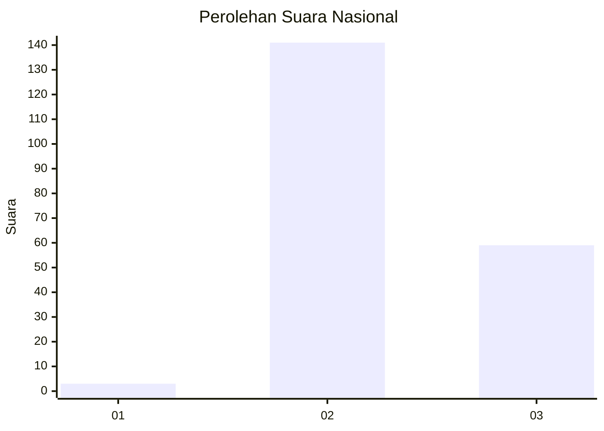

# Hasil

## Grafik

## Tabel

| No. | Nama Paslon    | Suara | Suara (raw) | Persentase |
|:--- |:-------------- | -----:| -----------:| ----------:|
| 1   | ANIES MUHAIMIN | 3     | [3][p-1]    | 1,48       |
| 2   | PRABOWO GIBRAN | 141   | [141][p-2]  | 69,46      |
| 3   | GANJAR MAHFUD  | 59    | [59][p-3]   | 29,06      |

[p-1]: https://github.com/gigit-pemilu/pemilu-2024/blob/main/pilpres/hitung-suara/sub/51-bali/sub/04-gianyar/sub/03-gianyar/sub/2001-tulikup/sub/024-tps/sub/paslon-1.txt
[p-2]: https://github.com/gigit-pemilu/pemilu-2024/blob/main/pilpres/hitung-suara/sub/51-bali/sub/04-gianyar/sub/03-gianyar/sub/2001-tulikup/sub/024-tps/sub/paslon-2.txt
[p-3]: https://github.com/gigit-pemilu/pemilu-2024/blob/main/pilpres/hitung-suara/sub/51-bali/sub/04-gianyar/sub/03-gianyar/sub/2001-tulikup/sub/024-tps/sub/paslon-3.txt

## Foto C Plano

https://sirekap-obj-formc.kpu.go.id/911b/pemilu/ppwp/51/04/03/20/01/5104032001024-20240214-205804--e565063b-97fe-402d-8d45-fd2898c47af9.jpg

https://sirekap-obj-formc.kpu.go.id/911b/pemilu/ppwp/51/04/03/20/01/5104032001024-20240214-205932--69cf6e6f-ea19-4e47-a129-174603e7a8b0.jpg

https://sirekap-obj-formc.kpu.go.id/911b/pemilu/ppwp/51/04/03/20/01/5104032001024-20240214-210048--d6bba80a-806e-4ab0-a8be-3ca92267de59.jpg

## Metadata

| Key        | Value               |
| ---------- | ------------------- |
| Time Stamp | 2024-02-15 12:00:28 |

