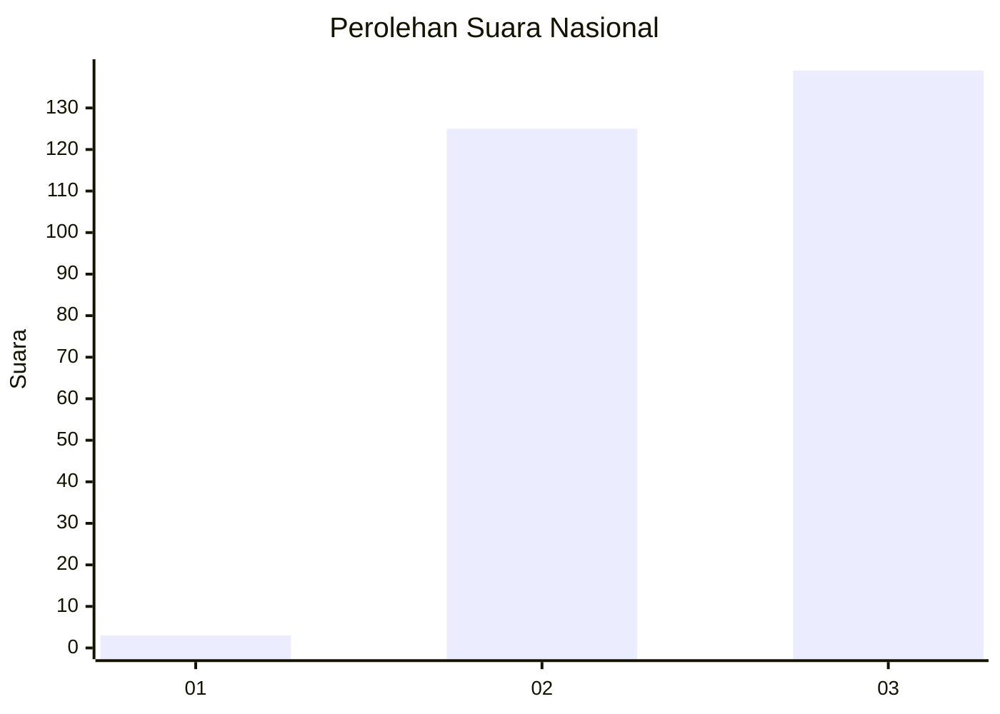
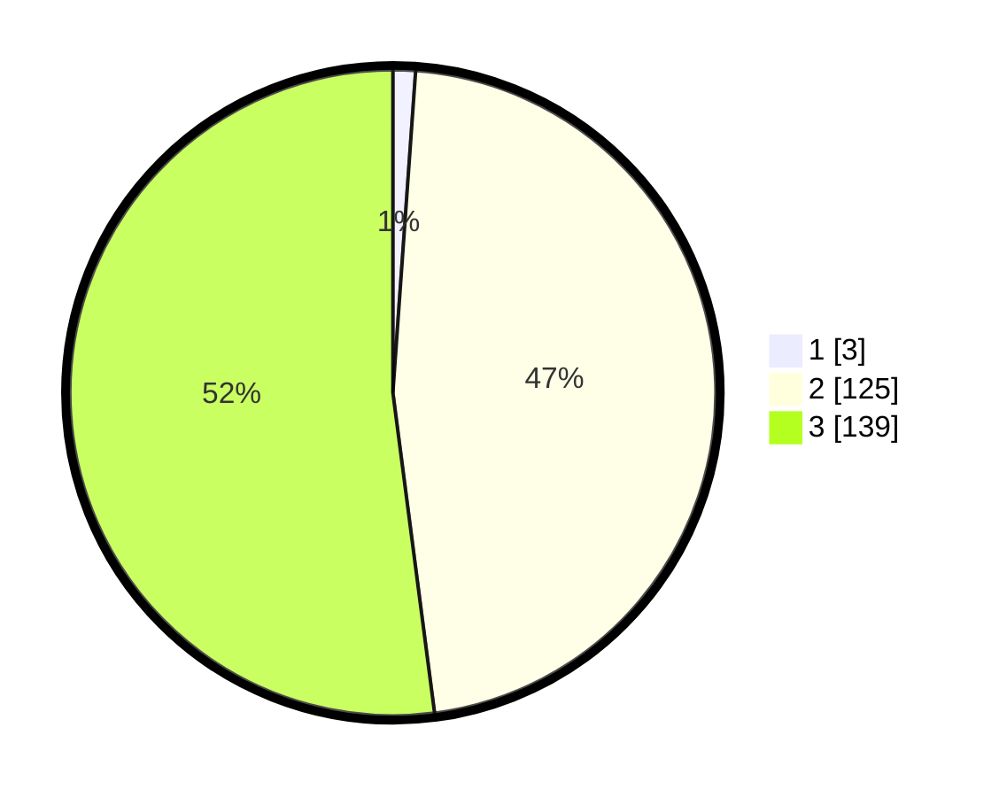

# Hasil

## Grafik

## Tabel

| No. | Nama Paslon    | Suara | Suara (raw) | Persentase |
|:--- |:-------------- | -----:| -----------:| ----------:|
| 1   | ANIES MUHAIMIN | 3     | [3][p-1]    | 1,12       |
| 2   | PRABOWO GIBRAN | 125   | [125][p-2]  | 46,82      |
| 3   | GANJAR MAHFUD  | 139   | [139][p-3]  | 52,06      |

[p-1]: https://github.com/gigit-pemilu/pemilu-2024/blob/main/pilpres/hitung-suara/sub/51-bali/sub/04-gianyar/sub/03-gianyar/sub/2004-lebih/sub/008-tps/sub/paslon-1.txt
[p-2]: https://github.com/gigit-pemilu/pemilu-2024/blob/main/pilpres/hitung-suara/sub/51-bali/sub/04-gianyar/sub/03-gianyar/sub/2004-lebih/sub/008-tps/sub/paslon-2.txt
[p-3]: https://github.com/gigit-pemilu/pemilu-2024/blob/main/pilpres/hitung-suara/sub/51-bali/sub/04-gianyar/sub/03-gianyar/sub/2004-lebih/sub/008-tps/sub/paslon-3.txt

## Foto C Plano

https://sirekap-obj-formc.kpu.go.id/c722/pemilu/ppwp/51/04/03/20/04/5104032004008-20240214-210023--b41e92e6-d833-4942-a060-8288577ac083.jpg

https://sirekap-obj-formc.kpu.go.id/c722/pemilu/ppwp/51/04/03/20/04/5104032004008-20240214-210141--f6176287-6e9c-491b-8ca1-f62f77c899d6.jpg

https://sirekap-obj-formc.kpu.go.id/c722/pemilu/ppwp/51/04/03/20/04/5104032004008-20240214-210239--b36009fb-f5ef-434e-81c7-0a635da1a9f0.jpg

## Metadata

| Key        | Value               |
| ---------- | ------------------- |
| Time Stamp | 2024-02-15 12:00:28 |

