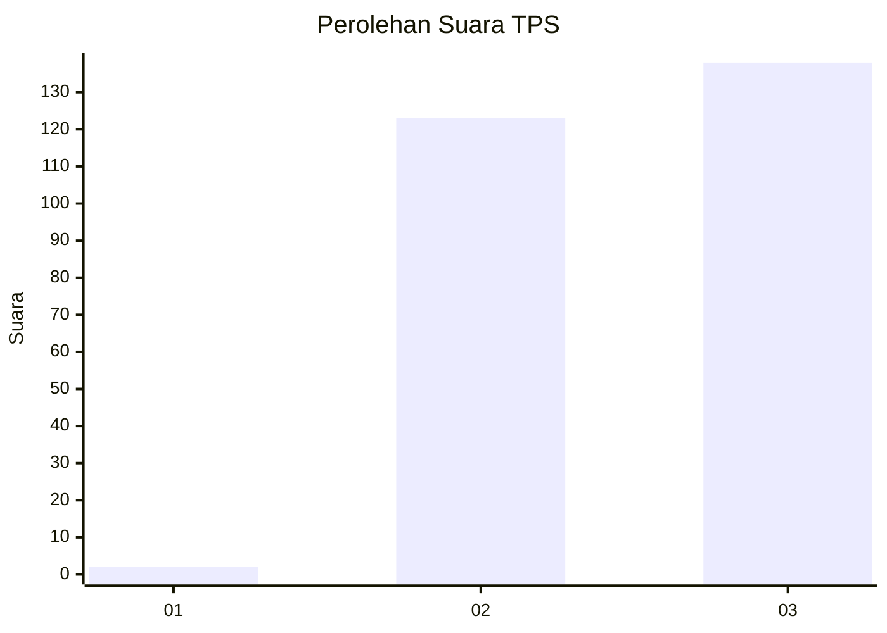
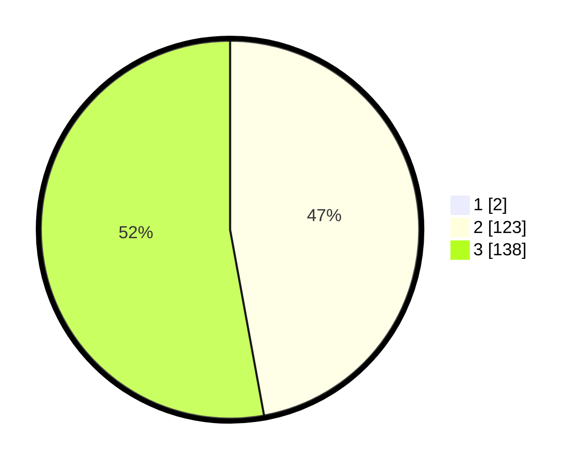

# Hasil

## Grafik

## Tabel

| No. | Nama Paslon    | Suara | Suara (raw) | Persentase |
|:--- |:-------------- | -----:| -----------:| ----------:|
| 1   | ANIES MUHAIMIN | 2     | [2][p-1]    | 0,76       |
| 2   | PRABOWO GIBRAN | 123   | [123][p-2]  | 46,77      |
| 3   | GANJAR MAHFUD  | 138   | [138][p-3]  | 52,47      |

[p-1]: https://github.com/gigit-pemilu/pemilu-2024-51-bali/blob/main/pilpres/hitung-suara/sub/51-bali/sub/04-gianyar/sub/03-gianyar/sub/2004-lebih/sub/009-tps/sub/paslon-1.txt
[p-2]: https://github.com/gigit-pemilu/pemilu-2024-51-bali/blob/main/pilpres/hitung-suara/sub/51-bali/sub/04-gianyar/sub/03-gianyar/sub/2004-lebih/sub/009-tps/sub/paslon-2.txt
[p-3]: https://github.com/gigit-pemilu/pemilu-2024-51-bali/blob/main/pilpres/hitung-suara/sub/51-bali/sub/04-gianyar/sub/03-gianyar/sub/2004-lebih/sub/009-tps/sub/paslon-3.txt

## Foto C Plano

https://sirekap-obj-formc.kpu.go.id/9458/pemilu/ppwp/51/04/03/20/04/5104032004009-20240214-232953--314af66f-808d-466c-95e5-c1b2e059f720.jpg

https://sirekap-obj-formc.kpu.go.id/9458/pemilu/ppwp/51/04/03/20/04/5104032004009-20240214-233133--dc1ad13d-ced3-4df5-a741-881f551fc0a9.jpg

https://sirekap-obj-formc.kpu.go.id/9458/pemilu/ppwp/51/04/03/20/04/5104032004009-20240214-233318--ccffb13d-9d19-4fa9-9a5a-70068008e046.jpg

## Metadata

| Key        | Value               |
| ---------- | ------------------- |
| Time Stamp | 2024-02-15 19:00:26 |

