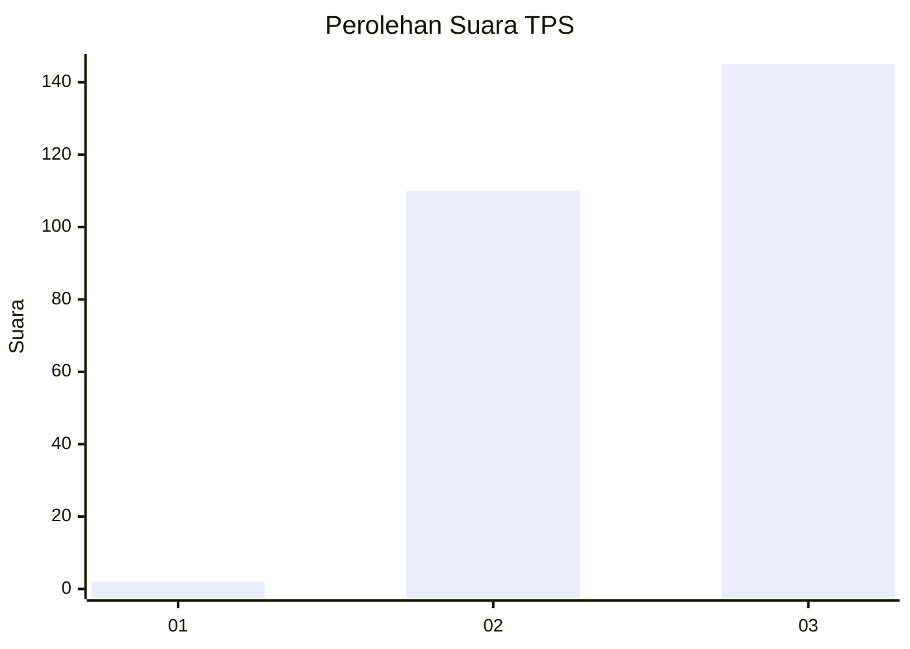
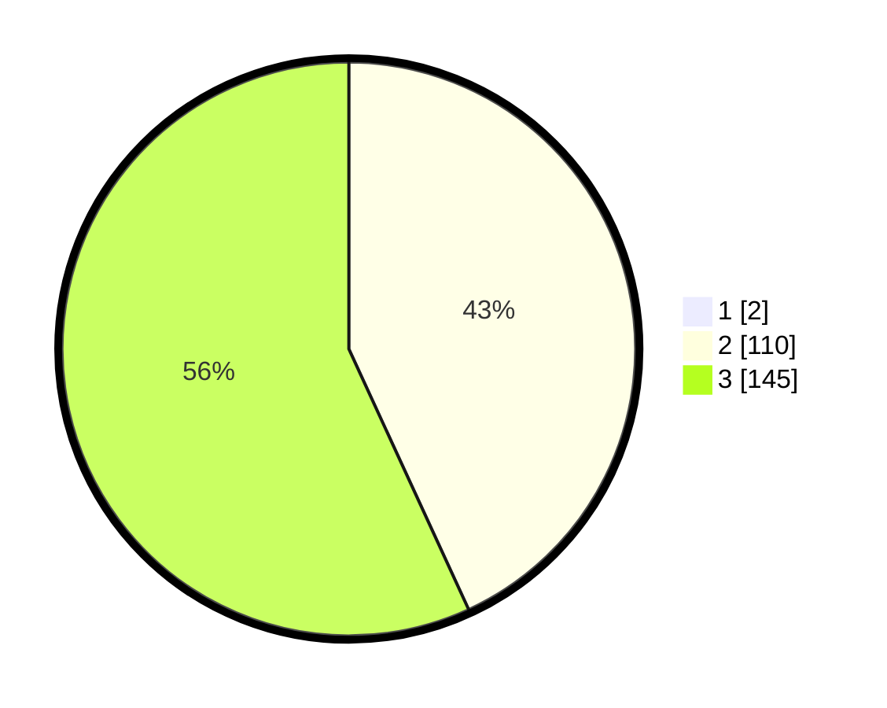

# Hasil

## Grafik

## Tabel

| No. | Nama Paslon    | Suara | Suara (raw) | Persentase |
|:--- |:-------------- | -----:| -----------:| ----------:|
| 1   | ANIES MUHAIMIN | 2     | [2][p-1]    | 0,78       |
| 2   | PRABOWO GIBRAN | 110   | [110][p-2]  | 42,80      |
| 3   | GANJAR MAHFUD  | 145   | [145][p-3]  | 56,42      |

[p-1]: https://github.com/gigit-pemilu/pemilu-2024-51-bali/blob/main/pilpres/hitung-suara/sub/51-bali/sub/04-gianyar/sub/03-gianyar/sub/2004-lebih/sub/015-tps/sub/paslon-1.txt
[p-2]: https://github.com/gigit-pemilu/pemilu-2024-51-bali/blob/main/pilpres/hitung-suara/sub/51-bali/sub/04-gianyar/sub/03-gianyar/sub/2004-lebih/sub/015-tps/sub/paslon-2.txt
[p-3]: https://github.com/gigit-pemilu/pemilu-2024-51-bali/blob/main/pilpres/hitung-suara/sub/51-bali/sub/04-gianyar/sub/03-gianyar/sub/2004-lebih/sub/015-tps/sub/paslon-3.txt

## Foto C Plano

https://sirekap-obj-formc.kpu.go.id/e4e4/pemilu/ppwp/51/04/03/20/04/5104032004015-20240214-221245--8f853d23-388d-4967-8b6f-6b920b668cbc.jpg

https://sirekap-obj-formc.kpu.go.id/e4e4/pemilu/ppwp/51/04/03/20/04/5104032004015-20240214-201854--779d8bfe-8b61-47e6-a82d-14edded5f61d.jpg

https://sirekap-obj-formc.kpu.go.id/e4e4/pemilu/ppwp/51/04/03/20/04/5104032004015-20240214-201953--5f3e1b31-781d-4085-9113-56cf3d8a381e.jpg

## Metadata

| Key        | Value               |
| ---------- | ------------------- |
| Time Stamp | 2024-02-15 15:00:29 |

