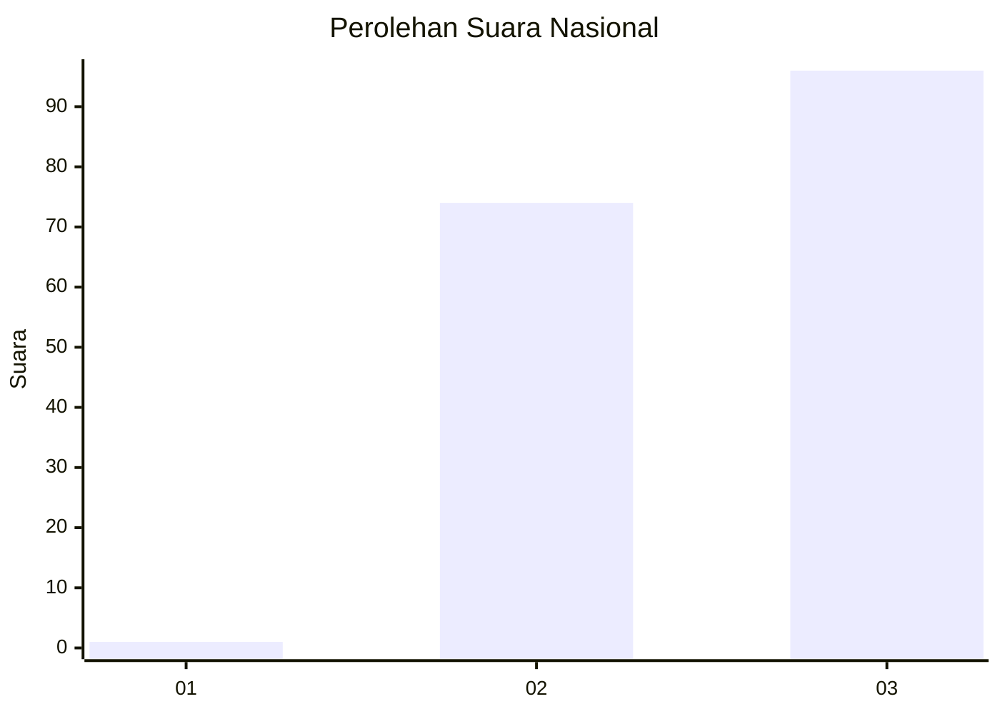
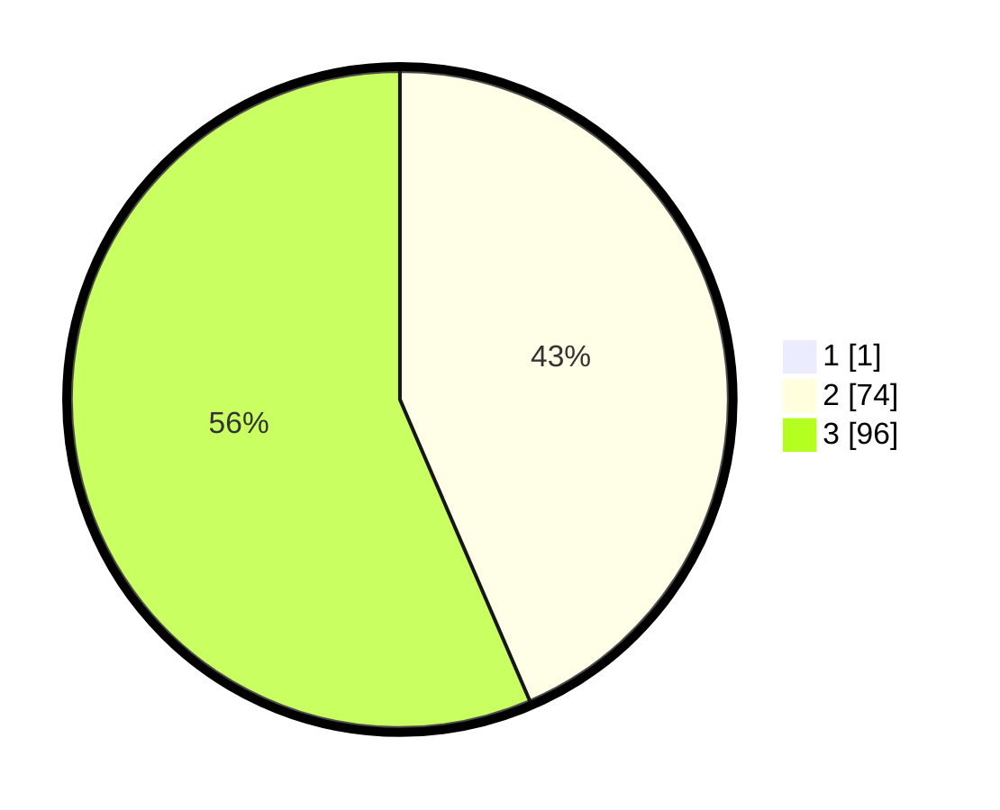

# Hasil

## Grafik

## Tabel

| No. | Nama Paslon    | Suara | Suara (raw) | Persentase |
|:--- |:-------------- | -----:| -----------:| ----------:|
| 1   | ANIES MUHAIMIN | 1     | [1][p-1]    | 0,58       |
| 2   | PRABOWO GIBRAN | 74    | [74][p-2]   | 43,27      |
| 3   | GANJAR MAHFUD  | 96    | [96][p-3]   | 56,14      |

[p-1]: https://github.com/gigit-pemilu/pemilu-2024/blob/main/pilpres/hitung-suara/sub/51-bali/sub/04-gianyar/sub/03-gianyar/sub/2009-bakbakan/sub/009-tps/sub/paslon-1.txt
[p-2]: https://github.com/gigit-pemilu/pemilu-2024/blob/main/pilpres/hitung-suara/sub/51-bali/sub/04-gianyar/sub/03-gianyar/sub/2009-bakbakan/sub/009-tps/sub/paslon-2.txt
[p-3]: https://github.com/gigit-pemilu/pemilu-2024/blob/main/pilpres/hitung-suara/sub/51-bali/sub/04-gianyar/sub/03-gianyar/sub/2009-bakbakan/sub/009-tps/sub/paslon-3.txt

## Foto C Plano

https://sirekap-obj-formc.kpu.go.id/5678/pemilu/ppwp/51/04/03/20/09/5104032009009-20240214-192256--77ed2d57-20a7-4d86-9e94-7b1b9b515034.jpg

https://sirekap-obj-formc.kpu.go.id/5678/pemilu/ppwp/51/04/03/20/09/5104032009009-20240214-192335--64089585-5b61-4ccf-8a98-6373dcfbf83f.jpg

https://sirekap-obj-formc.kpu.go.id/5678/pemilu/ppwp/51/04/03/20/09/5104032009009-20240214-192221--bb51cf2a-45c8-459a-ab53-3b37a8a3baa3.jpg

## Metadata

| Key        | Value               |
| ---------- | ------------------- |
| Time Stamp | 2024-02-15 15:30:25 |

