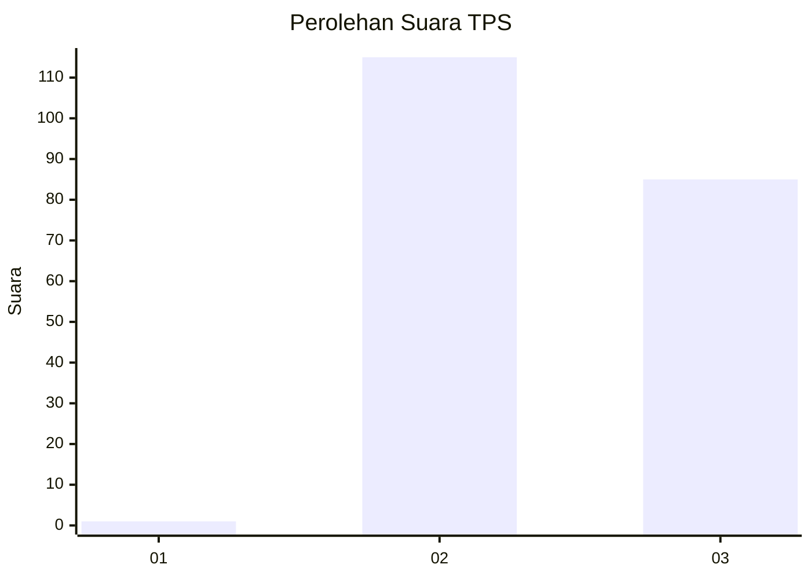
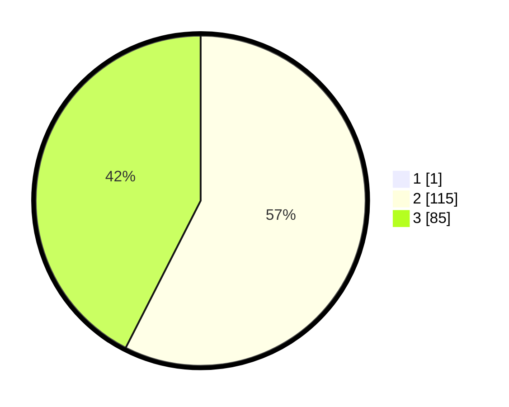

# Hasil

## Grafik

## Tabel

| No. | Nama Paslon    | Suara | Suara (raw) | Persentase |
|:--- |:-------------- | -----:| -----------:| ----------:|
| 1   | ANIES MUHAIMIN | 1     | [1][p-1]    | 0,50       |
| 2   | PRABOWO GIBRAN | 115   | [115][p-2]  | 57,21      |
| 3   | GANJAR MAHFUD  | 85    | [85][p-3]   | 42,29      |

[p-1]: https://github.com/gigit-pemilu/pemilu-2024-51-bali/blob/main/pilpres/hitung-suara/sub/51-bali/sub/04-gianyar/sub/03-gianyar/sub/2009-bakbakan/sub/013-tps/sub/paslon-1.txt
[p-2]: https://github.com/gigit-pemilu/pemilu-2024-51-bali/blob/main/pilpres/hitung-suara/sub/51-bali/sub/04-gianyar/sub/03-gianyar/sub/2009-bakbakan/sub/013-tps/sub/paslon-2.txt
[p-3]: https://github.com/gigit-pemilu/pemilu-2024-51-bali/blob/main/pilpres/hitung-suara/sub/51-bali/sub/04-gianyar/sub/03-gianyar/sub/2009-bakbakan/sub/013-tps/sub/paslon-3.txt

## Foto C Plano

https://sirekap-obj-formc.kpu.go.id/5f00/pemilu/ppwp/51/04/03/20/09/5104032009013-20240215-034324--8134bdef-90f1-43c6-9d8a-3ecba1bdda7d.jpg

https://sirekap-obj-formc.kpu.go.id/5f00/pemilu/ppwp/51/04/03/20/09/5104032009013-20240215-024545--0e487b71-04c7-4764-8e78-f8ef29f05c14.jpg

https://sirekap-obj-formc.kpu.go.id/5f00/pemilu/ppwp/51/04/03/20/09/5104032009013-20240215-024704--d6b3aa2a-0c8b-4186-bba4-5a817e837f25.jpg

## Metadata

| Key        | Value               |
| ---------- | ------------------- |
| Time Stamp | 2024-02-15 12:00:28 |

