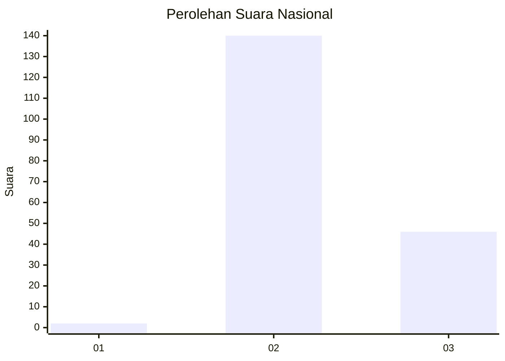
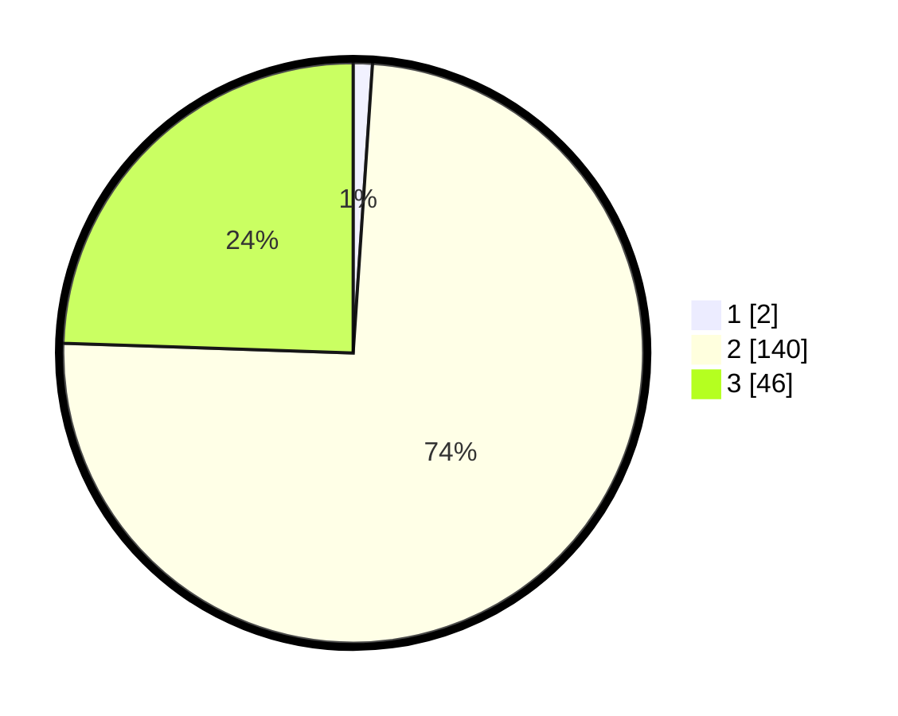

# Hasil

## Grafik

## Tabel

| No. | Nama Paslon    | Suara | Suara (raw) | Persentase |
|:--- |:-------------- | -----:| -----------:| ----------:|
| 1   | ANIES MUHAIMIN | 2     | [2][p-1]    | 1,06       |
| 2   | PRABOWO GIBRAN | 140   | [140][p-2]  | 74,47      |
| 3   | GANJAR MAHFUD  | 46    | [46][p-3]   | 24,47      |

[p-1]: https://github.com/gigit-pemilu/pemilu-2024/blob/main/pilpres/hitung-suara/sub/51-bali/sub/04-gianyar/sub/03-gianyar/sub/2010-siangan/sub/001-tps/sub/paslon-1.txt
[p-2]: https://github.com/gigit-pemilu/pemilu-2024/blob/main/pilpres/hitung-suara/sub/51-bali/sub/04-gianyar/sub/03-gianyar/sub/2010-siangan/sub/001-tps/sub/paslon-2.txt
[p-3]: https://github.com/gigit-pemilu/pemilu-2024/blob/main/pilpres/hitung-suara/sub/51-bali/sub/04-gianyar/sub/03-gianyar/sub/2010-siangan/sub/001-tps/sub/paslon-3.txt

## Foto C Plano

https://sirekap-obj-formc.kpu.go.id/7b39/pemilu/ppwp/51/04/03/20/10/5104032010001-20240214-133352--d8700da3-6852-4d3a-82fe-debe958738b6.jpg

https://sirekap-obj-formc.kpu.go.id/7b39/pemilu/ppwp/51/04/03/20/10/5104032010001-20240215-063308--812c470b-346b-44a8-bff6-def2b65a0b44.jpg

## Metadata

| Key        | Value               |
| ---------- | ------------------- |
| Time Stamp | 2024-02-22 11:00:00 |

