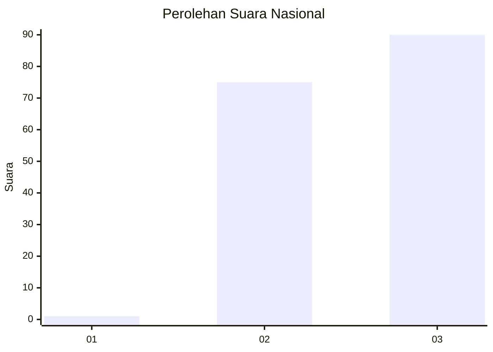
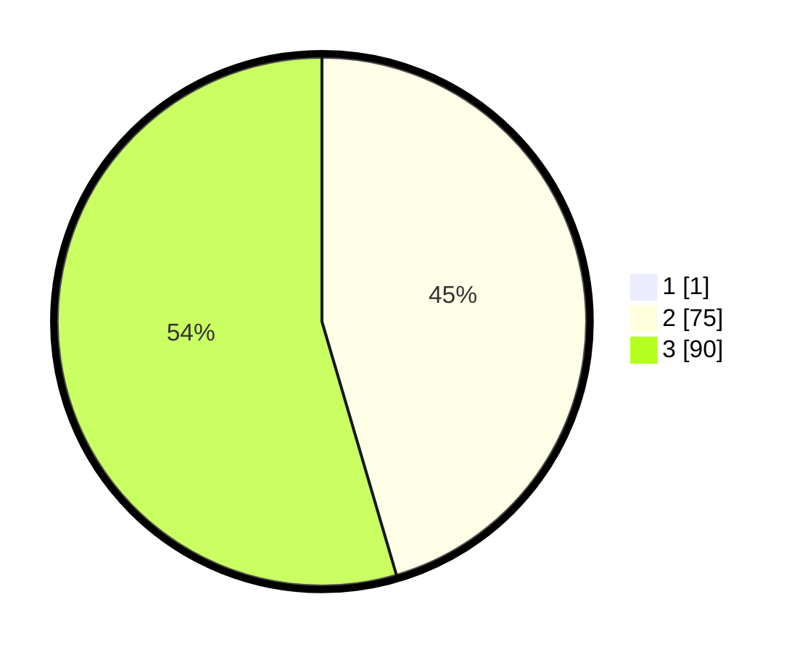

# Hasil

## Grafik

## Tabel

| No. | Nama Paslon    | Suara | Suara (raw) | Persentase |
|:--- |:-------------- | -----:| -----------:| ----------:|
| 1   | ANIES MUHAIMIN | 1     | [1][p-1]    | 0,60       |
| 2   | PRABOWO GIBRAN | 75    | [75][p-2]   | 45,18      |
| 3   | GANJAR MAHFUD  | 90    | [90][p-3]   | 54,22      |

[p-1]: https://github.com/gigit-pemilu/pemilu-2024/blob/main/pilpres/hitung-suara/sub/51-bali/sub/04-gianyar/sub/03-gianyar/sub/2010-siangan/sub/008-tps/sub/paslon-1.txt
[p-2]: https://github.com/gigit-pemilu/pemilu-2024/blob/main/pilpres/hitung-suara/sub/51-bali/sub/04-gianyar/sub/03-gianyar/sub/2010-siangan/sub/008-tps/sub/paslon-2.txt
[p-3]: https://github.com/gigit-pemilu/pemilu-2024/blob/main/pilpres/hitung-suara/sub/51-bali/sub/04-gianyar/sub/03-gianyar/sub/2010-siangan/sub/008-tps/sub/paslon-3.txt

## Foto C Plano

https://sirekap-obj-formc.kpu.go.id/90da/pemilu/ppwp/51/04/03/20/10/5104032010008-20240215-224932--f3d22fa6-d166-4ca3-a9bb-6f20525a2698.jpg

https://sirekap-obj-formc.kpu.go.id/90da/pemilu/ppwp/51/04/03/20/10/5104032010008-20240215-224934--9c43e7ad-0035-4862-99c4-5363fb17ee93.jpg

https://sirekap-obj-formc.kpu.go.id/90da/pemilu/ppwp/51/04/03/20/10/5104032010008-20240215-224932--5e0c1535-57a6-41d9-8628-584a66f0fd8f.jpg

## Metadata

| Key        | Value               |
| ---------- | ------------------- |
| Time Stamp | 2024-02-15 23:29:50 |

## DATA PEMILIH TETAP

Jumlah pemilih dalam DPT: **179**.
 * L: **89**.
 * P: **90**.

## DATA PENGGUNA HAK PILIH

Jumlah pengguna hak pilih dalam DPT: **167**.
 * L: **85**.
 * P: **82**.

Jumlah pengguna hak pilih dalam DPTb: **0**.
 * L: **0**.
 * P: **0**.

Jumlah pengguna hak pilih dalam DPK: **1**.
 * L: **0**.
 * P: **1**.

Jumlah pengguna hak pilih: **168**.
 * L: **85**.
 * P: **83**.

## JUMLAH SUARA SAH DAN TIDAK SAH

JUMLAH SELURUH SUARA SAH: **166**.

JUMLAH SUARA TIDAK SAH: **2**.

JUMLAH SELURUH SUARA SAH DAN SUARA TIDAK SAH: **168**.

