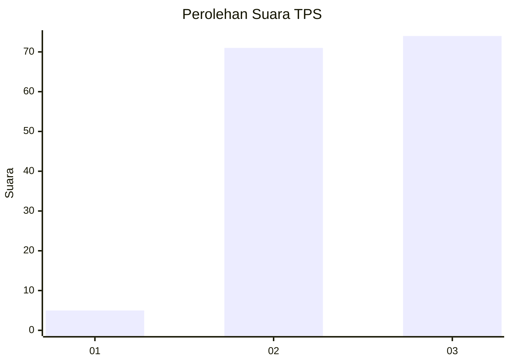
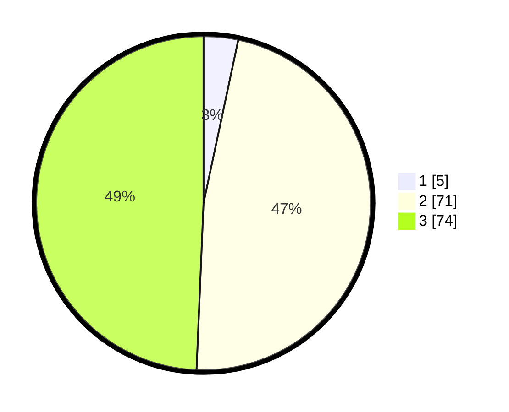

# Hasil

## Grafik

## Tabel

| No. | Nama Paslon    | Suara | Suara (raw) | Persentase |
|:--- |:-------------- | -----:| -----------:| ----------:|
| 1   | ANIES MUHAIMIN | 5     | [5][p-1]    | 3,33       |
| 2   | PRABOWO GIBRAN | 71    | [71][p-2]   | 47,33      |
| 3   | GANJAR MAHFUD  | 74    | [74][p-3]   | 49,33      |

[p-1]: https://github.com/gigit-pemilu/pemilu-2024-51-bali/blob/main/pilpres/hitung-suara/sub/51-bali/sub/04-gianyar/sub/03-gianyar/sub/2010-siangan/sub/017-tps/sub/paslon-1.txt
[p-2]: https://github.com/gigit-pemilu/pemilu-2024-51-bali/blob/main/pilpres/hitung-suara/sub/51-bali/sub/04-gianyar/sub/03-gianyar/sub/2010-siangan/sub/017-tps/sub/paslon-2.txt
[p-3]: https://github.com/gigit-pemilu/pemilu-2024-51-bali/blob/main/pilpres/hitung-suara/sub/51-bali/sub/04-gianyar/sub/03-gianyar/sub/2010-siangan/sub/017-tps/sub/paslon-3.txt

## Foto C Plano

https://sirekap-obj-formc.kpu.go.id/7ebc/pemilu/ppwp/51/04/03/20/10/5104032010017-20240214-193200--d3fff1dd-5b9a-45e7-88d5-39cafdb0c345.jpg

https://sirekap-obj-formc.kpu.go.id/7ebc/pemilu/ppwp/51/04/03/20/10/5104032010017-20240215-222758--89760c11-ca92-4273-b1b9-1d9d2592dcb7.jpg

https://sirekap-obj-formc.kpu.go.id/7ebc/pemilu/ppwp/51/04/03/20/10/5104032010017-20240214-192510--efc89a72-aa5c-46f7-b074-1ae6274d0d26.jpg

## Metadata

| Key        | Value               |
| ---------- | ------------------- |
| Time Stamp | 2024-02-15 22:40:13 |

## DATA PEMILIH TETAP

Jumlah pemilih dalam DPT: **175**.
 * L: **91**.
 * P: **84**.

## DATA PENGGUNA HAK PILIH

Jumlah pengguna hak pilih dalam DPT: **143**.
 * L: **77**.
 * P: **66**.

Jumlah pengguna hak pilih dalam DPTb: **0**.
 * L: **0**.
 * P: **0**.

Jumlah pengguna hak pilih dalam DPK: **7**.
 * L: **3**.
 * P: **4**.

Jumlah pengguna hak pilih: **150**.
 * L: **80**.
 * P: **70**.

## JUMLAH SUARA SAH DAN TIDAK SAH

JUMLAH SELURUH SUARA SAH: **150**.

JUMLAH SUARA TIDAK SAH: **0**.

JUMLAH SELURUH SUARA SAH DAN SUARA TIDAK SAH: **150**.

