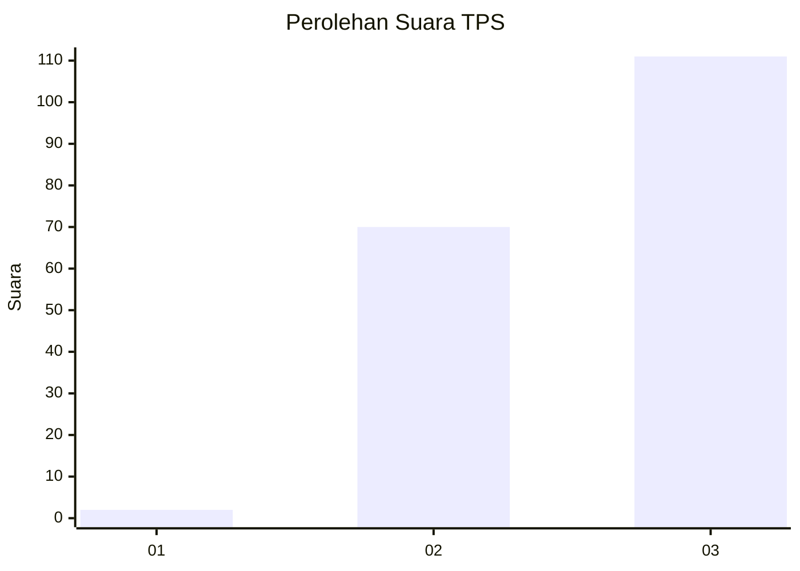
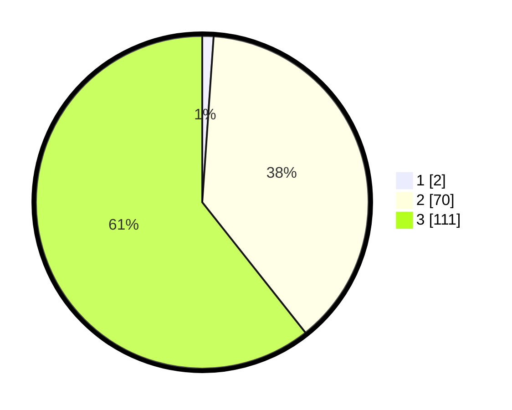

# Hasil

## Grafik

## Tabel

| No. | Nama Paslon    | Suara | Suara (raw) | Persentase |
|:--- |:-------------- | -----:| -----------:| ----------:|
| 1   | ANIES MUHAIMIN | 2     | [2][p-1]    | 1,09       |
| 2   | PRABOWO GIBRAN | 70    | [70][p-2]   | 38,25      |
| 3   | GANJAR MAHFUD  | 111   | [111][p-3]  | 60,66      |

[p-1]: https://github.com/gigit-pemilu/pemilu-2024-51-bali/blob/main/pilpres/hitung-suara/sub/51-bali/sub/04-gianyar/sub/03-gianyar/sub/2012-petak/sub/014-tps/sub/paslon-1.txt
[p-2]: https://github.com/gigit-pemilu/pemilu-2024-51-bali/blob/main/pilpres/hitung-suara/sub/51-bali/sub/04-gianyar/sub/03-gianyar/sub/2012-petak/sub/014-tps/sub/paslon-2.txt
[p-3]: https://github.com/gigit-pemilu/pemilu-2024-51-bali/blob/main/pilpres/hitung-suara/sub/51-bali/sub/04-gianyar/sub/03-gianyar/sub/2012-petak/sub/014-tps/sub/paslon-3.txt

## Foto C Plano

https://sirekap-obj-formc.kpu.go.id/bdc9/pemilu/ppwp/51/04/03/20/12/5104032012014-20240215-002557--e50892a6-ce6d-491b-a781-48eb27be0ce1.jpg

https://sirekap-obj-formc.kpu.go.id/bdc9/pemilu/ppwp/51/04/03/20/12/5104032012014-20240215-002710--d8837edd-2017-4cc4-9948-cdb86dcd0659.jpg

https://sirekap-obj-formc.kpu.go.id/bdc9/pemilu/ppwp/51/04/03/20/12/5104032012014-20240215-002907--8a5cd4ec-cf76-46cb-a57f-5e5c562e6bb8.jpg

## Metadata

| Key        | Value               |
| ---------- | ------------------- |
| Time Stamp | 2024-02-16 12:51:22 |

