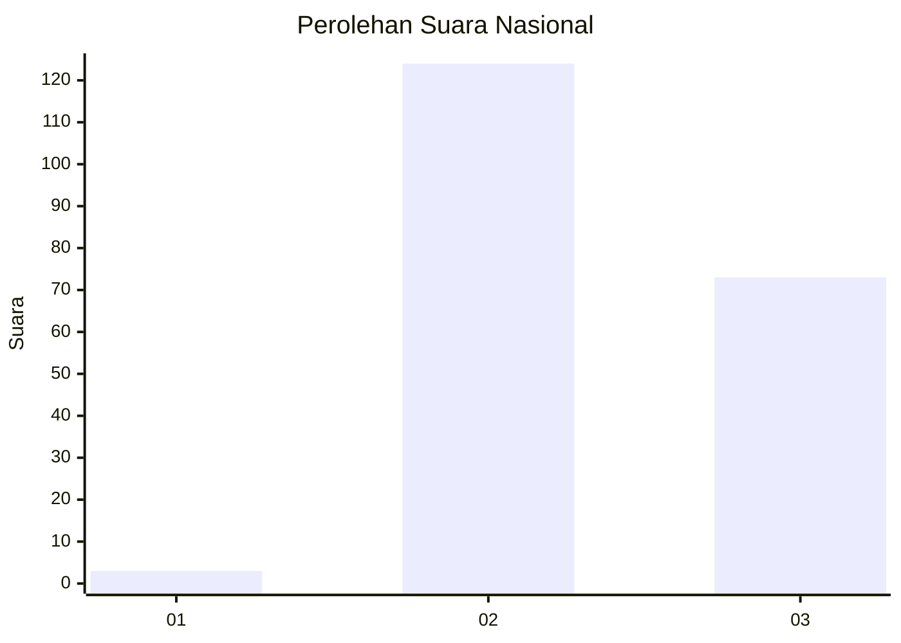
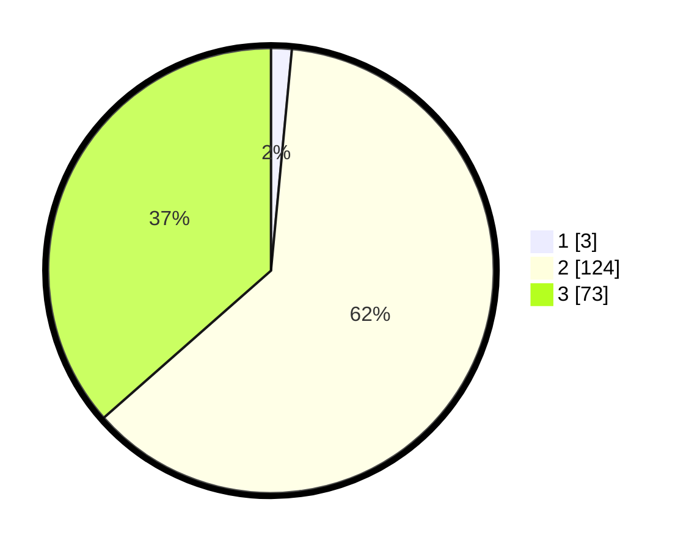

# Hasil

## Grafik

## Tabel

| No. | Nama Paslon    | Suara | Suara (raw) | Persentase |
|:--- |:-------------- | -----:| -----------:| ----------:|
| 1   | ANIES MUHAIMIN | 3     | [3][p-1]    | 1,50       |
| 2   | PRABOWO GIBRAN | 124   | [124][p-2]  | 62,00      |
| 3   | GANJAR MAHFUD  | 73    | [73][p-3]   | 36,50      |

[p-1]: https://github.com/gigit-pemilu/pemilu-2024/blob/main/pilpres/hitung-suara/sub/51-bali/sub/04-gianyar/sub/03-gianyar/sub/2013-serongga/sub/002-tps/sub/paslon-1.txt
[p-2]: https://github.com/gigit-pemilu/pemilu-2024/blob/main/pilpres/hitung-suara/sub/51-bali/sub/04-gianyar/sub/03-gianyar/sub/2013-serongga/sub/002-tps/sub/paslon-2.txt
[p-3]: https://github.com/gigit-pemilu/pemilu-2024/blob/main/pilpres/hitung-suara/sub/51-bali/sub/04-gianyar/sub/03-gianyar/sub/2013-serongga/sub/002-tps/sub/paslon-3.txt

## Foto C Plano

https://sirekap-obj-formc.kpu.go.id/9565/pemilu/ppwp/51/04/03/20/13/5104032013002-20240214-212414--8c279492-9881-4b07-85e7-942e30a42a5f.jpg

https://sirekap-obj-formc.kpu.go.id/9565/pemilu/ppwp/51/04/03/20/13/5104032013002-20240214-212700--be600e71-49ef-4e58-82f1-60384a2f347e.jpg

https://sirekap-obj-formc.kpu.go.id/9565/pemilu/ppwp/51/04/03/20/13/5104032013002-20240214-212742--82c7a3c5-3c86-4ea8-8aff-ed8fc42953c3.jpg

## Metadata

| Key        | Value               |
| ---------- | ------------------- |
| Time Stamp | 2024-02-15 15:30:25 |

