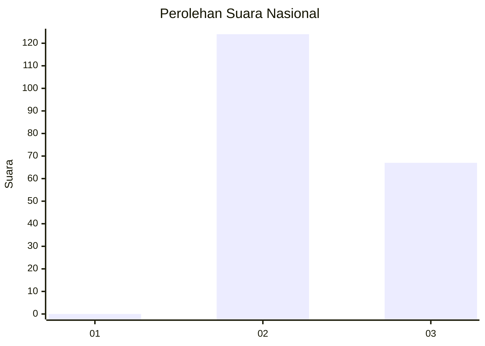
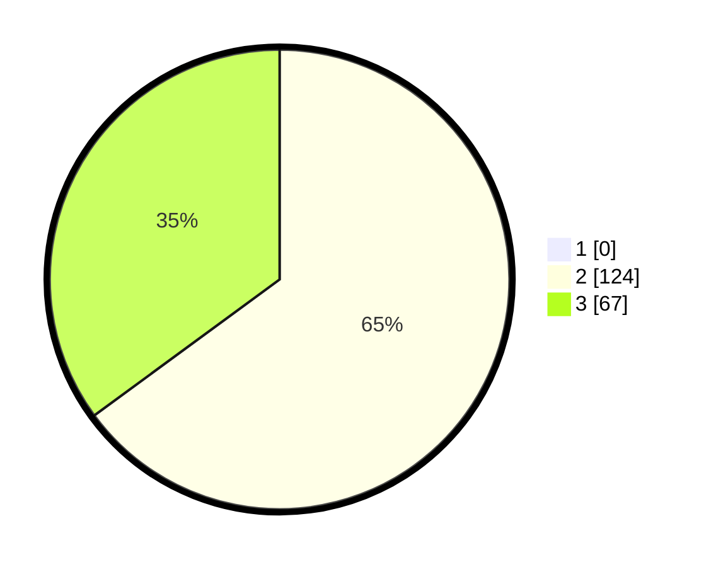

# Hasil

## Grafik

## Tabel

| No. | Nama Paslon    | Suara | Suara (raw) | Persentase |
|:--- |:-------------- | -----:| -----------:| ----------:|
| 1   | ANIES MUHAIMIN | 0     | [0][p-1]    | 0,00       |
| 2   | PRABOWO GIBRAN | 124   | [124][p-2]  | 64,92      |
| 3   | GANJAR MAHFUD  | 67    | [67][p-3]   | 35,08      |

[p-1]: https://github.com/gigit-pemilu/pemilu-2024/blob/main/pilpres/hitung-suara/sub/51-bali/sub/04-gianyar/sub/03-gianyar/sub/2013-serongga/sub/014-tps/sub/paslon-1.txt
[p-2]: https://github.com/gigit-pemilu/pemilu-2024/blob/main/pilpres/hitung-suara/sub/51-bali/sub/04-gianyar/sub/03-gianyar/sub/2013-serongga/sub/014-tps/sub/paslon-2.txt
[p-3]: https://github.com/gigit-pemilu/pemilu-2024/blob/main/pilpres/hitung-suara/sub/51-bali/sub/04-gianyar/sub/03-gianyar/sub/2013-serongga/sub/014-tps/sub/paslon-3.txt

## Foto C Plano

https://sirekap-obj-formc.kpu.go.id/4921/pemilu/ppwp/51/04/03/20/13/5104032013014-20240215-030150--903baa5c-a5a4-4b28-ac09-234f7e52fe2b.jpg

https://sirekap-obj-formc.kpu.go.id/4921/pemilu/ppwp/51/04/03/20/13/5104032013014-20240215-000015--0b61d1f2-633f-456e-a206-c6cca4bf8bc8.jpg

https://sirekap-obj-formc.kpu.go.id/4921/pemilu/ppwp/51/04/03/20/13/5104032013014-20240215-000113--c1bd5921-832c-49d4-9f6c-505a143b74e8.jpg

## Metadata

| Key        | Value               |
| ---------- | ------------------- |
| Time Stamp | 2024-02-15 16:00:26 |

