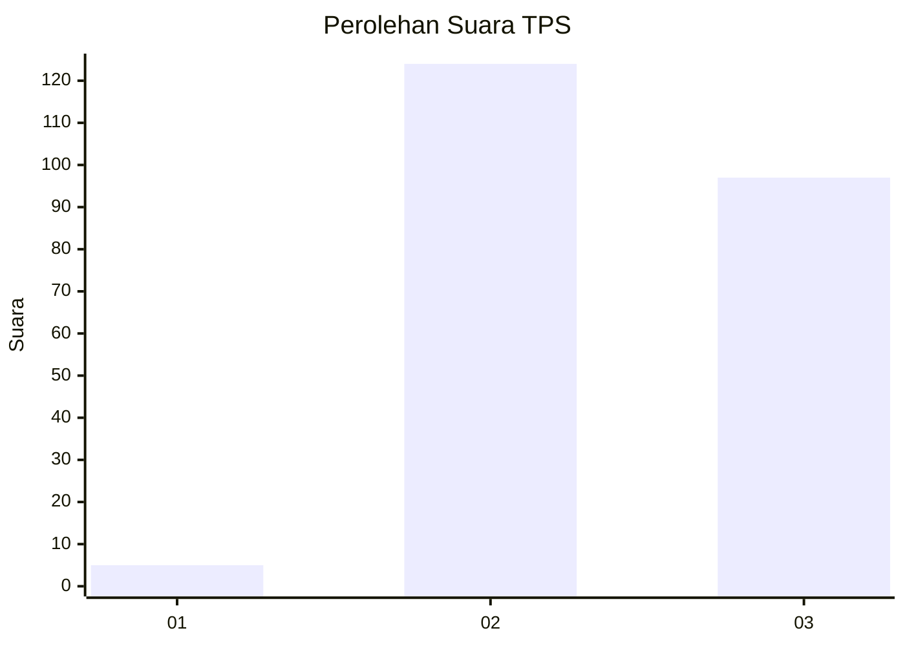
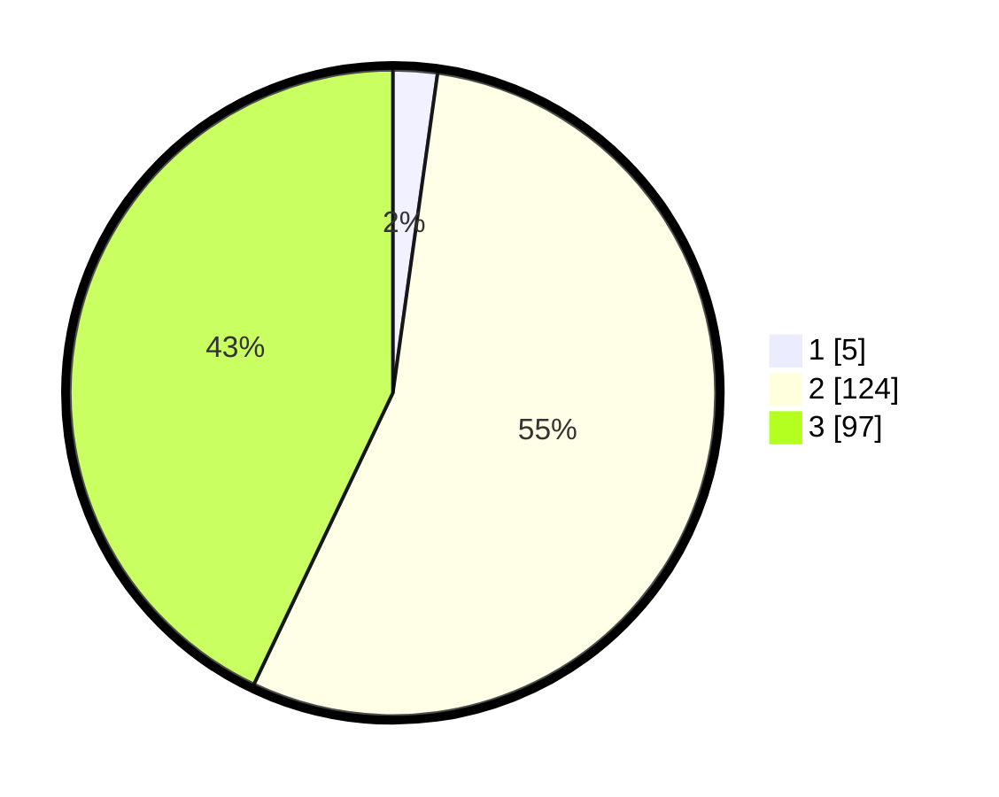

# Hasil

## Grafik

## Tabel

| No. | Nama Paslon    | Suara | Suara (raw) | Persentase |
|:--- |:-------------- | -----:| -----------:| ----------:|
| 1   | ANIES MUHAIMIN | 5     | [5][p-1]    | 2,21       |
| 2   | PRABOWO GIBRAN | 124   | [124][p-2]  | 54,87      |
| 3   | GANJAR MAHFUD  | 97    | [97][p-3]   | 42,92      |

[p-1]: https://github.com/gigit-pemilu/pemilu-2024-51-bali/blob/main/pilpres/hitung-suara/sub/51-bali/sub/04-gianyar/sub/03-gianyar/sub/2015-temesi/sub/003-tps/sub/paslon-1.txt
[p-2]: https://github.com/gigit-pemilu/pemilu-2024-51-bali/blob/main/pilpres/hitung-suara/sub/51-bali/sub/04-gianyar/sub/03-gianyar/sub/2015-temesi/sub/003-tps/sub/paslon-2.txt
[p-3]: https://github.com/gigit-pemilu/pemilu-2024-51-bali/blob/main/pilpres/hitung-suara/sub/51-bali/sub/04-gianyar/sub/03-gianyar/sub/2015-temesi/sub/003-tps/sub/paslon-3.txt

## Foto C Plano

https://sirekap-obj-formc.kpu.go.id/9f34/pemilu/ppwp/51/04/03/20/15/5104032015003-20240214-222917--f76e0699-a5ba-4ec9-9407-5668f8c8ee24.jpg

https://sirekap-obj-formc.kpu.go.id/9f34/pemilu/ppwp/51/04/03/20/15/5104032015003-20240214-223150--916bc82e-0405-4c59-8f64-f26279489ac5.jpg

https://sirekap-obj-formc.kpu.go.id/9f34/pemilu/ppwp/51/04/03/20/15/5104032015003-20240214-223344--439e8853-fd13-4465-93e5-495d15e42c48.jpg

## Metadata

| Key        | Value               |
| ---------- | ------------------- |
| Time Stamp | 2024-02-16 12:51:22 |

