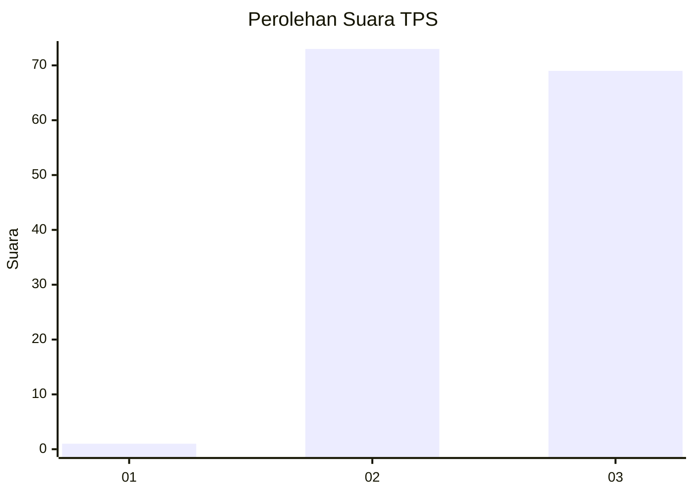
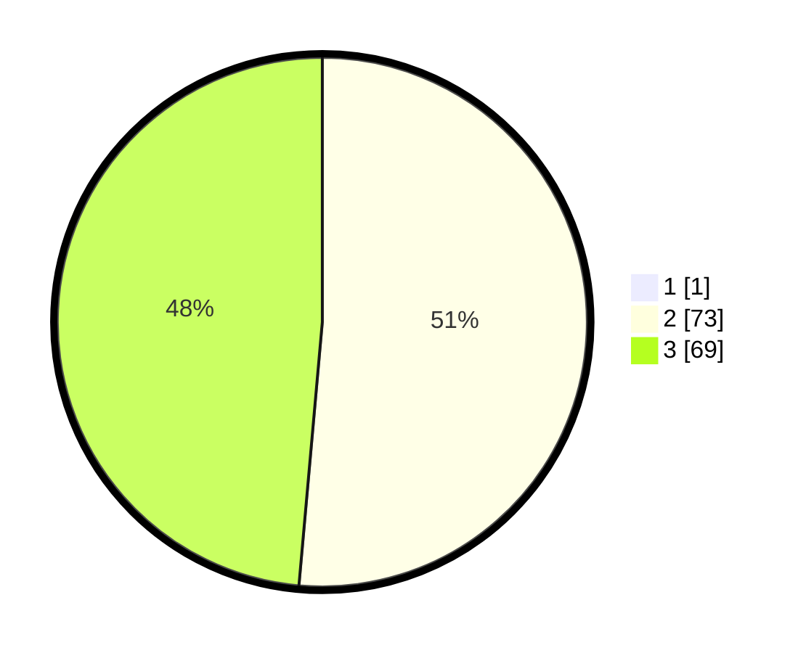

# Hasil

## Grafik

## Tabel

| No. | Nama Paslon    | Suara | Suara (raw) | Persentase |
|:--- |:-------------- | -----:| -----------:| ----------:|
| 1   | ANIES MUHAIMIN | 1     | [1][p-1]    | 0,70       |
| 2   | PRABOWO GIBRAN | 73    | [73][p-2]   | 51,05      |
| 3   | GANJAR MAHFUD  | 69    | [69][p-3]   | 48,25      |

[p-1]: https://github.com/gigit-pemilu/pemilu-2024-51-bali/blob/main/pilpres/hitung-suara/sub/51-bali/sub/04-gianyar/sub/03-gianyar/sub/2016-sumita/sub/002-tps/sub/paslon-1.txt
[p-2]: https://github.com/gigit-pemilu/pemilu-2024-51-bali/blob/main/pilpres/hitung-suara/sub/51-bali/sub/04-gianyar/sub/03-gianyar/sub/2016-sumita/sub/002-tps/sub/paslon-2.txt
[p-3]: https://github.com/gigit-pemilu/pemilu-2024-51-bali/blob/main/pilpres/hitung-suara/sub/51-bali/sub/04-gianyar/sub/03-gianyar/sub/2016-sumita/sub/002-tps/sub/paslon-3.txt

## Foto C Plano

https://sirekap-obj-formc.kpu.go.id/d8cf/pemilu/ppwp/51/04/03/20/16/5104032016002-20240216-132125--ed9db4af-aa08-4fa3-aabd-717e41435648.jpg

https://sirekap-obj-formc.kpu.go.id/d8cf/pemilu/ppwp/51/04/03/20/16/5104032016002-20240216-132126--a593b213-da5c-4c0e-ac30-39fea3426e37.jpg

https://sirekap-obj-formc.kpu.go.id/d8cf/pemilu/ppwp/51/04/03/20/16/5104032016002-20240216-132126--40089215-4a23-4422-96e3-869ae4c63b08.jpg

## Metadata

| Key        | Value               |
| ---------- | ------------------- |
| Time Stamp | 2024-02-16 14:00:34 |

## DATA PEMILIH TETAP

Jumlah pemilih dalam DPT: **146**.
 * L: **73**.
 * P: **73**.

## DATA PENGGUNA HAK PILIH

Jumlah pengguna hak pilih dalam DPT: **142**.
 * L: **70**.
 * P: **72**.

Jumlah pengguna hak pilih dalam DPTb: **0**.
 * L: **0**.
 * P: **0**.

Jumlah pengguna hak pilih dalam DPK: **2**.
 * L: **0**.
 * P: **2**.

Jumlah pengguna hak pilih: **144**.
 * L: **70**.
 * P: **74**.

## JUMLAH SUARA SAH DAN TIDAK SAH

JUMLAH SELURUH SUARA SAH: **143**.

JUMLAH SUARA TIDAK SAH: **1**.

JUMLAH SELURUH SUARA SAH DAN SUARA TIDAK SAH: **144**.

