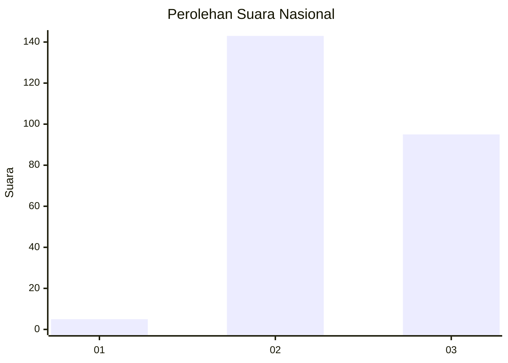
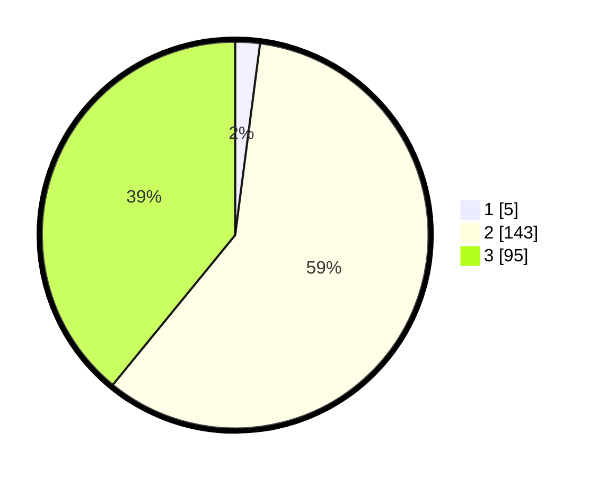

# Hasil

## Grafik

## Tabel

| No. | Nama Paslon    | Suara | Suara (raw) | Persentase |
|:--- |:-------------- | -----:| -----------:| ----------:|
| 1   | ANIES MUHAIMIN | 5     | [5][p-1]    | 2,06       |
| 2   | PRABOWO GIBRAN | 143   | [143][p-2]  | 58,85      |
| 3   | GANJAR MAHFUD  | 95    | [95][p-3]   | 39,09      |

[p-1]: https://github.com/gigit-pemilu/pemilu-2024/blob/main/pilpres/hitung-suara/sub/51-bali/sub/04-gianyar/sub/03-gianyar/sub/2017-tegal-tugu/sub/004-tps/sub/paslon-1.txt
[p-2]: https://github.com/gigit-pemilu/pemilu-2024/blob/main/pilpres/hitung-suara/sub/51-bali/sub/04-gianyar/sub/03-gianyar/sub/2017-tegal-tugu/sub/004-tps/sub/paslon-2.txt
[p-3]: https://github.com/gigit-pemilu/pemilu-2024/blob/main/pilpres/hitung-suara/sub/51-bali/sub/04-gianyar/sub/03-gianyar/sub/2017-tegal-tugu/sub/004-tps/sub/paslon-3.txt

## Foto C Plano

https://sirekap-obj-formc.kpu.go.id/e935/pemilu/ppwp/51/04/03/20/17/5104032017004-20240214-235600--65fd2efa-5307-4d28-901c-37c984d1ea74.jpg

https://sirekap-obj-formc.kpu.go.id/e935/pemilu/ppwp/51/04/03/20/17/5104032017004-20240214-235654--7b53f02a-3ac3-4fa6-9945-8ddb66155208.jpg

https://sirekap-obj-formc.kpu.go.id/e935/pemilu/ppwp/51/04/03/20/17/5104032017004-20240214-235739--64e57bb5-b9da-424b-9e0a-4e247cb25148.jpg

## Metadata

| Key        | Value               |
| ---------- | ------------------- |
| Time Stamp | 2024-02-15 15:30:25 |

