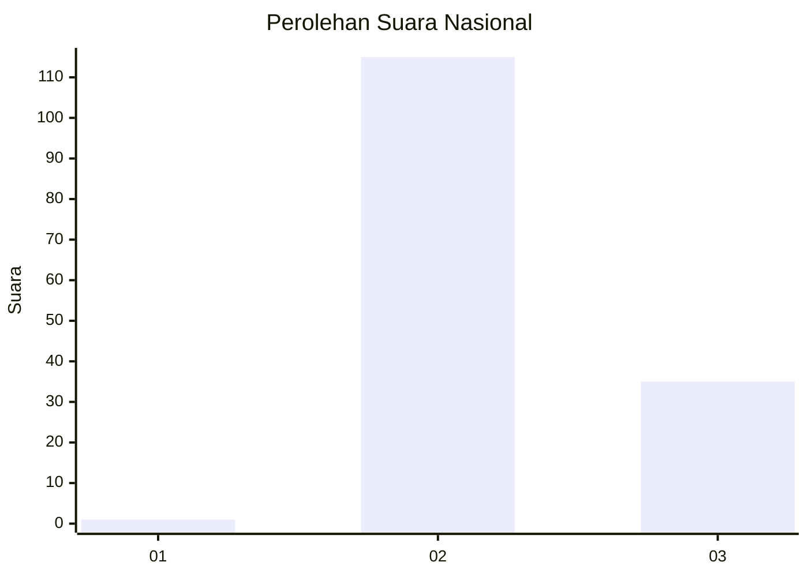
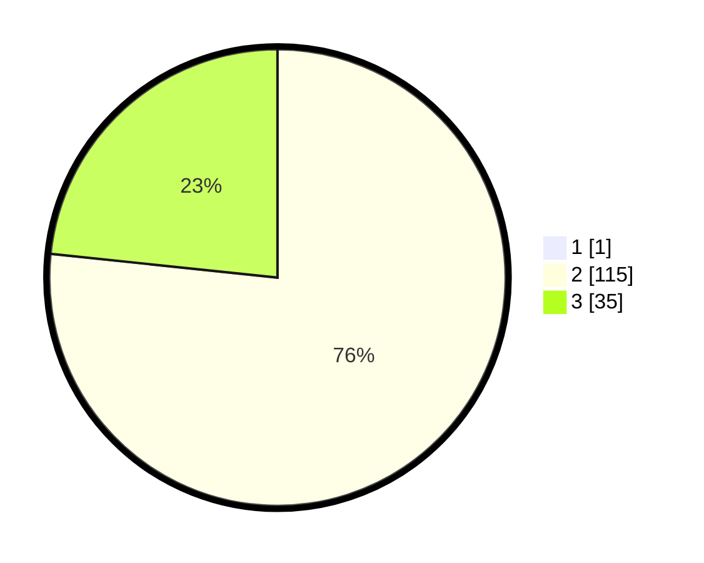

# Hasil

## Grafik

## Tabel

| No. | Nama Paslon    | Suara | Suara (raw) | Persentase |
|:--- |:-------------- | -----:| -----------:| ----------:|
| 1   | ANIES MUHAIMIN | 1     | [1][p-1]    | 0,66       |
| 2   | PRABOWO GIBRAN | 115   | [115][p-2]  | 76,16      |
| 3   | GANJAR MAHFUD  | 35    | [35][p-3]   | 23,18      |

[p-1]: https://github.com/gigit-pemilu/pemilu-2024/blob/main/pilpres/hitung-suara/sub/51-bali/sub/04-gianyar/sub/03-gianyar/sub/2017-tegal-tugu/sub/008-tps/sub/paslon-1.txt
[p-2]: https://github.com/gigit-pemilu/pemilu-2024/blob/main/pilpres/hitung-suara/sub/51-bali/sub/04-gianyar/sub/03-gianyar/sub/2017-tegal-tugu/sub/008-tps/sub/paslon-2.txt
[p-3]: https://github.com/gigit-pemilu/pemilu-2024/blob/main/pilpres/hitung-suara/sub/51-bali/sub/04-gianyar/sub/03-gianyar/sub/2017-tegal-tugu/sub/008-tps/sub/paslon-3.txt

## Foto C Plano

https://sirekap-obj-formc.kpu.go.id/de2d/pemilu/ppwp/51/04/03/20/17/5104032017008-20240214-155228--e39fed95-0c45-44b8-abb1-3be5417abd6a.jpg

https://sirekap-obj-formc.kpu.go.id/de2d/pemilu/ppwp/51/04/03/20/17/5104032017008-20240214-155236--31a77d6f-ab8b-44d5-be58-62beacda025d.jpg

https://sirekap-obj-formc.kpu.go.id/de2d/pemilu/ppwp/51/04/03/20/17/5104032017008-20240214-155245--b221e658-01ea-49e9-b247-236d77085ac0.jpg

## Metadata

| Key        | Value               |
| ---------- | ------------------- |
| Time Stamp | 2024-02-15 12:00:28 |

