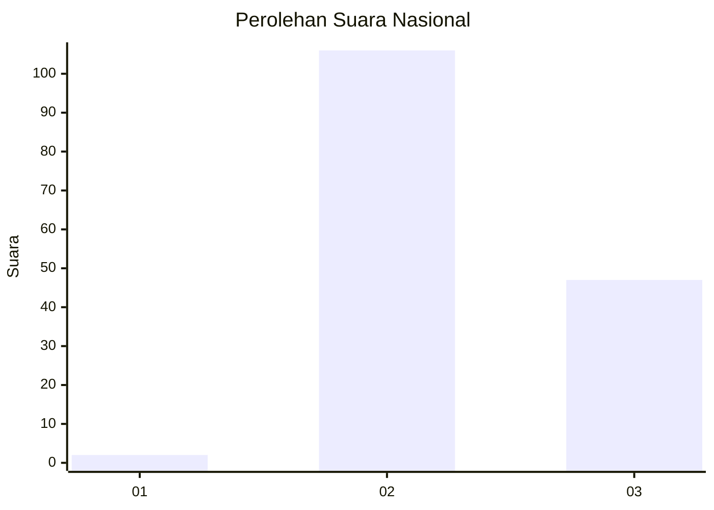

# Hasil

## Grafik

## Tabel

| No. | Nama Paslon    | Suara | Suara (raw) | Persentase |
|:--- |:-------------- | -----:| -----------:| ----------:|
| 1   | ANIES MUHAIMIN | 2     | [2][p-1]    | 1,29       |
| 2   | PRABOWO GIBRAN | 106   | [106][p-2]  | 68,39      |
| 3   | GANJAR MAHFUD  | 47    | [47][p-3]   | 30,32      |

[p-1]: https://github.com/gigit-pemilu/pemilu-2024/blob/main/pilpres/hitung-suara/sub/51-bali/sub/04-gianyar/sub/03-gianyar/sub/2017-tegal-tugu/sub/009-tps/sub/paslon-1.txt
[p-2]: https://github.com/gigit-pemilu/pemilu-2024/blob/main/pilpres/hitung-suara/sub/51-bali/sub/04-gianyar/sub/03-gianyar/sub/2017-tegal-tugu/sub/009-tps/sub/paslon-2.txt
[p-3]: https://github.com/gigit-pemilu/pemilu-2024/blob/main/pilpres/hitung-suara/sub/51-bali/sub/04-gianyar/sub/03-gianyar/sub/2017-tegal-tugu/sub/009-tps/sub/paslon-3.txt

## Foto C Plano

https://sirekap-obj-formc.kpu.go.id/93ca/pemilu/ppwp/51/04/03/20/17/5104032017009-20240214-140941--73b51fb6-2ef0-4775-a45f-321a5a82ff61.jpg

https://sirekap-obj-formc.kpu.go.id/93ca/pemilu/ppwp/51/04/03/20/17/5104032017009-20240214-140946--b7e6a54c-6534-43a6-b4e1-e9bb58d4e32e.jpg

https://sirekap-obj-formc.kpu.go.id/93ca/pemilu/ppwp/51/04/03/20/17/5104032017009-20240214-140952--556ac4d8-ae6b-4e8d-aa91-0af6c7467ff9.jpg

## Metadata

| Key        | Value               |
| ---------- | ------------------- |
| Time Stamp | 2024-02-14 21:46:01 |

## DATA PEMILIH TETAP

Jumlah pemilih dalam DPT: **174**.
 * L: **79**.
 * P: **95**.

## DATA PENGGUNA HAK PILIH

Jumlah pengguna hak pilih dalam DPT: **164**.
 * L: **77**.
 * P: **87**.

Jumlah pengguna hak pilih dalam DPTb: **0**.
 * L: **0**.
 * P: **0**.

Jumlah pengguna hak pilih dalam DPK: **2**.
 * L: **1**.
 * P: **1**.

Jumlah pengguna hak pilih: **166**.
 * L: **78**.
 * P: **88**.

## JUMLAH SUARA SAH DAN TIDAK SAH

JUMLAH SELURUH SUARA SAH: **155**.

JUMLAH SUARA TIDAK SAH: **11**.

JUMLAH SELURUH SUARA SAH DAN SUARA TIDAK SAH: **166**.

