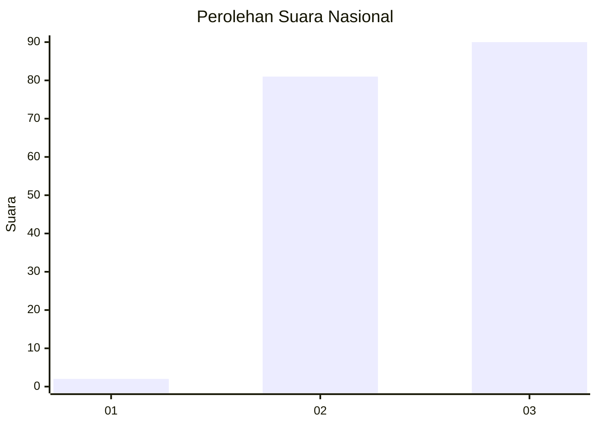
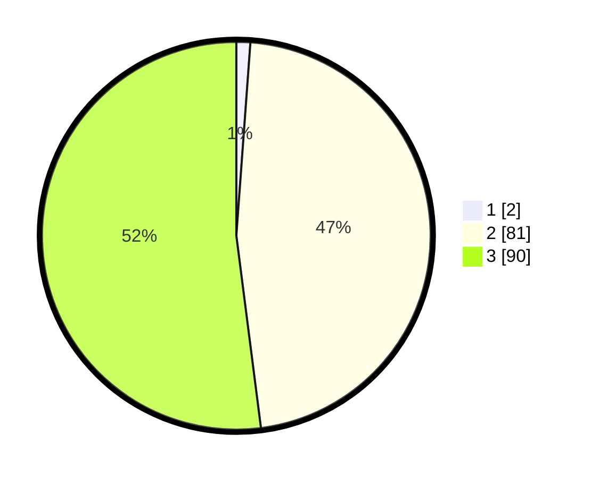

# Hasil

## Grafik

## Tabel

| No. | Nama Paslon    | Suara | Suara (raw) | Persentase |
|:--- |:-------------- | -----:| -----------:| ----------:|
| 1   | ANIES MUHAIMIN | 2     | [2][p-1]    | 1,16       |
| 2   | PRABOWO GIBRAN | 81    | [81][p-2]   | 46,82      |
| 3   | GANJAR MAHFUD  | 90    | [90][p-3]   | 52,02      |

[p-1]: https://github.com/gigit-pemilu/pemilu-2024/blob/main/pilpres/hitung-suara/sub/51-bali/sub/04-gianyar/sub/04-tampaksiring/sub/2001-pejeng/sub/001-tps/sub/paslon-1.txt
[p-2]: https://github.com/gigit-pemilu/pemilu-2024/blob/main/pilpres/hitung-suara/sub/51-bali/sub/04-gianyar/sub/04-tampaksiring/sub/2001-pejeng/sub/001-tps/sub/paslon-2.txt
[p-3]: https://github.com/gigit-pemilu/pemilu-2024/blob/main/pilpres/hitung-suara/sub/51-bali/sub/04-gianyar/sub/04-tampaksiring/sub/2001-pejeng/sub/001-tps/sub/paslon-3.txt

## Foto C Plano

https://sirekap-obj-formc.kpu.go.id/34ec/pemilu/ppwp/51/04/04/20/01/5104042001001-20240214-231617--b395395d-128e-4658-a8a2-3c9345ba4d13.jpg

https://sirekap-obj-formc.kpu.go.id/34ec/pemilu/ppwp/51/04/04/20/01/5104042001001-20240214-141024--d57c9a2c-d789-49f8-a9fe-e5ff7d81a3b6.jpg

https://sirekap-obj-formc.kpu.go.id/34ec/pemilu/ppwp/51/04/04/20/01/5104042001001-20240214-141036--7be1da5f-2e16-497c-a662-fe3d5581d014.jpg

## Metadata

| Key        | Value               |
| ---------- | ------------------- |
| Time Stamp | 2024-02-17 12:00:00 |

