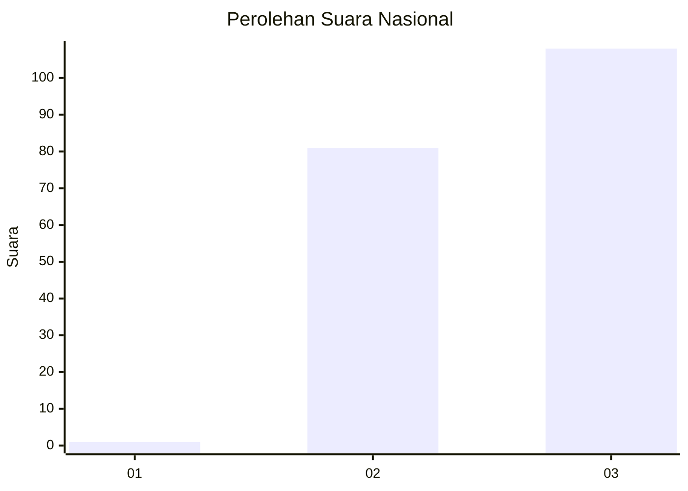
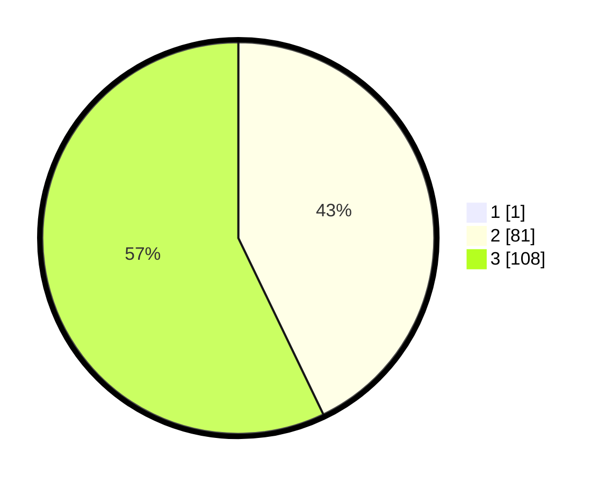

# Hasil

## Grafik

## Tabel

| No. | Nama Paslon    | Suara | Suara (raw) | Persentase |
|:--- |:-------------- | -----:| -----------:| ----------:|
| 1   | ANIES MUHAIMIN | 1     | [1][p-1]    | 0,53       |
| 2   | PRABOWO GIBRAN | 81    | [81][p-2]   | 42,63      |
| 3   | GANJAR MAHFUD  | 108   | [108][p-3]  | 56,84      |

[p-1]: https://github.com/gigit-pemilu/pemilu-2024/blob/main/pilpres/hitung-suara/sub/51-bali/sub/04-gianyar/sub/04-tampaksiring/sub/2001-pejeng/sub/002-tps/sub/paslon-1.txt
[p-2]: https://github.com/gigit-pemilu/pemilu-2024/blob/main/pilpres/hitung-suara/sub/51-bali/sub/04-gianyar/sub/04-tampaksiring/sub/2001-pejeng/sub/002-tps/sub/paslon-2.txt
[p-3]: https://github.com/gigit-pemilu/pemilu-2024/blob/main/pilpres/hitung-suara/sub/51-bali/sub/04-gianyar/sub/04-tampaksiring/sub/2001-pejeng/sub/002-tps/sub/paslon-3.txt

## Foto C Plano

https://sirekap-obj-formc.kpu.go.id/9e56/pemilu/ppwp/51/04/04/20/01/5104042001002-20240216-024350--93728e4c-a11f-48c7-8590-aa06d89b42bc.jpg

https://sirekap-obj-formc.kpu.go.id/9e56/pemilu/ppwp/51/04/04/20/01/5104042001002-20240216-024243--f01102ba-b920-4948-a765-faf69e1a68a1.jpg

https://sirekap-obj-formc.kpu.go.id/9e56/pemilu/ppwp/51/04/04/20/01/5104042001002-20240216-024237--2138fbb7-49c8-4334-b609-4b73eaa6ea94.jpg

## Metadata

| Key        | Value               |
| ---------- | ------------------- |
| Time Stamp | 2024-02-16 10:00:28 |

## DATA PEMILIH TETAP

Jumlah pemilih dalam DPT: **212**.
 * L: **106**.
 * P: **106**.

## DATA PENGGUNA HAK PILIH

Jumlah pengguna hak pilih dalam DPT: **191**.
 * L: **99**.
 * P: **92**.

Jumlah pengguna hak pilih dalam DPTb: **0**.
 * L: **0**.
 * P: **0**.

Jumlah pengguna hak pilih dalam DPK: **0**.
 * L: **0**.
 * P: **0**.

Jumlah pengguna hak pilih: **191**.
 * L: **99**.
 * P: **92**.

## JUMLAH SUARA SAH DAN TIDAK SAH

JUMLAH SELURUH SUARA SAH: **190**.

JUMLAH SUARA TIDAK SAH: **1**.

JUMLAH SELURUH SUARA SAH DAN SUARA TIDAK SAH: **191**.

