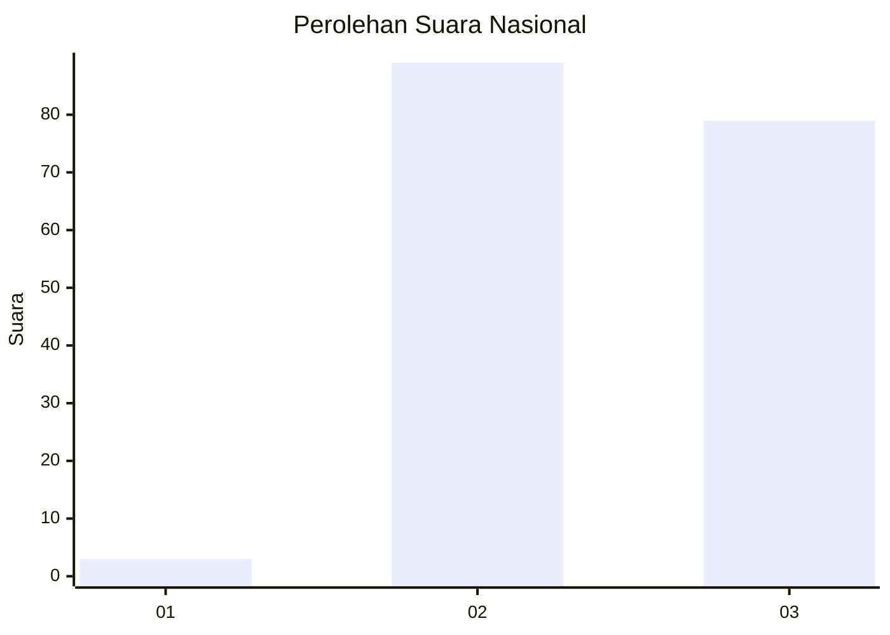
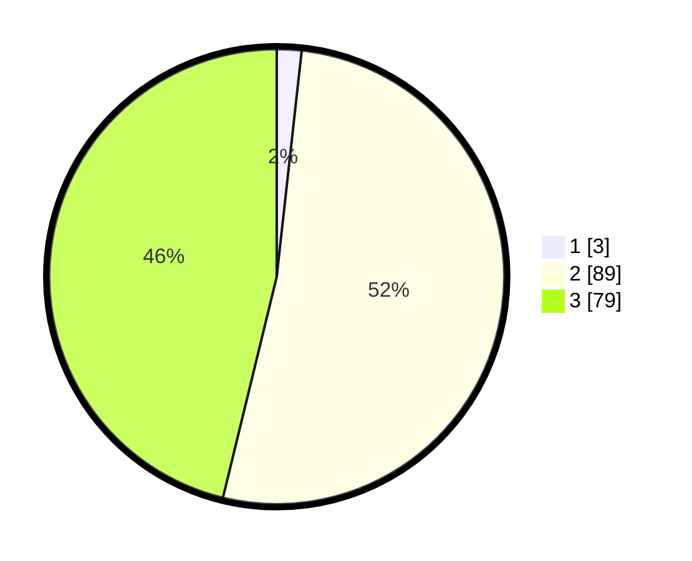

# Hasil

## Grafik

## Tabel

| No. | Nama Paslon    | Suara | Suara (raw) | Persentase |
|:--- |:-------------- | -----:| -----------:| ----------:|
| 1   | ANIES MUHAIMIN | 3     | [3][p-1]    | 1,75       |
| 2   | PRABOWO GIBRAN | 89    | [89][p-2]   | 52,05      |
| 3   | GANJAR MAHFUD  | 79    | [79][p-3]   | 46,20      |

[p-1]: https://github.com/gigit-pemilu/pemilu-2024/blob/main/pilpres/hitung-suara/sub/51-bali/sub/04-gianyar/sub/04-tampaksiring/sub/2001-pejeng/sub/003-tps/sub/paslon-1.txt
[p-2]: https://github.com/gigit-pemilu/pemilu-2024/blob/main/pilpres/hitung-suara/sub/51-bali/sub/04-gianyar/sub/04-tampaksiring/sub/2001-pejeng/sub/003-tps/sub/paslon-2.txt
[p-3]: https://github.com/gigit-pemilu/pemilu-2024/blob/main/pilpres/hitung-suara/sub/51-bali/sub/04-gianyar/sub/04-tampaksiring/sub/2001-pejeng/sub/003-tps/sub/paslon-3.txt

## Foto C Plano

https://sirekap-obj-formc.kpu.go.id/0db5/pemilu/ppwp/51/04/04/20/01/5104042001003-20240216-131717--b9059754-e4f2-4669-b7d0-7606655f5382.jpg

https://sirekap-obj-formc.kpu.go.id/0db5/pemilu/ppwp/51/04/04/20/01/5104042001003-20240216-131719--8108b95e-a69f-43bd-bde4-3ba8a920a035.jpg

https://sirekap-obj-formc.kpu.go.id/0db5/pemilu/ppwp/51/04/04/20/01/5104042001003-20240216-131718--4ed000cf-d04f-46ed-a5c0-7c36970e41a3.jpg

## Metadata

| Key        | Value               |
| ---------- | ------------------- |
| Time Stamp | 2024-02-16 14:00:34 |

## DATA PEMILIH TETAP

Jumlah pemilih dalam DPT: **201**.
 * L: **108**.
 * P: **93**.

## DATA PENGGUNA HAK PILIH

Jumlah pengguna hak pilih dalam DPT: **175**.
 * L: **99**.
 * P: **76**.

Jumlah pengguna hak pilih dalam DPTb: **0**.
 * L: **0**.
 * P: **0**.

Jumlah pengguna hak pilih dalam DPK: **0**.
 * L: **0**.
 * P: **0**.

Jumlah pengguna hak pilih: **175**.
 * L: **99**.
 * P: **76**.

## JUMLAH SUARA SAH DAN TIDAK SAH

JUMLAH SELURUH SUARA SAH: **171**.

JUMLAH SUARA TIDAK SAH: **4**.

JUMLAH SELURUH SUARA SAH DAN SUARA TIDAK SAH: **175**.

