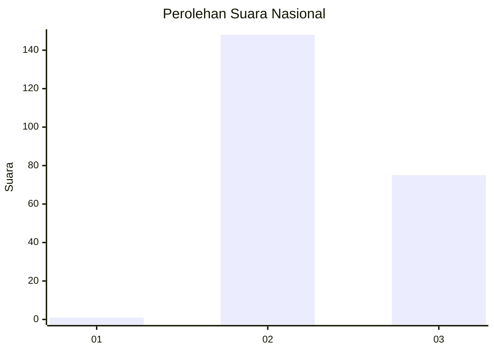
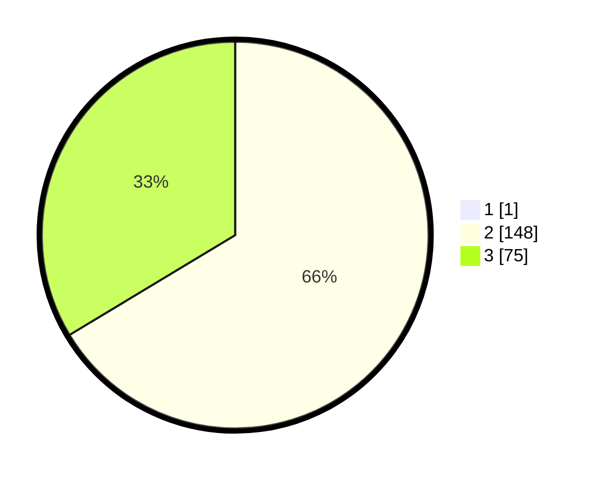

# Hasil

## Grafik

## Tabel

| No. | Nama Paslon    | Suara | Suara (raw) | Persentase |
|:--- |:-------------- | -----:| -----------:| ----------:|
| 1   | ANIES MUHAIMIN | 1     | [1][p-1]    | 0,45       |
| 2   | PRABOWO GIBRAN | 148   | [148][p-2]  | 66,07      |
| 3   | GANJAR MAHFUD  | 75    | [75][p-3]   | 33,48      |

[p-1]: https://github.com/gigit-pemilu/pemilu-2024/blob/main/pilpres/hitung-suara/sub/51-bali/sub/04-gianyar/sub/04-tampaksiring/sub/2001-pejeng/sub/004-tps/sub/paslon-1.txt
[p-2]: https://github.com/gigit-pemilu/pemilu-2024/blob/main/pilpres/hitung-suara/sub/51-bali/sub/04-gianyar/sub/04-tampaksiring/sub/2001-pejeng/sub/004-tps/sub/paslon-2.txt
[p-3]: https://github.com/gigit-pemilu/pemilu-2024/blob/main/pilpres/hitung-suara/sub/51-bali/sub/04-gianyar/sub/04-tampaksiring/sub/2001-pejeng/sub/004-tps/sub/paslon-3.txt

## Foto C Plano

https://sirekap-obj-formc.kpu.go.id/96a9/pemilu/ppwp/51/04/04/20/01/5104042001004-20240214-131700--1f2ec1e5-50e3-4e91-9b93-22a547a30939.jpg

https://sirekap-obj-formc.kpu.go.id/96a9/pemilu/ppwp/51/04/04/20/01/5104042001004-20240214-132003--34e59183-6903-4447-b54a-3c73e14f9d0b.jpg

https://sirekap-obj-formc.kpu.go.id/96a9/pemilu/ppwp/51/04/04/20/01/5104042001004-20240214-132225--7f4cb26f-16ae-4ed6-9ad4-a6ceaabcfd79.jpg

## Metadata

| Key        | Value               |
| ---------- | ------------------- |
| Time Stamp | 2024-02-15 01:47:43 |

## DATA PEMILIH TETAP

Jumlah pemilih dalam DPT: **251**.
 * L: **121**.
 * P: **130**.

## DATA PENGGUNA HAK PILIH

Jumlah pengguna hak pilih dalam DPT: **221**.
 * L: **110**.
 * P: **111**.

Jumlah pengguna hak pilih dalam DPTb: **0**.
 * L: **0**.
 * P: **0**.

Jumlah pengguna hak pilih dalam DPK: **5**.
 * L: **4**.
 * P: **1**.

Jumlah pengguna hak pilih: **226**.
 * L: **114**.
 * P: **112**.

## JUMLAH SUARA SAH DAN TIDAK SAH

JUMLAH SELURUH SUARA SAH: **224**.

JUMLAH SUARA TIDAK SAH: **2**.

JUMLAH SELURUH SUARA SAH DAN SUARA TIDAK SAH: **226**.

