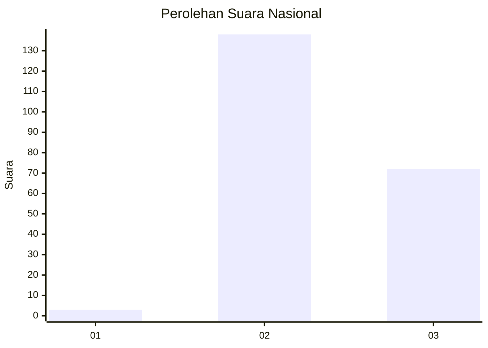
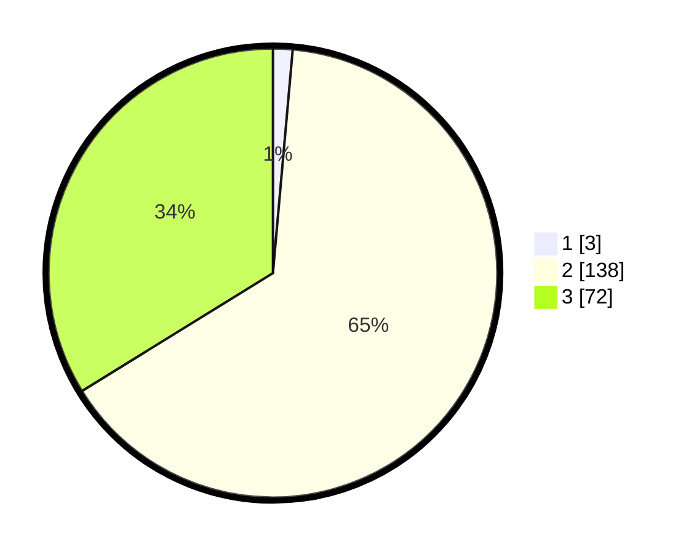

# Hasil

## Grafik

## Tabel

| No. | Nama Paslon    | Suara | Suara (raw) | Persentase |
|:--- |:-------------- | -----:| -----------:| ----------:|
| 1   | ANIES MUHAIMIN | 3     | [3][p-1]    | 1,41       |
| 2   | PRABOWO GIBRAN | 138   | [138][p-2]  | 64,79      |
| 3   | GANJAR MAHFUD  | 72    | [72][p-3]   | 33,80      |

[p-1]: https://github.com/gigit-pemilu/pemilu-2024/blob/main/pilpres/hitung-suara/sub/51-bali/sub/04-gianyar/sub/04-tampaksiring/sub/2001-pejeng/sub/006-tps/sub/paslon-1.txt
[p-2]: https://github.com/gigit-pemilu/pemilu-2024/blob/main/pilpres/hitung-suara/sub/51-bali/sub/04-gianyar/sub/04-tampaksiring/sub/2001-pejeng/sub/006-tps/sub/paslon-2.txt
[p-3]: https://github.com/gigit-pemilu/pemilu-2024/blob/main/pilpres/hitung-suara/sub/51-bali/sub/04-gianyar/sub/04-tampaksiring/sub/2001-pejeng/sub/006-tps/sub/paslon-3.txt

## Foto C Plano

https://sirekap-obj-formc.kpu.go.id/e8c6/pemilu/ppwp/51/04/04/20/01/5104042001006-20240215-004551--4b471942-4cfd-4bd2-b46d-68d1f3871011.jpg

https://sirekap-obj-formc.kpu.go.id/e8c6/pemilu/ppwp/51/04/04/20/01/5104042001006-20240215-004608--46c453f4-914c-4377-9d4f-9e9f2f55b71b.jpg

https://sirekap-obj-formc.kpu.go.id/e8c6/pemilu/ppwp/51/04/04/20/01/5104042001006-20240215-105048--a3b5f96f-85b9-4bce-9433-75c93b363c7e.jpg

## Metadata

| Key        | Value               |
| ---------- | ------------------- |
| Time Stamp | 2024-02-24 22:31:28 |

