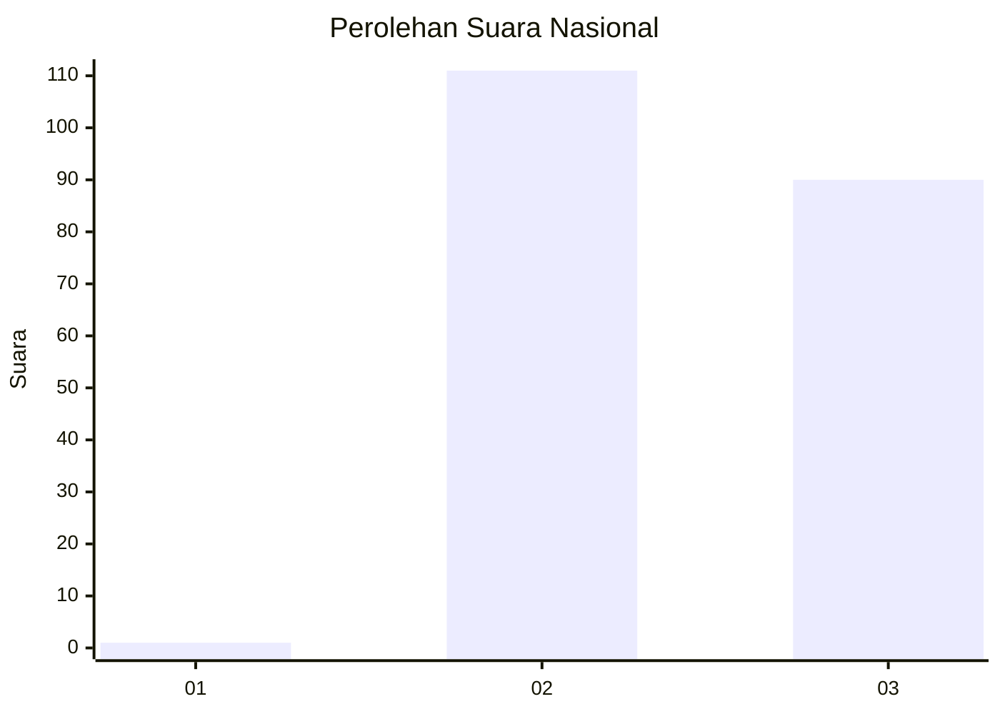
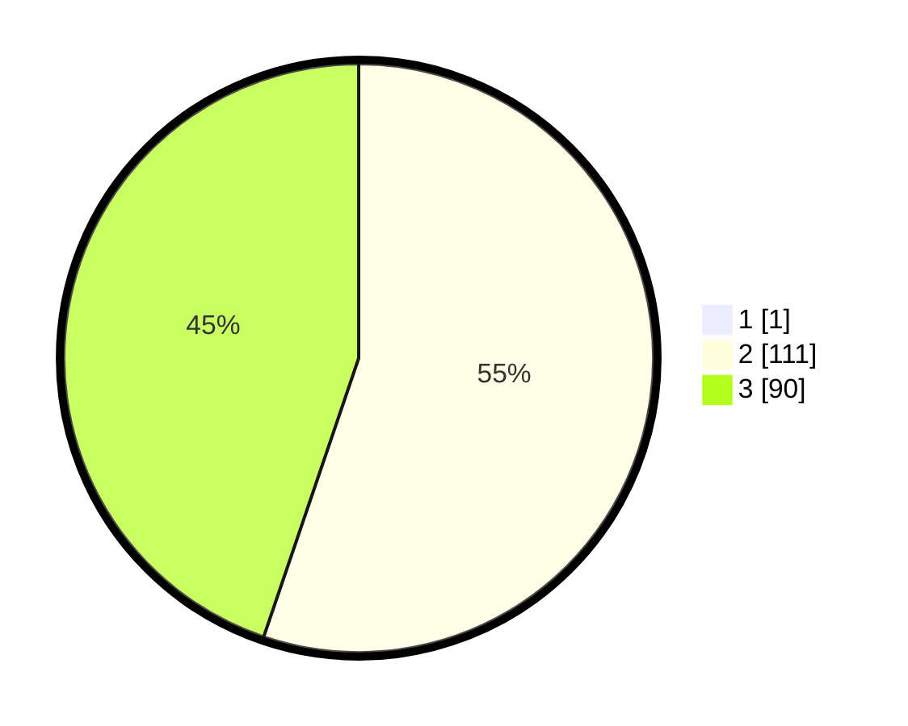

# Hasil

## Grafik

## Tabel

| No. | Nama Paslon    | Suara | Suara (raw) | Persentase |
|:--- |:-------------- | -----:| -----------:| ----------:|
| 1   | ANIES MUHAIMIN | 1     | [1][p-1]    | 0,50       |
| 2   | PRABOWO GIBRAN | 111   | [111][p-2]  | 54,95      |
| 3   | GANJAR MAHFUD  | 90    | [90][p-3]   | 44,55      |

[p-1]: https://github.com/gigit-pemilu/pemilu-2024/blob/main/pilpres/hitung-suara/sub/51-bali/sub/04-gianyar/sub/04-tampaksiring/sub/2001-pejeng/sub/007-tps/sub/paslon-1.txt
[p-2]: https://github.com/gigit-pemilu/pemilu-2024/blob/main/pilpres/hitung-suara/sub/51-bali/sub/04-gianyar/sub/04-tampaksiring/sub/2001-pejeng/sub/007-tps/sub/paslon-2.txt
[p-3]: https://github.com/gigit-pemilu/pemilu-2024/blob/main/pilpres/hitung-suara/sub/51-bali/sub/04-gianyar/sub/04-tampaksiring/sub/2001-pejeng/sub/007-tps/sub/paslon-3.txt

## Foto C Plano

https://sirekap-obj-formc.kpu.go.id/8002/pemilu/ppwp/51/04/04/20/01/5104042001007-20240217-175136--6f9875b2-5e07-4256-b06c-5b687e0cc84a.jpg

https://sirekap-obj-formc.kpu.go.id/8002/pemilu/ppwp/51/04/04/20/01/5104042001007-20240217-175234--5ad708d8-1848-4951-b3ca-423a6752252c.jpg

https://sirekap-obj-formc.kpu.go.id/8002/pemilu/ppwp/51/04/04/20/01/5104042001007-20240217-175332--cb698ff7-7fc1-4515-b714-f1ed11e7cfb0.jpg

## Metadata

| Key        | Value               |
| ---------- | ------------------- |
| Time Stamp | 2024-02-24 22:31:28 |

