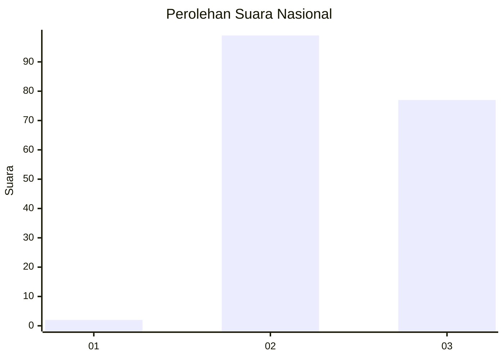
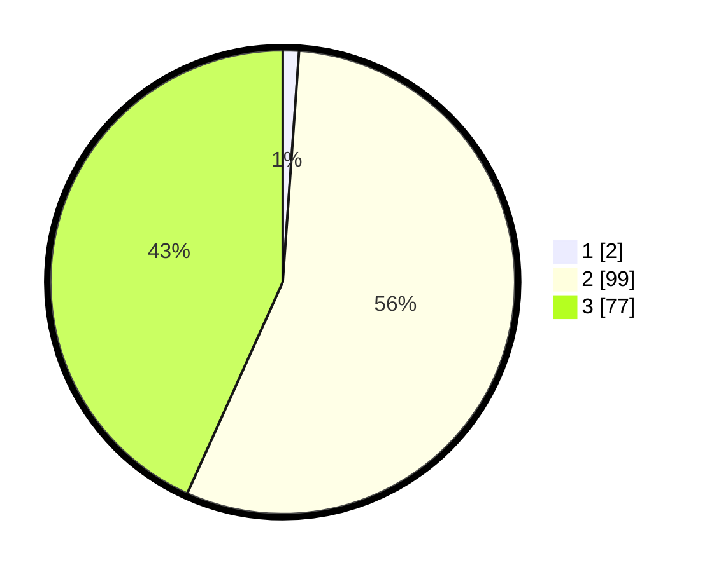

# Hasil

## Grafik

## Tabel

| No. | Nama Paslon    | Suara | Suara (raw) | Persentase |
|:--- |:-------------- | -----:| -----------:| ----------:|
| 1   | ANIES MUHAIMIN | 2     | [2][p-1]    | 1,12       |
| 2   | PRABOWO GIBRAN | 99    | [99][p-2]   | 55,62      |
| 3   | GANJAR MAHFUD  | 77    | [77][p-3]   | 43,26      |

[p-1]: https://github.com/gigit-pemilu/pemilu-2024/blob/main/pilpres/hitung-suara/sub/51-bali/sub/04-gianyar/sub/04-tampaksiring/sub/2001-pejeng/sub/008-tps/sub/paslon-1.txt
[p-2]: https://github.com/gigit-pemilu/pemilu-2024/blob/main/pilpres/hitung-suara/sub/51-bali/sub/04-gianyar/sub/04-tampaksiring/sub/2001-pejeng/sub/008-tps/sub/paslon-2.txt
[p-3]: https://github.com/gigit-pemilu/pemilu-2024/blob/main/pilpres/hitung-suara/sub/51-bali/sub/04-gianyar/sub/04-tampaksiring/sub/2001-pejeng/sub/008-tps/sub/paslon-3.txt

## Foto C Plano

https://sirekap-obj-formc.kpu.go.id/9781/pemilu/ppwp/51/04/04/20/01/5104042001008-20240214-225037--bc54abe8-353c-4310-8663-ae94ebde19c6.jpg

https://sirekap-obj-formc.kpu.go.id/9781/pemilu/ppwp/51/04/04/20/01/5104042001008-20240217-084551--54213047-37a6-4c5d-9a25-1eda30bb6cc7.jpg

https://sirekap-obj-formc.kpu.go.id/9781/pemilu/ppwp/51/04/04/20/01/5104042001008-20240217-084550--bb33cb40-713d-410e-b446-f5e2efa6196a.jpg

## Metadata

| Key        | Value               |
| ---------- | ------------------- |
| Time Stamp | 2024-02-17 12:00:00 |

## DATA PEMILIH TETAP

Jumlah pemilih dalam DPT: **206**.
 * L: **106**.
 * P: **100**.

## DATA PENGGUNA HAK PILIH

Jumlah pengguna hak pilih dalam DPT: **182**.
 * L: **93**.
 * P: **89**.

Jumlah pengguna hak pilih dalam DPTb: **0**.
 * L: **0**.
 * P: **0**.

Jumlah pengguna hak pilih dalam DPK: **1**.
 * L: **0**.
 * P: **1**.

Jumlah pengguna hak pilih: **183**.
 * L: **93**.
 * P: **90**.

## JUMLAH SUARA SAH DAN TIDAK SAH

JUMLAH SELURUH SUARA SAH: **178**.

JUMLAH SUARA TIDAK SAH: **5**.

JUMLAH SELURUH SUARA SAH DAN SUARA TIDAK SAH: **183**.

