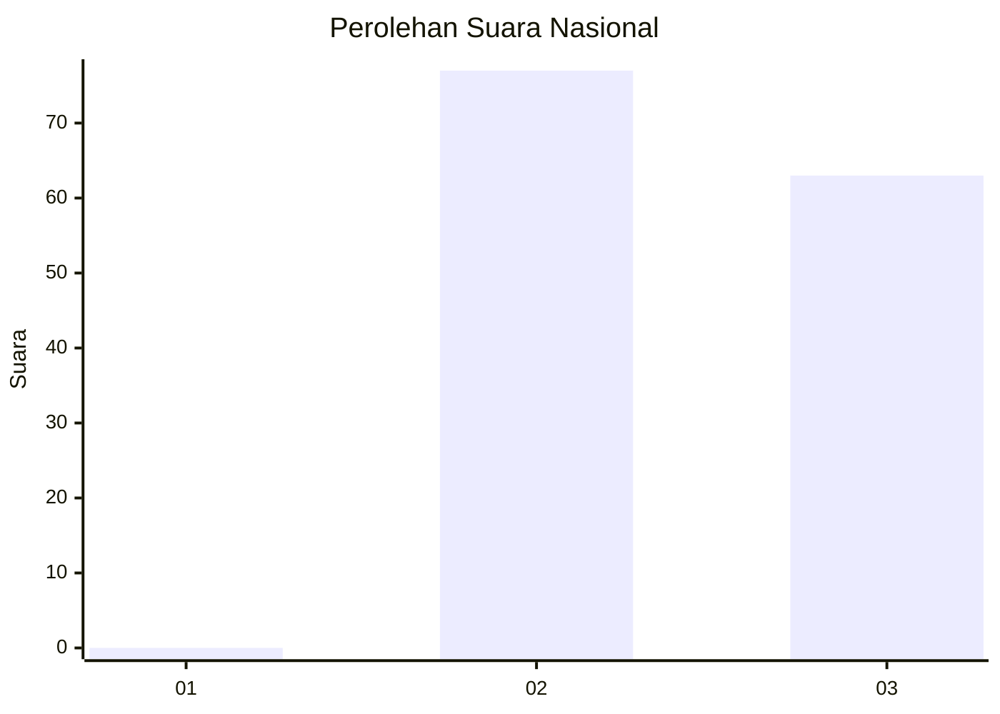
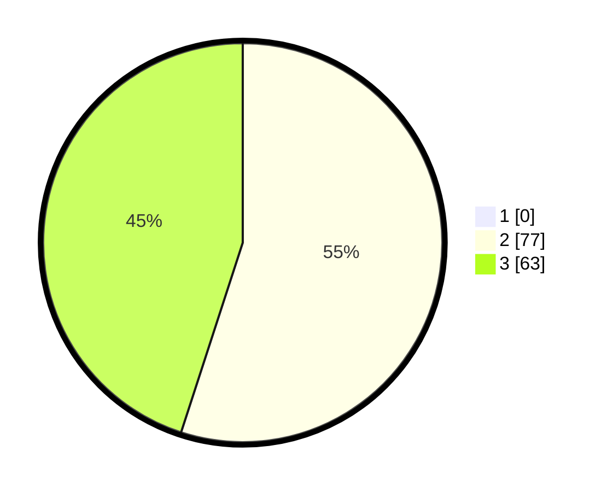

# Hasil

## Grafik

## Tabel

| No. | Nama Paslon    | Suara | Suara (raw) | Persentase |
|:--- |:-------------- | -----:| -----------:| ----------:|
| 1   | ANIES MUHAIMIN | 0     | [0][p-1]    | 0,00       |
| 2   | PRABOWO GIBRAN | 77    | [77][p-2]   | 55,00      |
| 3   | GANJAR MAHFUD  | 63    | [63][p-3]   | 45,00      |

[p-1]: https://github.com/gigit-pemilu/pemilu-2024/blob/main/pilpres/hitung-suara/sub/51-bali/sub/04-gianyar/sub/04-tampaksiring/sub/2002-sanding/sub/006-tps/sub/paslon-1.txt
[p-2]: https://github.com/gigit-pemilu/pemilu-2024/blob/main/pilpres/hitung-suara/sub/51-bali/sub/04-gianyar/sub/04-tampaksiring/sub/2002-sanding/sub/006-tps/sub/paslon-2.txt
[p-3]: https://github.com/gigit-pemilu/pemilu-2024/blob/main/pilpres/hitung-suara/sub/51-bali/sub/04-gianyar/sub/04-tampaksiring/sub/2002-sanding/sub/006-tps/sub/paslon-3.txt

## Foto C Plano

https://sirekap-obj-formc.kpu.go.id/8e8a/pemilu/ppwp/51/04/04/20/02/5104042002006-20240214-213918--66209f43-74d2-44f3-8e0b-17619c521660.jpg

https://sirekap-obj-formc.kpu.go.id/8e8a/pemilu/ppwp/51/04/04/20/02/5104042002006-20240214-214117--3af673f5-ccd0-4daa-b06a-ee8f940e18d9.jpg

https://sirekap-obj-formc.kpu.go.id/8e8a/pemilu/ppwp/51/04/04/20/02/5104042002006-20240214-214207--3ead30dc-a016-4f9a-9471-1ed7e3b69c6f.jpg

## Metadata

| Key        | Value               |
| ---------- | ------------------- |
| Time Stamp | 2024-02-15 12:00:28 |

