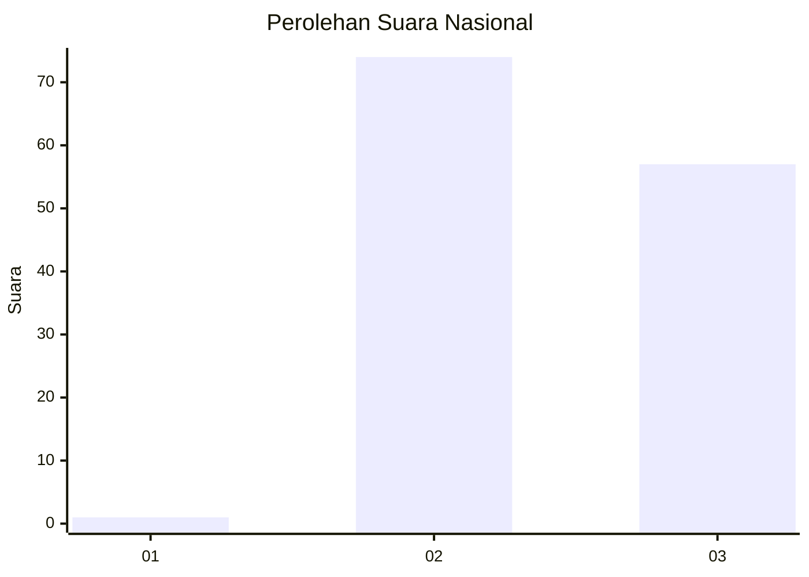
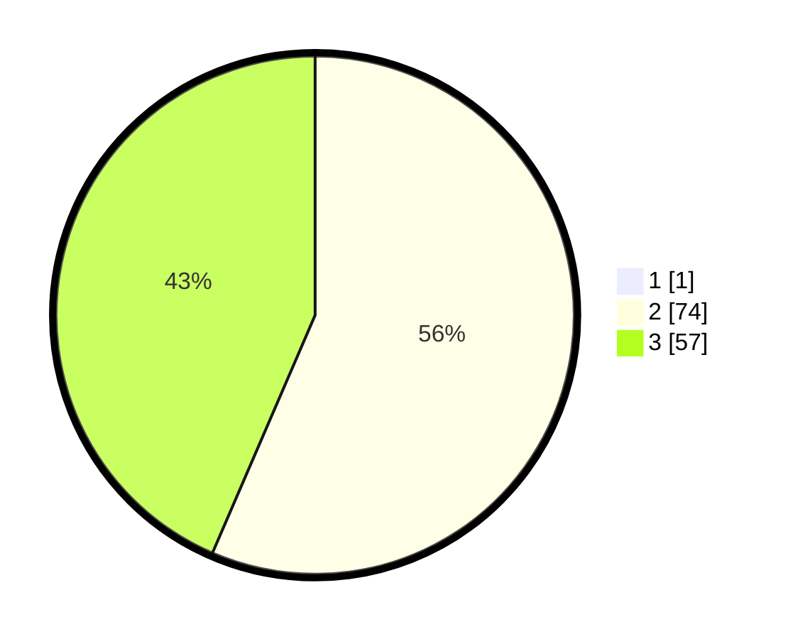

# Hasil

## Grafik

## Tabel

| No. | Nama Paslon    | Suara | Suara (raw) | Persentase |
|:--- |:-------------- | -----:| -----------:| ----------:|
| 1   | ANIES MUHAIMIN | 1     | [1][p-1]    | 0,76       |
| 2   | PRABOWO GIBRAN | 74    | [74][p-2]   | 56,06      |
| 3   | GANJAR MAHFUD  | 57    | [57][p-3]   | 43,18      |

[p-1]: https://github.com/gigit-pemilu/pemilu-2024/blob/main/pilpres/hitung-suara/sub/51-bali/sub/04-gianyar/sub/04-tampaksiring/sub/2002-sanding/sub/007-tps/sub/paslon-1.txt
[p-2]: https://github.com/gigit-pemilu/pemilu-2024/blob/main/pilpres/hitung-suara/sub/51-bali/sub/04-gianyar/sub/04-tampaksiring/sub/2002-sanding/sub/007-tps/sub/paslon-2.txt
[p-3]: https://github.com/gigit-pemilu/pemilu-2024/blob/main/pilpres/hitung-suara/sub/51-bali/sub/04-gianyar/sub/04-tampaksiring/sub/2002-sanding/sub/007-tps/sub/paslon-3.txt

## Foto C Plano

https://sirekap-obj-formc.kpu.go.id/b1c9/pemilu/ppwp/51/04/04/20/02/5104042002007-20240214-195650--28e20b92-0e39-4577-9b31-a6a63a231686.jpg

https://sirekap-obj-formc.kpu.go.id/b1c9/pemilu/ppwp/51/04/04/20/02/5104042002007-20240214-195909--a0d97a9f-a955-4ddb-ab83-c2eb38e0c87d.jpg

https://sirekap-obj-formc.kpu.go.id/b1c9/pemilu/ppwp/51/04/04/20/02/5104042002007-20240214-200252--29812ecb-54d5-4402-b8da-214af0272e34.jpg

## Metadata

| Key        | Value               |
| ---------- | ------------------- |
| Time Stamp | 2024-02-15 00:41:44 |

## DATA PEMILIH TETAP

Jumlah pemilih dalam DPT: **155**.
 * L: **77**.
 * P: **78**.

## DATA PENGGUNA HAK PILIH

Jumlah pengguna hak pilih dalam DPT: **136**.
 * L: **70**.
 * P: **66**.

Jumlah pengguna hak pilih dalam DPTb: **0**.
 * L: **0**.
 * P: **0**.

Jumlah pengguna hak pilih dalam DPK: **0**.
 * L: **0**.
 * P: **0**.

Jumlah pengguna hak pilih: **136**.
 * L: **70**.
 * P: **66**.

## JUMLAH SUARA SAH DAN TIDAK SAH

JUMLAH SELURUH SUARA SAH: **132**.

JUMLAH SUARA TIDAK SAH: **4**.

JUMLAH SELURUH SUARA SAH DAN SUARA TIDAK SAH: **136**.

